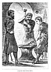

  
[Intangible Textual Heritage](../../../index)  [Legends &
Sagas](../../index)  [Iceland](../index)  [Index](index) 
[Previous](gto11)  [Next](gto13) 

------------------------------------------------------------------------

p. 35

### CHAPTER VII.

### VESTEIN COMES BACK TO ICELAND.

GISLI made a feast, and bade his friends to it he wished to have a
gathering, and so to welcome both the winter and his friends; but he had
left off all heathen sacrifices since he had been in Viborg with
Sigrhadd. He bade to the feast both the Thorkels and his cousins, the
sons of Bjartmar. So that the day that the guests were looked for Gisli
made ready his house. Then Auda, the housewife, spoke and said: "Now,
methinks but one thing is wanting."

"What is that?" asked Gisli.

"This alone," said Auda, "that my brother Vestein is not here."

"Well," said Gisli, "we do not look at things in the same way. I would
give much goods that he were not here, as I now ween he is."

There was a man of whom we have spoken before, Thorgrim Bottlenose; he
dwelt at Nebstead, in the inner bight of the river. He was full of
witchcraft and sorcery, and he was a wizard and worker of spells. This
man Thorgrim. and Thorkel asked to their feast, for they had as large a
gathering as Gisli Thorgrim, the priest of Frey, was a man well skilled
in forging

p. 36

iron. So those three went aside together--the two Thorgrims and Thorkel.
Then Thorkel brings out the broken bits of "Graysteel," which had fallen
to his lot when they parted their heritage, and Thorgrim forged out of
it a spear, and that spear was all ready by even and fitted to its haft.
It was a great spear-head, and runes were on it, and it was fitted to a
haft a span long.

And when this was being done there came Aunund of Tweendale to Gisli's
house; and took him aside to talk, and tells him that Vestein his
brother-in-law has come into the land, and is now at his house under
Hest, and that he will be with him that evening. Then Gisli called his
two house-carles, Hallvard and Havard, and bids them go on a message
north to Aunundarfirth.

"Find now my brother-in-law Vestein; I am told he has come home. Bear
him my greeting, and bid him sit quietly at home till I come to see him;
for my will is, that he should not come-to this feast." Gisli gives them
into their hands a purse, and in it half of the silver coin, for a token
in case Vestein should not believe their story. Now the house-carles set
off, and take ship out of Hawkdale, and row across to Brooksmouth. There
they land, and go to a farmer named Bessi, who dwelt at Bessastead. To
him Gisli had sent word that he should lend them two horses which he
had, which were called "the Pair of Gloves." They were the fleetest
horses in all the firths. He lent them the horses, and they got on their
backs and rode till they came to Mossvale. After that they turned and
rode along the firth.

 

[  
Click to enlarge](img/03600.jpg)  
FORGING THE SPEAR-HEAD.  

 

p. 37

But at the same time Vestein had started from home, and had got as far
as beneath the sandhill at Mossvale, and then on to Holt. But the
house-carles had ridden the upper road, and so they rode by and missed
each other. There was a man named Thorvard who lived at Holt, and his
house-carles were quarrelling over their work, and were striking at one
another with their scythes, and gave one another bad wounds. Then
Vestein came up and made them good friends again, so that both sides
were well pleased. Then he rode on for Dyrafirth, and two Easterlings
with him. By this time Gisli's house-carles had reached Hest. There they
learn of Vestein's journey-how he had left home; and now they turn back
after him as fast as they can. And when they come to Mossvale they see a
train of men riding in the midst of the dale, and then a jutting crag
hid them from their view. So they ride on up the dale, and when they
come to Arnkelsbrink both their horses were foundered. But the
house-carles run on on foot, and call out. Vestein and his men heard
them cry, and by that time they had got up on Gemladaleheath. So Vestein
waited there till the others come up. But when they meet, the
house-carles tell him their errand and show him the token. Then he takes
the other half of the coin out of his purse, and put the two bits
together, and grew red, as he said:

"’Tis sooth every word of it, and I would have turned back had ye found
me before; but now all the streams fall towards Dyrafirth, and I will
ride thither, for I am eager to see my brother-in-law and my sister;
'tis long since we parted;

p. 38

but these Easterlings shall turn back. As for ye, ye shall go the
shortest way, as ye are afoot; but tell Gisli and my sister that I am
coming to them, for I hope to get there safe and sound."

Now they cross the firth, and come to Hol, and tell Gisli all that had
happened on their journey, and that Vestein was on his way thither.

"So it must be, then," said Gisli.

Now Vestein rides the inner road round Dyrafirth, but the house-carles
had a boat, as was said before, and so they were far quicker. Vestein
comes to Luta, his kinswoman, in Lambdale--that is far up in the bight
of the firth. She had him ferried across the top of the firth, and said
to him:

"Beware of thyself, kinsman. Thou wilt need to take all care."

He said he would do all he could. Thence he was ferried over to
Thingere, where a man dwelt whose name was Thorhall. Vestein went up to
his house, and he lent him a horse. Vestein had with him his saddle and
saddle-cloth, and rode with a streamer to his spear. Thorhall went with
him on the way as far as Sandmouth, and offers to go with him as far as
Gisli's house. Vestein said there was no need of that.

"Ah!" said Thorhall, "there have been many changes in Hawkdale since
thou wert last here, and beware of thyself"

With these words they parted. Now Vestein rides till he comes to
Hawkdale, and the evening was bright and starlit. But it so happened as
he rode by Thorgrim's house at Sæbol in

p. 39

the dusk that they were tethering the cattle--Geirmund the lad, the
kinsman of Thorkel and Gisli, and along with him a woman whose name was
Rannveiga. She makes up the beds for the cattle, while he drives them
into her; and so as they were at that work there rides Vestein round the
'town' and meets Geirmund. Then Geirmund said: "Come not thou in here at
Sæbol, but go to Gisli, and beware of thyself."

Just then Rannveiga came out of the byre, and looked at the man and
thought she knew him, for she had often seen Vestein. So when they had
tethered the cattle in the byre they fell to wrangling about the
stranger, who he could have been, and they were hard at it when they
reached the house. Thorgrim and Thorkel were sitting before the fire
when they came in-doors, and Thorgrim. asks if they had seen any one,
and about what they were wrangling

"Oh!" said Rannveiga, "I thought I saw that Vestein rode here round our
'town,' and he had on a blue cape and held a big spear in his hand with
a streamer fluttering on it."

"What sayest thou to that, Geirmund?" asked Thorgrim.

"I did not see clearly," he answered; "but I thought it was the
house-carle of Aunund of Tweendale, and he had on Gisli's cape, and rode
one of his master's horses, and in his hand he had a salmon-spear with a
landing-net bound on it."

"Now one of you must be telling lies," said Thorgrim. "Go now over to
Hol, Rannveiga, and find out what strangers have come thither."

So she went and stood at the door. Outside the doorway

p. 40

was Gisli, who greeted her and asked her to stay there, but she said she
must go back home.

"What's thy errand?" he asked.

"I only wanted to have a word with Gudrida," she answered.

So Gisli called Gudrida, but when she came Rannveiga had nothing to say
to her. Then Rannveiga said: "Where is the mistress Auda?"

"She is here," says Gisli, "inside the house. Auda, come and see
Rannveiga," he calls out.

Then Auda went out to see Rannveiga, and asked what she wanted. But she
said it was only about a little thing, and still she could not say what
that little thing was.

So Gisli bade her do one thing or the other--stay there or go away;
"for," he said, "’tis now getting so late that thou oughtest not to go
back alone though the way be short."

Then she went home and was half as silly as she had been before, and she
could tell nothing of any stranger that had come to Gisli's house.

Next morning Vestein made them bring in two bags which some of his
lading was in, and which he had given over to Hallvard and Havard to
bring. Out of these Vestein took seventy ells of hangings and a kerchief
twenty ells long, all woven with a pattern of gold in three stripes. He
also brought out two gilded basons. These treasures he took out, and to
his sister he gave the kerchief, but to Gisli and Thorkel he gave the
hangings and the basons between them, if Thorkel would take them. After
that Gisli goes over to Sæbol, and both the Thorkels with him, to

p. 41

see his brother Thorkel; and now Gisli says that Vestein has come to
stay with him, and he shows Thorkel the treasures, and tells him how
they were given between them, and bade him take them; but Thorkel says:

"Thou art worthy to have them all alone, and I will not take them. It is
not so very plain how I shall repay them."

So Gisli goes home, and Thorkel will not touch the gifts; and Gisli
thought that things all went in one and the same way.

------------------------------------------------------------------------

[Next: Chapter VIII. Vestein's Slaying](gto13)
