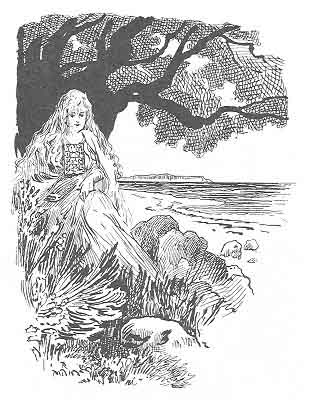

  
[Intangible Textual Heritage](../../index)  [Legends & Sagas](../index) 

------------------------------------------------------------------------

# The Key of Gold

##### 23 Czech Folk Tales

### by Josef Baudis

#### \[1922\]

------------------------------------------------------------------------

This is a short collection of folk tales translated from Czech sources.
Aside from the character's names and a mention of a water gnome called a
'Waternick', these stories could be from just about anywhere in Europe,
and several (such as 'Three at One Blow') will be familiar to readers of
Lang's 'colored' fairy books. That said, this book is pleasant reading
and a nice collection.

NOTE: This text uses Unicode to display certain accented letters. To
view this your browser must be Unicode enabled. Please refer to the
[Unicode page](../../unicode) for more information on how to do this.

A free audio version of this book is available at:
[LibriVox.org](https://librivox.org/the-key-of-gold-23-czech-folk-tales-translated-by-joseph-baudis/),
dedicated to the public domain under a Creative Commons license.

------------------------------------------------------------------------

[Title Page](kog00)  
[Preface](kog01)  
[Contents](kog02)  
[Introduction](kog03)  
[1. The Twelve Months](kog04)  
[2. Víťazko](kog05)  
[3. Boots, Cloak, and Ring](kog06)  
[4. Silly Jura](kog07)  
[5. Sleepy John](kog08)  
[6. Three Doves](kog09)  
[7. The Bear, the Eagle, and the Fish](kog10)  
[8. Kojata](kog11)  
[9. Shepherd Hynek](kog12)  
[10. The Three Roses](kog13)  
[11. The Enchanted Princesses](kog14)  
[12. The Twin Brothers](kog15)  
[13. The Waternick](kog16)  
[14. The Man Who Met Misery](kog17)  
[15. Nine At A Blow](kog18)  
[16. A Clever Lass](kog19)  
[17. The Soldier and the Devil](kog20)  
[18. Old Nick and Kitty](kog21)  
[19. The Knight Bambus](kog22)  
[20. Francis and Martin](kog23)  
[21. Witches at the Cross](kog24)  
[22. The Witch and the Horseshoes](kog25)  
[23. The Haunted Mill](kog26)  
