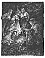
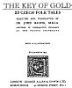
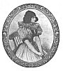

  
[Intangible Textual Heritage](../../index)  [Legends & Sagas](../index) 
[Index](index)  [Next](kog01) 

------------------------------------------------------------------------

# THE KEY OF GOLD

## 23 CZECH FOLK TALES

##### SELECTED AND TRANSLATED BY

## DR. JOSEF BAUDIS, M.R.I.A.

###### LECTURER IN COMPARATIVE PHILOLOGY AT THE PRAGUE UNIVERSITY

###### WITH 11 ILLUSTRATIONS

#### LONDON: GEORGE ALLEN & UNWIN LTD.

#### RUSKIN HOUSE MUSEUM STREET, W.C. 1

#### \[1917\]

###### NOTICE OF ATTRIBUTION Scanned at Intangible Textual Heritage, December 2004. John Bruno Hare, redactor. This text is in the public domain in the US because it was published prior to 1922. These files may be used for any non-commercial purpose, provided this notice of attribution is left intact.

[  
Click to enlarge](img/front.jpg)  
Frontispiece  

[  
Click to enlarge](img/title.jpg)  
Title Page  

[  
Click to enlarge](img/girl.jpg)

------------------------------------------------------------------------

[Next: Preface](kog01)
