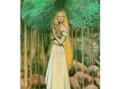

  
[Intangible Textual Heritage](../../index)  [Legends and
Sagas](../index)  [Index](index)  [Previous](kvtitle)  [Next](kvintro) 

------------------------------------------------------------------------

[Buy this Book at
Amazon.com](https://www.amazon.com/exec/obidos/ASIN/B001W0Z82C/internetsacredte)

------------------------------------------------------------------------

  
*The Kalevala*, by John Martin Crawford, \[1888\], at Intangible Textual
Heritage

------------------------------------------------------------------------

# CONTENTS.

|               |                                   |
|---------------|-----------------------------------|
|               | PREFACE                           |
|               | PROEM                             |
| RUNE I.       | Birth of Wainamoinen              |
| RUNE II.      | Wainamoinen's Sowing              |
| RUNE III.     | Wainamoinen and Youkahainen       |
| RUNE IV.      | The Fate of Aino                  |
| RUNE V.       | Wainamoinen's Lamentation         |
| RUNE VI.      | Wainamoinen's Hapless Journey     |
| RUNE VII.     | Wainamoinen's Rescue              |
| RUNE VIII.    | Maiden of the Rainbow             |
| RUNE IX.      | Origin of Iron                    |
| RUNE X.       | Ilmarinen forges the Sampo        |
| RUNE XI.      | Lemminkainen's Lament             |
| RUNE XII.     | Kyllikki's Broken Vow             |
| RUNE XIII.    | Lemminkainen's Second Wooing      |
| RUNE XIV.     | Death of Lemminkainen             |
| RUNE XV.      | Lemminkainen's Restoration        |
| RUNE XVI.     | Wainainoinen's Boat-building      |
| RUNE XVII.    | Wainamoinen finds the Lost Word   |
| RUNE XVIII.   | The Rival Suitors                 |
| RUNE XIX.     | Ilmarinen's Wooing                |
| RUNE XX.      | The Brewing of Beer               |
| RUNE XXI.     | Ilmarinen's Wedding-feast         |
| RUNE XXII.    | The Bride's Farewell              |
| RUNE XXIII.   | Osmotar, the Bride-adviser        |
| RUNE XXIV.    | The Bride's Farewell              |
| RUNE XXV.     | Wainamoinen's Wedding-songs       |
| RUNE XXVI.    | Origin of the Serpent             |
| RUNE XXVII.   | The Unwelcome Guest               |
| RUNE XXVIII.  | The Mother's Counsel              |
| RUNE XXIX.    | The Isle of Refuge                |
| RUNE XXX.     | The Frost-fiend                   |
| RUNE XXXI.    | Kullerwoinen, Son of Evil         |
| RUNE XXXII.   | Kullervo as a Shepherd            |
| RUNE XXXIII.  | Kullervo and the Cheat-cake       |
| RUNE XXXIV.   | Kullervo finds his Tribe-folk     |
| RUNE XXXV.    | Kullervo's Evil Deeds             |
| RUNE XXXVI.   | Kullerwoinen's Victory and Death  |
| RUNE XXXVII.  | Ilmarinen's Bride of Gold         |
| RUNE XXXVIII. | Ilmarinen's Fruitless Wooing      |
| RUNE XXXIX.   | Wainamoinen's Sailing             |
| RUNE XL.      | Birth of the Harp                 |
| RUNE XLI.     | Wainamoinen's Harp-songs          |
| RUNE XLII.    | Capture of the Sampo              |
| RUNE XLIII.   | The Sampo lost in the Sea         |
| RUNE XLIV.    | Birth of the Second Harp          |
| RUNE XLV.     | Birth of the Nine Diseases        |
| RUNE XLVI.    | Otso the Honey-eater              |
| RUNE XLVII.   | Louhi steals Sun, Moon, and Fire  |
| RUNE XLVIII.  | Capture of the Fire-fish          |
| RUNE XLIX.    | Restoration of the Sun and Moon   |
| RUNE L.       | Mariatta--Wainamoinen's Departure |
|               | EPILOGUE                          |

 

------------------------------------------------------------------------

[Next: Preface](kvintro)
