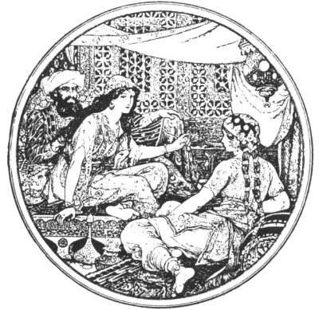

  
[Intangible Textual Heritage](../../index)  [Legends and
Sagas](../index)  [Index](index)  [Next](tale00) 

------------------------------------------------------------------------

[Buy this Book at
Amazon.com](https://www.amazon.com/exec/obidos/ASIN/0486222896/internetsacredte)

------------------------------------------------------------------------

*The Arabian Nights' Entertainments*, ed. Andrew Lang, \[1898\], at
Intangible Textual Heritage

------------------------------------------------------------------------

# The Arabian Nights Entertainments

 

### Selected and Edited by Andrew Lang

### With Numerous Illustrations by H. J. Ford

#### Longmans, Green and Co

#### \[1898\]

TO

EVELYN AND MARJORY SELLAR

IN MEMORY OF

URRARD AND BONNY DUNDEE

[  
Click to enlarge](img/front.jpg)  
THE TALISMAN IS DISCOVERED IN ONE OF THE JARS (Frontispiece)  

------------------------------------------------------------------------

[Next: Preface](tale00)
