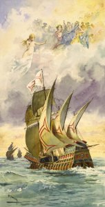

  
[Intangible Textual Heritage](../../index)  [Legends/Sagas](../index) 

------------------------------------------------------------------------

<table width="75%">
<colgroup>
<col style="width: 50%" />
<col style="width: 50%" />
</colgroup>
<tbody>
<tr class="odd">
<td width="50%" data-valign="CENTER"> 
</td>
<td width="50%" data-valign="CENTER"><h1 id="the-lusiad" data-align="CENTER">The Lusiad</h1>
<h2 id="by-luis-de-camõens" data-align="CENTER">by Luis de Camõens</h2>
<h3 id="trans.-by-william-julius-mickle" data-align="CENTER">trans. by William Julius Mickle</h3>
<h4 id="edition-of-1877" data-align="CENTER">[1776, edition of 1877]</h4></td>
</tr>
</tbody>
</table>

------------------------------------------------------------------------

|                                                                                                                           |
|---------------------------------------------------------------------------------------------------------------------------|
|  |

Columbus was a failure.

He utterly failed to accomplish what NASA would call his 'mission
profile,' that is, to find a practical trade route to India. Of course,
he did get the biggest consolation prize in history...

Vasco da Gama, who sailed from Portugal in 1498, however, succeeded in
achieving Columbus' goal. He rounded the Cape of Good Hope and reached
India. This accomplishment was memorialized shortly thereafter by this
epic poem written by a Portuguese sailor, Luis de Camõens. Unless you
were raised speaking Portuguese, it is unlikely you've heard of Camõens.
However, if you were, you probably already know that he's considered the
Portuguese Shakespeare, and the Lusiads the Portuguese national epic.

Although there have been several attempts to translate the Lusiads into
English, none have been very successful until the 20th century. Notably,
Richard Burton attempted a translation, but it has been universally
criticized. Mickle's translation is provided here, not because it is of
exceptional literary quality, but because it is in the public domain,
and better than some of the rest. If you would like to read this poem
casually, I recommend a modern translation such as Landeg White's (see
box on right), or [William Atkinsons' prose translation of
1972](https://www.amazon.com/exec/obidos/ASIN/0140440267/internetsacredte)
(in the Penguin Classics).

Mickle employs ABAB couplets, where the original whereas Camõens used
ottava rima, an ABABABCC form. He also took a few liberties with the
text. In the most egregious case, he inserts a 300 line naval engagement
which is not found in the original; he also omits an entire section
where de Gama engages in questionable conduct. However, the editor of
this, the 1877 edition, indicates these sections. Mickle's footnotes are
worth consulting for the wealth of information on the classical
references, as well as Portuguese history. However, some of his
annotations must be taken with a grain of salt, particularly his five
page footnote in book X where he deprecates Chinese culture, for no
particular reason.

That said, Mickle is not entirely unreadable, and a thorough reading of
this edition along with the apparatus is well worth the trouble. This is
the first time a full English translation of the Lusiads has appeared on
the Internet, to my knowledge--JBH.

------------------------------------------------------------------------

[Title Page and Front Matter](lus00)  
[Editor’s Preface](lus01)  
[The Life of Camoëns](lus02)  
[Dissertation on the Lusiad, and on Epic Poetry](lus03)  
[Mickle’s Introduction to the Lusiad](lus04)  
[Mickle’s Sketch of the History of the Discovery of India](lus05)  
[Contents](lus06)  
[Book I](lusbk01)  
[Book II](lusbk02)  
[Book III](lusbk03)  
[Book IV](lusbk04)  
[Book V](lusbk05)  
[Book VI](lusbk06)  
[Book VII](lusbk07)  
[Book VIII](lusbk08)  
[Book IX](lusbk09)  
[Dissertation on the Fiction of the Island of Venus](lusbk09a)  
[Book X](lusbk10)  
