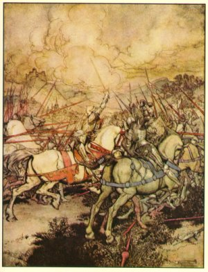

[Intangible Textual Heritage](../../index)  [Legends
and Sagas](../index) 

------------------------------------------------------------------------

<table>
<colgroup>
<col style="width: 50%" />
<col style="width: 50%" />
</colgroup>
<tbody>
<tr class="odd">
<td></td>
<td><h1 id="le-morte-darthur">Le Morte d'Arthur</h1>
<h2 id="by-sir-thomas-malory">by Sir Thomas Malory</h2></td>
</tr>
</tbody>
</table>

*Image: How Arthur drew his sword Excalibur for the
first time (Arthur Rackham).*

[BOOK I](book00)  
[BOOK II](book01)  
[BOOK III](book02)  
[BOOK IV](book03)  
[BOOK V](book04)  
[BOOK VI](book05)  
[BOOK VII](book06)  
[BOOK VIII](book07)  
[BOOK IX](book08)  
[BOOK X](book09)  
[BOOK XI](book10)  
[BOOK XII](book11)  
[BOOK XIII](book12)  
[BOOK XIV](book13)  
[BOOK XV](book14)  
[BOOK XVI](book15)  
[BOOK XVII](book16)  
[BOOK XVIII](book17)  
[BOOK XIX](book18)  
[BOOK XX](book19)  
[BOOK XXI](book20)  
