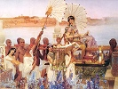

  
[Intangible Textual Heritage](../../index)  [Legends and
Sagas](../index)  [Index](index)  [Previous](mbh00)  [Next](mbh02) 

------------------------------------------------------------------------

[Buy this Book on
Kindle](https://www.amazon.com/exec/obidos/ASIN/B002H9XPY0/internetsacredte)

------------------------------------------------------------------------

  
*The Myth of the Birth of the Hero*, by Otto Rank, \[1914\], at
Intangible Textual Heritage

------------------------------------------------------------------------

p. 3

### I. Introduction

THE prominent civilized nations--the Babylonians and Egyptians, the
Hebrews and Hindus, the Persians, the Greeks and the Romans, as well as
the Teutons and others--all began at an early stage to glorify their
national heroes--mythical princes and kings, founders of religions,
dynasties, empires, or cities--in a number of poetic tales and legends.
The history of the birth and of the early life of these personalities
came to be especially invested with fantastic features, which in
different nations--even though widely separated by space and entirely
independent of each other--present a baffling similarity or, in part, a
literal correspondence. Many investigators have long been impressed with
this fact, and one of the chief problems of mythological research still
consists in the elucidation of the reason for the extensive analogies in
the fundamental outlines of mythical tales, which are rendered still
more puzzling by the unanimity in certain details and their reappearance
in most of the mythical groupings.

The mythological theories, aiming at the explanation of these remarkable
phenomena, are, in a general way, as follows: [1](#fn_0)

p. 4

1\. The "Idea of the People," propounded by Adolf Bastian. [1](#fn_1) This theory assumes the existence of
*elemental ideas*, so that the unanimity of the myths is a necessary
sequence of the uniform disposition of the human mind and the manner of
its manifestation, which within certain limits is identical at all times
and in all places. This interpretation was urgently advocated by Adolf
Bauer as accounting for the wide distribution of the hero myths. [2](#fn_2)

2\. The explanation by *original community*, first applied by Theodor
Benfey to the widely distributed parallel forms of folklore and fairy
tales [3](#fn_3). Originating in a favorable
locality (India), these tales were first accepted by the primarily
related (Indo-Germanic) peoples, then continued to grow while retaining
the common primary traits, and ultimately radiated over the entire
earth. This mode of explanation was first adapted to the wide
distribution of the hero myths by Rudolf Schubert. [4](#fn_4)

3\. The modern theory of *migration*, or *borrowing*, according to which
individual myths originate from definite peoples (especially the
Babylonians) and are accepted by other peoples through oral tradition
(commerce and traffic) or through literary influences. [5](#fn_5)

The modern theory of migration and borrowing can be readily shown to be
merely a modification of Benfey's theory, necessitated by newly
discovered and irreconcilable material. This profound and extensive
research of modern investigations has shown that India, rather than
Babylonia, may be regarded as the first home of the myths. Moreover, the
tales presumably did not radiate from a single point, but traveled over
and across the entire inhabited globe. This brings into prominence the
idea of the interdependence of mythological structures, an idea which
was generalized by Braun as the basic law of the nature of the human

p. 5

mind: Nothing new is ever discovered as long as it is possible to
copy. [1](#fn_6) The theory of elemental ideas,
so strenuously advocated by Bauer over a quarter of a century ago, is
unconditionally declined by the most recent investigators
(Winckler, [2](#fn_7) Stucken), who maintain the
migration theory.

There is really no such sharp contrast between the various theories or
their advocates, for the concept of elemental ideas does not interfere
with the claims of primary common possession or of migration.
Furthermore, the ultimate problem is not whence and how the material
reached a certain people; the question is: Where did it come from to
begin with? All these theories would explain only the variability and
distribution of the myths, but not their origin. Even Schubert, the most
inveterate opponent of Bauer's view, acknowledges this truth, by stating
that all these manifold sagas date back to a single very ancient
prototype. But he is unable to tell us anything of the origin of this
prototype. Bauer likewise inclines to this mediating view; he points out
repeatedly that in spite of the multiple origin of independent tales, it
is necessary to concede a most extensive and ramified borrowing, as well
as an original community of the concepts in related peoples. [3](#fn_8) The same conciliatory attitude is maintained
by Lessmann in a recent publication (1908), in which he rejects the
assumption of elemental ideas, but admits that primary relationship and
borrowing do not exclude each other. [4](#fn_9)
As pointed out by Wundt, however, it must be kept in mind that the
appropriation of mythological contents always represents at the same
time an independent mythological construction; because only that can be
retained permanently which corresponds to the borrower's stage of
mythological ideation. The faint recollections of preceding narratives
would hardly suffice for the refiguration of the same material, without

p. 6

the persistent presence of the underlying motifs; but precisely for this
reason, such motifs may produce new contents that agree in their
fundamental themes, even in the absence of similar associations. [1](#fn_10)

Leaving aside for the present the inquiry as to the mode of distribution
of these myths, the origin of the hero myth in general is now to be
investigated, fully anticipating that migration (or borrowing) will
prove to be directly and fairly positively demonstrable in a number of
the cases. When this is not feasible, other viewpoints will have to be
conceded, at least for the present, rather than bar the way to further
progress by the somewhat unscientific attitude of Hugo Winckler, who
says: When human beings and products, exactly corresponding to each
other, are found at remote parts of the earth, we must conclude that
they have wandered thither; whether we have knowledge of the how or when
makes no difference in the assumption of the fact itself. [2](#fn_11) Even granting the migration of all myths,
the origin of the first myth would still have to be explained. [3](#fn_12)

Investigations along these lines will necessarily help to provide a
deeper insight into the contents of the tales. Nearly all authors who
have hitherto been engaged in the interpretation of the birth myths of
heroes find in them a personification of the processes of nature,
following the dominant mode of natural mythological interpretation.

p. 7

\[paragraph continues\] The newborn hero
is the young sun rising from the waters, first confronted by lowering
clouds, but finally triumphing over all obstacles. [1](#fn_13) The taking into consideration of all
natural (chiefly atmospheric) phenomena--as was done by the first
representatives of this method of myth interpretation [2](#fn_14)--and the regarding of the legends, in a
more restricted sense, as astral myths (Stucken, Winckler, and others)
are approaches not so essentially distinct as the followers of each
individual direction believe to be the case. Nor does it seem a basic
improvement when the purely solar interpretation, as advocated
especially by Frobenius, [3](#fn_15) was no
longer accepted and the view was advanced that all myths were originally
lunar. Hüsing holds this theory in his discussion of the myth of Cyrus
the Great; Siecke also claims this view as the only legitimate, obvious
interpretation of the birth myths of the heroes; and it is a concept
that is beginning to gain popularity. [4](#fn_16)

The interpretation of the myths themselves will be taken up in detail
later on, and we shall refrain here from all detailed critical comments
on the above mode of explanation. Although significant, and undoubtedly
in part correct, the astral theory is not altogether satisfactory and
fails to afford an insight into the motives of myth formation. The
objection may be raised that the tracing to astronomical processes does
not fully represent the content of these myths, and that much clearer
and simpler relations might be established through another mode of
interpretation. The much abused theory of elemental ideas indicates a
practically

p. 8

neglected aspect of mythological research. At the beginning, as well as
at the end of his contribution, Bauer points out how much more natural
and probable it would be to seek the reason for the general unanimity of
these myths in the very general traits of the human psyche, rather than
in primary community or migration. This assumption appears to be more
justifiable, since such general movements of the human mind are also
expressed in still other forms and in other domains, where they can be
demonstrated as universal.

Concerning the character of these general movements of the human mind,
the psychological study of the essence of these myths might help to
reveal the source from which has flowed uniformly, at all times and in
all places, an identical mythological content. Such a derivation of an
essential constituent, from a common human source, has already been
successfully attempted with one of these legendary motifs. Freud, in his
*Interpretation of Dreams*, reveals the connection of the Oedipus
fable--where Oedipus is told by the oracle that he will kill his father
and marry his mother, as he unwittingly does later--with two typical
dreams experienced by many now living: the dream of the father's death,
and the dream of sexual intercourse with the mother. Of King Oedipus he
says:

His fate moves us only because it might have been our own, because the
oracle laid upon us before our birth the very curse which rested upon
him. It may be that we were all destined to direct our first sexual
impulses toward our mothers, and our first impulses of hatred and
resistance toward our fathers; our dreams convince us that we were. King
Oedipus, who slew his father Laius and wedded his mother Jocasta, is

p. 9

nothing more or less than a wish-fulfillment--the fulfillment of the
wish of our childhood. [1](#fn_17)

The manifestation of the intimate relationship between dream and
myth--not only in regard to the content but also as to the form and
motor forces of this and many other, more particularly pathological,
psyche structures--entirely justifies the interpretation of the myth as
a dream of the masses of the people, which I have recently shown
elsewhere. At the same time, the transference of the method, and in part
also of the results, of Freud's technique of dream interpretation to the
myths would seem to be justifiable, as was defended by Abraham, and
illustrated in an example, in his paper on "Dreams and Myths." In the
circle of myths that follow, the intimate relations between dream and
myth find further confirmation, with frequent opportunity for reasoning
from analogy.

The hostile attitude of the most modern mythological tendency (chiefly
represented by the Society for Comparative Mythological Research)
against all attempts at establishing a relation between dream and myth
is for the most part the outcome of the restriction of the
parallelization to the so-called nightmares (*Alpträume*), as attempted
in Laistner's notable book, and also of ignorance of the relevant
teachings of Freud. [2](#fn_18) The latter not
only help us to understand the dreams themselves but also show their
symbolism and close relationship with all psychic phenomena in general,
especially with daydreams or fantasies, with artistic creativeness, and
with certain disturbances of the normal psychic function. A common share
in all

p. 10

these productions belongs to a single psychic function: the human
imagination. It is to this imaginative faculty--of humanity at large
rather than of the individual--that the modern myth theory is obliged to
concede a high rank, perhaps the first, as the ultimate source of all
myths. The interpretation of the myths in the astral sense--or more
accurately speaking, as "almanac tales"--gives rise to the query: In
view of a creative imagination in humanity, should we seek (with
Lessmann) for the first germ of the origin of such tales precisely in
the processes of the heavens, or on the contrary, should we conclude
that ready-made tales of an entirely different (but presumably psychic)
origin were only subsequently transferred to the heavenly bodies? [1](#fn_19) Ehrenreich makes a more positive
admission: The mythologic evolution certainly begins on terrestrial
soil, in so far as experiences must first be gathered in the immediate
surroundings before they can be projected into the heavenly
universe. [2](#fn_20) And Wundt tells us that
the theory of the evolution of mythology according to which it first
originates in the heavens, whence at a later date it descends to earth,
is contradictory both to the history of the myth (which is unaware of
such a migration) and to the psychology of myth formation (which must
repudiate such a translocation as internally impossible). [3](#fn_21) We are also convinced that the
myths, [4](#fn_22) originally at least, are
structures of the human faculty of imagination, which were at some time
projected for certain reasons upon the heavens, and may be secondarily
transferred to the heavenly bodies, with their baffling phenomena. The
significance

p. 11

of the unmistakable traces--the fixed figures, and so forth--that have
been imprinted upon the myth by this transference must by no means be
underrated, although the origin of these figures was possibly psychic in
character; they were subsequently made the basis of the almanac and
firmament calculations precisely on account of this significance.

In a general way, it would seem as if the investigators who apply an
exclusively "natural" scheme of interpretation have been unable, in any
sense--in their endeavor to discover the original sense of the myths--to
get away entirely from a psychological process such as must be assumed
similarly for the creators of the myths. [1](#fn_23) The motive is identical, and led to the
same course for myth-creators and for myth-interpreters. It is most
naïvely uttered by one of the founders and champions of comparative myth
investigation and of the natural mythological mode of interpretation;
Max Müller points out in his *Essays* that this procedure not only
invests meaningless legends with a significance and beauty of their own
but also helps to remove some of the most revolting features of
classical mythology, as well as to elucidate their true meaning. [2](#fn_24) This readily understandable revulsion
naturally prevents the mythologist from assuming that such
motifs--incest with mother, sister, or daughter; murder of father,
grandfather, or brother--could be based on universal fantasies, which
according to Freud's teachings have their source in the infantile
psyche, with its peculiar interpretation of the external world and its
denizens. This revulsion is, therefore, only the reaction of the dimly
sensed painful recognition of the actuality of these relations; and this
reaction impels the myth interpreters, for their own subconscious
rehabilitation, and that of all mankind, to credit these motifs with an
entirely different meaning from their original significance. The same
internal repudiation prevents the myth-creating people from believing in
the possibility of such revolting thoughts, and this defense probably
was

p. 12

the first reason for projecting these relations onto the firmament. The
psychological pacifying through such a rehabilitation, by projection
upon external and remote objects, can still be realized--to a certain
degree, at least--by a glance at one of these interpretations, for
instance that of the objectionable Oedipus fable, as given by Goldhizer,
a representative of the natural school of myth interpreters: Oedipus
(who kills his father, marries his mother, and dies old and blind) is
the solar hero who murders his procreator, the darkness; he shares his
couch with his mother, the gloaming, from whose lap, the dawn, he has
been born; he dies, blinded, as the setting sun. [1](#fn_25)

It is understandable that some such interpretation is more soothing to
the mind than the revelation of the fact that incest and murder impulses
against their nearest relatives are found in the fantasies of most
people, as remnants of infantile ideation. But this is not a scientific
argument, and revulsion of this kind--although it may not always be
equally conscious--is altogether out of place in view of existing facts.
One must either become reconciled to these indecencies, provided they
are felt to be such, or one must abandon the study of psychological
phenomena. It is evident that human beings, even in the earliest times,
and with a most naïve imagination, never saw incest and parricide in the
firmament on high, [2](#fn_26) but it is far
more probable that these ideas are derived from another source,
presumably human. In what way they came to reach the sky, and what
modifications or additions they received in the process, are questions
of a secondary character that cannot

p. 13

be settled until the psychic origin of the myths in general has been
established.

At any rate, besides the astral conception, the claims of the part
played by the psychic life must be credited with the same rights for
myth formation, and this argument will be amply vindicated by the
results of our method of interpretation. With this object in view, we
shall first take up in the following pages the legendary material on
which such a psychological interpretation is to be attempted on a large
scale for the first time.

------------------------------------------------------------------------

### Footnotes

[3:1](mbh01.htm#fr_0) A short and fairly complete
review of the general theories of mythology, and of the principal
advocates of each, is to be found in Wilhelm Wundt: *Völkerpsychologie*
(Leipzig, 1905-9), Vol. II, Part I, p. 527.

[4:1](mbh01.htm#fr_1) *Das Beständige in den
Menschenrassen and die Spielweise ihrer Veränderlichkeit* (Berlin,
1868).

[4:2](mbh01.htm#fr_2) "*Die Kyros Sage and
Verwandtes*," *Sitzungsberichte der Wiener Akademie*, No. 100 (1882), P.
495.

[4:3](mbh01.htm#fr_3) *Pantschatantra* (1859).

[4:4](mbh01.htm#fr_4) *Herodots Darstellung der
Cyrussage* (Breslau, 1890).

[4:5](mbh01.htm#fr_5) Compare E. Stricken:
*Astral Mythen* (Leipzig, 1896-1907), especially Part V, "Moses"; and H.
Lessmann: "*Die Kyrossage in Europe*," *Wissen. beit. z. Jahresbericht
d. städt. Realschule zu Charlottenburg* (1906).

[5:1](mbh01.htm#fr_6) *Naturgeschichte der Sage*,
2 vols. (Munich, 1864-5), tracing all religious ideas, legends, and
systems back to their common family tree and primary root.

[5:2](mbh01.htm#fr_7) Some of the important
writings by Winckler will be mentioned in the course of this article.

[5:3](mbh01.htm#fr_8) *Zeitschrift für der
Oesterr. Gymnasium* (1891), pp. 161 ff. Schubert's reply is also found
here, pp. 594 ff.

[5:4](mbh01.htm#fr_9) "Object and Aim of
Mythological Research," *Mytholog. Bibliot*. (Leipzig), Vol. I, No. 4.

[6:1](mbh01.htm#fr_10) Wundt, op. cit., Part
III.

[6:2](mbh01.htm#fr_11) "*Die babylonische
Geisteskultur in ihren Beziehungen zur Kulturentwicklung der
Menschheit*," *Wissenschaft and Bildung*, Vol. XV (1907), p. 47.

[6:3](mbh01.htm#fr_12) Of course no time will be
wasted here on the futile question as to what the first legend may have
been; in all probability this never existed, any more than "the first
human couple."

[7:1](mbh01.htm#fr_13) Brodbeck: *Zoroaster*
(Leipzig, 1893), p. 138.

[7:2](mbh01.htm#fr_14) As an especially
discouraging example of this mode of procedure may be mentioned a
contribution by the well-known natural mythologist Schwartz, which
touches on this circle of myths, and is entitled: *Der Ursprung der
Stamm and Gründungssage Roms unter dem Reflex indogermanischer Mythen*
(Jena, 1898).

[7:3](mbh01.htm#fr_15) Leo Frobenius: *Das
Zeitalter des Sonnengotten* (Berlin, 1904).

[7:4](mbh01.htm#fr_16) G. Hüsing: *Contributions
to the Kyros Myth* (Berlin, 1906). Siecke, "Hermes als Mondgott,"
Mytholog. Bibliot., Vol. II, No. 1 (1908), P. 48. Compare, for example,
Paul Koch: *Sagen der Bibel and ihre Ubereinstimmung mit der Mythologie
der Indogermanen* (Berlin, 1907). Compare also the partly lunar, partly
solar, but at any rate entirely one-sided conception of the hero myth in
Gustav Friedrich: *Grundlage, Entstehung and genaue Einzeldeutung der
bekanntesten germanischen Märchen, Mythen and Sagen* (Leipzig, 1909), p.
118.

[9:1](mbh01.htm#fr_17) The fable of
Shakespeare's Hamlet also permits of a similar interpretation, according
to Freud. It will be seen later on how mythological investigators bring
the Hamlet legend from entirely different viewpoints into the
correlation of the circle of myths.

[9:2](mbh01.htm#fr_18) Laistner: *The Riddle of
the Sphinx* (1889). Compare Lessmann, "Object and Aim . . . ," loc. cit.
Ehrenreich alone (*General Psychology,* p. 149) admits the extraordinary
significance of dream-life for the myth-fiction of all times. Wundt does
so likewise, for individual mythological motifs.

[10:1](mbh01.htm#fr_19) Stucken (op. cit., p.
432) says in this sense: The myth transmitted by the ancestors was
transferred to natural processes and interpreted in a naturalistic way,
not vice versa. "Interpretation of nature is a motive in itself" (p. 636
n.). In a very similar way, Eduard Meyer (*Geschichte des Altertums*,
1884-1902, Vol. V. p. 48) has written: "In many cases, the natural
symbolism, sought in the myths, is only apparently present or has been
secondarily introduced, as often in the Vedas and in the Egyptian myths;
it is a primary attempt at interpretation, like the myth-interpretations
that arose among the Greeks as early as the fifth century."

[10:2](mbh01.htm#fr_20) Op. cit., p. 104.

[10:3](mbh01.htm#fr_21) Op. cit., p. 282.

[10:4](mbh01.htm#fr_22) For fairy tales, in this
as well as in other essential features, Thimme advocates the same point
of view as is here claimed for the myths. Compare Adolf Thimme: Das
Märchen, Vol. II of *Handbücher zur Volkskunde* (Leipzig, 1909).

[11:1](mbh01.htm#fr_23) Of this myth
interpretation, Wundt (op. cit., p. 352) has well said that it really
should have accompanied the original myth formation.

[11:2](mbh01.htm#fr_24) Vol. II, p. 143, in the
German translation (Leipzig, 1869).

[12:1](mbh01.htm#fr_25) See Ignaz Goldhizer:
*Der Mythus bei den Hebräern and seine geschichtliche Entwickelung*
(Leipzig, 1876), p. 125. According to the writings of Siecke (loc. cit.,
p. 39), the incest myths lose all unusual features through being
referred to the moon and its relation to the sun. His explanation is
quite simple: the daughter (the new moon) is the repetition of the
mother (the old moon); with her the father (the sun) (also the brother,
the son) becomes reunited.

[12:2](mbh01.htm#fr_26) Is it to be believed? In
an article entitled "*Urreligion der Indogermanen*" (Berlin, 1897),
where Siecke points out that the incest myths are descriptive narrations
of the seen but inconceivable process of nature, he objects to the
assumption by Oldenburg (Religion der Veda, p. 5) of a primeval tendency
of myths to the incest motif, with the remark that in the days of yore
the theme was thrust upon the narrator, without an inclination of his
own, through the forcefulness of the witnessed facts.

------------------------------------------------------------------------

[Next: Sargon](mbh02)
