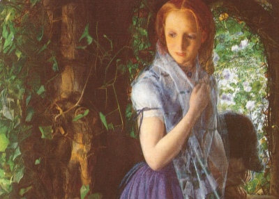

  
[Intangible Textual Heritage](../../../index)  [Legends and
Sagas](../../index)  [William Morris](../index) 

------------------------------------------------------------------------

<table width="75%">
<colgroup>
<col style="width: 50%" />
<col style="width: 50%" />
</colgroup>
<tbody>
<tr class="odd">
<td width="50%" data-valign="TOP"></td>
<td width="50%" data-valign="CENTER"><h1 id="child-christopher-and-goldilind-the-fair" data-align="CENTER">Child Christopher and Goldilind the Fair</h1>
<h2 id="by-william-morris" data-align="CENTER">by William Morris</h2>
<h4 id="section" data-align="CENTER">[1895]</h4></td>
</tr>
</tbody>
</table>

------------------------------------------------------------------------

[Contents](#contents)    [Start Reading](chc00)    [Text
\[Zipped\]](chc.txt.gz)

------------------------------------------------------------------------

Child Christopher and Goldilind the Fair was William Morris' retelling
of the medieval Lay of Havelock the Dane. Unlike the original, Morris
puts more emphasis on the romantic side of the story. The novel, with
its development of a royal character unaware of their true status, had
an influence on Prince Caspian by C.S. Lewis.

------------------------------------------------------------------------

 [Title Page](chc00)  
[Contents](chc01)  
[Chapter I. Of the King of Oakenrealm, and his Wife and his
Child](chc02)  
[Chapter II. Of the King's Son](chc03)  
[Chapter III. Of The King of Meadham and his Daughter](chc04)  
[Chapter IV. Of the Maiden Goldilind](chc05)  
[Chapter V. Goldilind comes to Greenharbour](chc06)  
[Chapter VI. How Rolf the Marshal Dreams a Dream and Comes to the Castle
of the Uttermost March](chc07)  
[Chapter VII. How Christopher Went a Journey into the
Wild-Wood](chc08)  
[Chapter VIII. Christopher Comes to the Tofts](chc09)  
[Chapter IX. Squire Simon Comes Back to Oakenham. The Earl Marshal Taken
to King in Oakenrealm](chc10)  
[Chapter X. Of Christopher at the Tofts](chc11)  
[Chapter XI. How Christopher Came to Littledale to Abide there a
While](chc12)  
[Chapter XII. Of Goldilind in The May Morning at Greenharbour](chc13)  
[Chapter XIII. Of Goldilind in the Garth](chc14)  
[Chapter XIV. Goldilind Goes Free](chc15)  
[Chapter XV. Of Goldilind in the Wild-Wood](chc16)  
[Chapter XVI. What Goldilind Found in the Wood](chc17)  
[Chapter XVII. Goldilind Comes back to Greenharbour](chc18)  
[Chapter XVIII. Earl Geoffrey Speaks with Goldilind](chc19)  
[ChapterXIX. Earl Geoffrey Speaketh with Christopher](chc20)  
[Chapter XX. Of the Wedding of Christopher and Goldilind](chc21)  
[Chapter XXI. Of The Wedding of those Twain](chc22)  
[Chapter XXII. Of the Woodland Bride-Chamber](chc23)  
[Chapter XXIII. They Fall in with Friends](chc24)  
[Chapter XXIV. They take Counsel at Littledale](chc25)  
[Chapter XXV. Now they all Come to the Tofts](chc26)  
[Chapter XXVI. Of The King of Oakenrealm](chc27)  
[Chapter XXVII. Of the Husting of the Tofts](chc28)  
[ChapterXXVIII. Of the Hosting in Hazeldale](chc29)  
[Chapter XXIX. Tidings Come to Hazeldale](chc30)  
[Chapter XXX. Of The Field that was Set in the Holm of
Hazeldale](chc31)  
[Chapter XXXI. The Battle on the Holm](chc32)  
[Chapter XXXII. Of Goldilind and Christopher](chc33)  
[Chapter XXXIII. A Council of Captains: The Host Comes to Broadlees, and
Makes for Woodwall](chc34)  
[Chapter XXXIV. Battle Before Woodwall](chc35)  
[Chapter XXXV. An Old Acquaintance and an Evil Deed](chc36)  
[Chapter XXXVI. King Christopher Comes to Oakenham](chc37)  
[Chapter XXXVII. Of Child Christopher's Dealings with his Friends and
His Folk](chc38)  
[Chapter XXXVIII. Of Matters of Meadham](chc39)  
