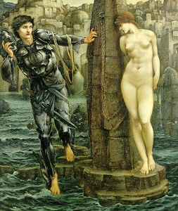

  
[Intangible Textual Heritage](../../../index)  [Legends &
Sagas](../../index)  [William Morris](../index) 

------------------------------------------------------------------------

[Buy this Book at
Amazon.com](https://www.amazon.com/exec/obidos/ASIN/0543771660/internetsacredte)

------------------------------------------------------------------------

<table width="75%">
<colgroup>
<col style="width: 50%" />
<col style="width: 50%" />
</colgroup>
<tbody>
<tr class="odd">
<td width="50%" data-valign="TOP"></td>
<td width="50%" data-valign="CENTER"><h1 id="the-earthly-paradise" data-align="CENTER">The Earthly Paradise</h1>
<h5 id="march-august" data-align="CENTER">March-August</h5>
<h2 id="by-william-morris" data-align="CENTER">by William Morris</h2>
<h4 id="section" data-align="CENTER">[1868]</h4></td>
</tr>
</tbody>
</table>

------------------------------------------------------------------------

[Contents](#contents)    [Start Reading](ep100)

------------------------------------------------------------------------

**March-August** \|  [September-November](../ep2/index) \| 
[December-February](../ep3/index)

------------------------------------------------------------------------

|                                                                                                                           |
|---------------------------------------------------------------------------------------------------------------------------|
|  |

*The ceaseless tumbling of the billows grey,  
The white upspringing of the spurts of spray*--p. 633

This is the first part of a three part etext of William Morris'
epic-length poem, The Earthly Paradise. The work is a sequence of 24
framed episodes (two per 'month') each with its own story, rather than
one long narrative with a complicated cast. This invites browsing, as it
is easy to drop in and read a complete story in one sitting. The entire
poem is written in colloquial modern English with a few archaicisms.
Morris draws from European mythology and folklore, particularly
Classical mythology and the world of the fairytale.

In fact, the most complicated thing about this poem is its publishing
history. There were two, three, and six volume editions, by both English
and American publishers, (some of them pirated). However, it appears
that the text of the poem is fairly standard across editions. For this
first portion, I used an 1868 American printing which has the first six
months in one volume. Forthcoming are the final six months in two
separate volumes.

------------------------------------------------------------------------

 [Title Page and Front Matter](ep100)  
[A Table of Contents](ep101)  
[An Apology](ep102)  
[Prologue—The Wanderers](ep103)  
[To The Reader](ep104)  

### March

[Introduction](ep105)  
[Atalanta's Race](ep106)  
[The Man Born to be King](ep107)  

### April

[Introduction](ep108)  
[The Doom of King Acrisius](ep109)  
[The Proud King](ep110)  

### May

[Introduction](ep111)  
[The Story of Cupid and Psyche](ep112)  
[The Writing on the Image](ep113)  

### June

[Introduction](ep114)  
[The Love of Alcestis](ep115)  
[The Lady of the Land](ep116)  

### July

[Introduction](ep117)  
[The Son of Crœsus](ep118)  
[The Watching of the Falcon](ep119)  

### August

[Introduction](ep120)  
[Pygmalion and the Image](ep121)  
[Ogier the Dane](ep122)  

 

[End Matter](ep123)  
