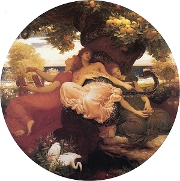

  
[Intangible Textual Heritage](../../../index)  [Legends &
Sagas](../../index)  [William Morris](../index) 

------------------------------------------------------------------------

[Buy this Book at
Amazon.com](https://www.amazon.com/exec/obidos/ASIN/1402184670/internetsacredte)

------------------------------------------------------------------------

<table width="75%">
<colgroup>
<col style="width: 50%" />
<col style="width: 50%" />
</colgroup>
<tbody>
<tr class="odd">
<td width="50%" data-valign="TOP"></td>
<td width="50%" data-valign="CENTER"><h1 id="the-earthly-paradise" data-align="CENTER">The Earthly Paradise</h1>
<h5 id="september-november" data-align="CENTER">September-November</h5>
<h2 id="by-william-morris" data-align="CENTER">by William Morris</h2>
<h4 id="section" data-align="CENTER">[1870]</h4></td>
</tr>
</tbody>
</table>

------------------------------------------------------------------------

[Contents](#contents)    [Start Reading](ep200)

------------------------------------------------------------------------

[March-August](../ep1/index) \|  **September-November** \| 
[December-February](../ep3/index)

------------------------------------------------------------------------

|                                                                                                                           |
|---------------------------------------------------------------------------------------------------------------------------|
|  |

This is the second part of a three part etext of William Morris'
epic-length poem, The Earthly Paradise. In this portion, Morris expands
his scope from classical mythology into the Near East with The Man who
never laughed again, and the Northern realm with the extended The Lovers
of Gudrun, a retelling of an episode from the Icelandic [Laxdaela
Saga](../../ice/lax/index), and East of the Moon, West of the Sun.

Confusingly, this is actually part III of the original edition (the
first volume was considered part I and II).

------------------------------------------------------------------------

 [Title Page](ep200)  
[Contents](ep201)  

### September

[Introduction](ep202)  
[The Death of Paris](ep203)  
[The Land East of the Sun and West of the Moon](ep204)  

### October

[Introduction](ep205)  
[The Story of Accontius and Cydippe](ep206)  
[The Man Who Never Laughed Again](ep207)  

### November

[Introduction](ep208)  
[The Story of Rhodope](ep209)  

### The Lovers of Gudrun

[Of Herdholt and Bathstead](ep210)  
[The Prophecy of Guest the Wise](ep211)  
[Gudrun twice Wedded, Widowed and Wooed of Kiartan](ep212)  
[The Dealings of King Olaf Tryggvison with the Icelanders](ep213)  
[Bodli brings Tidings to Bathstead](ep214)  
[Kiartan's Farewell to Norway](ep215)  
[Kiartan back in Iceland; Refna comes into the Tale](ep216)  
[Tidings brought to Bathstead of Kiartan's coming back](ep217)  
[Kiartan weds Refna](ep218)  
[The Sword comes back without the Scabbard](ep219)  
[The Stealing of the Coif](ep220)  
[Refna hears Women talking](ep221)  
[Kiartan fetches the price of the Coif from Bathstead](ep222)  
[Thorhalla tells of Kiartan's Comings and Goings](ep223)  
[The Slaying of Kiartan Olafson](ep224)  
[Kiartan brought dead to Bathstead](ep225)  
[What Folk did at Herdholt after the Slaying](ep226)  
[Gudrun's deeming of the Men who loved her.](ep227)  

 

[Advertisements from Original Edition](ep228)  
