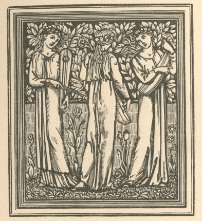

  
[Intangible Textual Heritage](../../../index)  [Legends &
Sagas](../../index)  [William Morris](../index)  [Index](index) 
[Previous](ep311)  [Next](ep313) 

------------------------------------------------------------------------

[Buy this Book at
Amazon.com](https://www.amazon.com/exec/obidos/ASIN/1402184662/internetsacredte)

------------------------------------------------------------------------

*The Earthly Paradise, (December-February)*, by William Morris,
\[1870\], at Intangible Textual Heritage

------------------------------------------------------------------------

p. 438

### L’ENVOI.

*HERE are we for the last time face to face,  
Thou and I, Book, before I bid thee speed  
Upon thy perilous journey to that place  
For which I have done on thee pilgrim's weed,  
Striving to get thee all things for thy need—  
—I love thee, whatso time or men may say  
Of the poor singer of an empty day.*

*   Good reason why I love thee, e’en if thou  
Be mocked or clean forgot as time wears on;  
For ever as thy fashioning did grow,  
Kind word and praise because of thee I won  
From those without whom were my world all gone,  
My hope fallen dead, my singing cast away,  
And I set soothly in an empty day.*

*   I love thee; yet this last time must it be  
That thou must hold thy peace and I must speak,  
Lest if thou babble I begin to see  
Thy gear too thin, thy limbs and heart too weak,  
To find the land thou goest forth to seek—  
—Though what harm if thou die upon the way,  
Thou idle singer of an empty day?* p. 439

*   But though this land desired thou never reach,  
Yet folk who know it mayst thou meet or death;  
Therefore a word unto thee would I teach  
To answer these, who, noting thy weak breath,  
Thy wandering eyes, thy heart of little faith,  
May make thy fond desire a sport and play,  
Mocking the singer of an empty day.*

*   That land's name, say’st thou? and the road thereto?  
Nay, Book, thou mockest, saying thou know’st it not;  
Surely no book of verse I ever knew  
But ever was the heart within him hot  
To gain the Land of Matters Unforgot—  
—There, now we both laugh—as the whole world may,  
At us poor singers of an empty day.*

*   Nay, let it pass, and hearken! Hast thou heard  
That therein I believe I have a friend,  
Of whom for love I may not be afeard?  
It is to him indeed I bid thee wend;  
Yea, he perchance may meet thee ere thou end,  
Dying so far off from the hedge of bay,  
Thou idle singer of an empty day!*

*   Well, think of him, I bid thee, on the road,  
And if it hap that midst of thy defeat,  
Fainting beneath thy follies’ heavy load,  
My Master, GEOFFRY CHAUCER, thou do meet,  
Then shalt thou win a space of rest full sweet;* p.
440  
*Then be thou bold, and speak the words I say,  
The idle singer of an empty day!*

*   "O Master, O thou great of heart and tongue,  
Thou well mayst ask me why I wander here,  
In raiment rent of stories oft besung!  
But of thy gentleness draw thou anear,  
And then the heart of one who held thee dear  
Mayst thou behold! So near as that I lay  
Unto the singer of an empty day.*

*   "For this he ever said, who sent me forth  
To seek a place amid thy company;  
That howsoever little was my worth,  
Yet was he worth e’en just so much as I;  
He said that rhyme hath little skill to lie;  
Nor feigned to cast his worser part away  
In idle singing for an empty day.*

*   "I have beheld him tremble oft enough  
At things he could not choose but trust to me,  
Although he knew the world was wise and rough:  
And never did he fail to let me see  
His love, his folly and faithlessness, maybe;  
And still in turn I gave him voice to pray  
Such prayers as cling about an empty day.*

*   "Thou, keen-eyed, reading me, mayst read him through,  
For surely little is there left behind;* p.
441  
*No power great deeds unnameable to do;  
No knowledge for which words he may not find;  
No love of things as vague as autumn wind—  
—Earth of the earth lies hidden by my clay,  
The idle singer of an empty day!*

*   "Children we twain are, saith he, late made wise  
In love, but in all else most childish still,  
And seeking still the pleasure of our eyes,  
And what our ears with sweetest sounds may fill;  
Not fearing Love, lest these things he should kill;  
Howe’er his pain by pleasure doth he lay,  
Making a strange tale of an empty day.*

*   "Death have we hated, knowing not what it meant;  
Life have we loved, through green leaf and through sere,  
Though still the less we knew of its intent:  
The Earth and Heaven through countless year on year,  
Slow changing, were to us but curtains fair,  
Hung round about a little room, where play  
Weeping and laughter of man's empty day.*

*   "O Master, if thine heart could love us yet,  
Spite of things left undone, and wrongly done,  
Some place in loving hearts then should we get,  
For thou, sweet-souled, didst never stand alone,  
But knew’st the joy and woe of many an one —  
—By lovers dead, who live through thee, we pray,  
Help thou us singers of an empty day!" p.
442*

*   Fearest thou, Book, what answer thou mayst gain  
Lest he should scorn thee, and thereof thou die?  
Nay, it shall not be.—Thou mayst toil in vain,  
And never draw the House of Fame anigh;  
Yet he and his shall know whereof we cry,  
Shall call it not ill done to strive to lay  
The ghosts that crowd about life's empty day.*

*   Then let the others go! and if indeed  
In some old garden thou and I have wrought,  
And made fresh flowers spring up from hoarded seed,  
And fragrance of old days and deeds have brought  
Back to folk weary; all was not for nought.  
—No little part it was for me to play—  
The idle singer of an empty day*.

 

 

 

THE END.

 

 

 

LONDON:  
Printed by STRANGEWAYS AND WALDEN Castle St. Leicester Sq.

 

p. 443

 

------------------------------------------------------------------------

[Next: Advertisements and End Matter](ep313)
