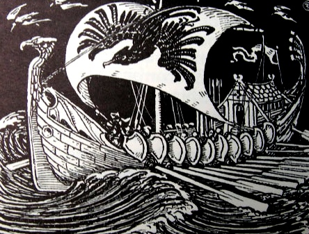

  
[Intangible Textual Heritage](../../../index)  [Legends and
Sagas](../../index)  [William Morris](../index) 

------------------------------------------------------------------------

<table width="75%">
<colgroup>
<col style="width: 50%" />
<col style="width: 50%" />
</colgroup>
<tbody>
<tr class="odd">
<td width="50%" data-valign="TOP"></td>
<td width="50%" data-valign="CENTER"><h1 id="the-story-of-the-glittering-plain" data-align="CENTER">The Story of the Glittering Plain</h1>
<h2 id="by-william-morris" data-align="CENTER">by William Morris</h2>
<h4 id="section" data-align="CENTER">[1891]</h4></td>
</tr>
</tbody>
</table>

------------------------------------------------------------------------

[Contents](#contents)    [Start Reading](sglt00)    [Text
\[Zipped\]](sglt.txt.gz)

------------------------------------------------------------------------

This fantasy novel by William Morris is the tale of the quest of
Hallblithe to rescue his fiance from pirates. He finally catches up with
her in the utopian Land of the Glittering Plain. This locale is also
known as the Land of the Living Men, inhabitants of which are immortal.

------------------------------------------------------------------------

 [Title Page](sglt00)  
[Contents](sglt01)  
[Chapter I. Of Those Three Who Came to the House of the Raven](sglt02)  
[Chapter II. Evil Tidings Come to Hand at Cleveland](sglt03)  
[Chapter III. The Warriors of the Raven Search the Seas](sglt04)  
[Chapter IV. Now Hallblithe Taketh the Sea](sglt05)  
[Chapter V. They Come unto the Isle of Ransom](sglt06)  
[Chapter VI. Of A Dwelling of Man on the Isle of Ransom](sglt07)  
[Chapter VII. A Feast in the Isle of Ransom](sglt08)  
[Chapter VIII. Hallblithe Taketh Ship Again Away from the Isle of
Ransom](sglt09)  
[Chapter IX. They Come to the Land of the Glittering Plain](sglt10)  
[Chapter X. They Hold Converse with Folk of the Glittering
Plain](sglt11)  
[Chapter XI. The Sea-Eagle Reneweth His Life](sglt12)  
[Chapter XII. They Look on the King of the Glittering Plain](sglt13)  
[Chapter XIII. Hallblithe Beholdeth the Woman who Loveth Him](sglt14)  
[Chapter XIV. Hallblithe has Speech with the King Again](sglt15)  
[Chapter XV. Yet Hallblithe Speaketh with the King](sglt16)  
[Chapter XVI. Those Three Go Their Ways to the Edge of the Glittering
Plain](sglt17)  
[Chapter XVII. Hallblithe Amongst the Mountains](sglt18)  
[Chapter XVIII. Hallblithe Dwelleth in the Wood Alone](sglt19)  
[Chapter XIX. Hallblithe Builds Him A Skiff](sglt20)  
[Chapter XX. So Now Saileth Hallblithe Away From the Glittering
Plain](sglt21)  
[Chapter XXI. Of the Fight of the Champions in the Hall of the
Ravagers](sglt22)  
[Chapter XXII. They go from the Isle of Ransom and Come to Cleveland by
the Sea](sglt23)  
