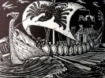

  
[Intangible Textual Heritage](../../../index)  [Legends and
Sagas](../../index)  [William Morris](../index)  [Index](index) 
[Previous](sglt14)  [Next](sglt16) 

------------------------------------------------------------------------

  
*The Story of the Glittering Plain*, by William Morris, \[1891\], at
Intangible Textual Heritage

------------------------------------------------------------------------

CHAPTER XIV: HALLBLITHE HAS SPEECH WITH THE KING AGAIN

He stood up when he had made an end, as a man ready for the road; but
they lay there downcast and abashed, and had no words to answer him. For
the Sea-eagle was sorry that his faring-fellow was hapless, and was
sorry that he was sorry; and as for the damsel, she had not known but
that she was leading the goodly Spearman to the fulfilment of his
heart's desire.  Albeit after a while she spake again and said:

"Dear friends, day is gone and night is at hand; now to-night it were
ill lodging at yonder house; and the next house on our backward road is
over far for wayworn folk.  But hard by through the thicket is a fair
little wood-lawn, by the lip of a pool in the stream wherein we may
bathe us to-morrow morning; and it is grassy and flowery and sheltered
from all winds that blow, and I have victual enough in my wallet.  Let
us sup and rest there under the bare heaven, as oft is the wont of us in
this land; and on the morrow early we will arise and get us back again
to Wood-end, where yet the King abideth, and there shalt thou talk to
him again, O Spearman."

Said Hallblithe:  "Take me whither ye will; but now nought availeth. I
am a captive in a land of lies, and here most like shall I live betrayed
and die hapless."

"Hold thy peace, dear friend, of such words as those last," said she,
"or I must needs flee from thee, for they hurt me sorely.  Come now to
this pleasant place."

She took him by the hand and looked kindly on him, and the Sea-eagle
followed him, murmuring an old song of the harvest-field, and they went
together by a path through a thicket of white-thorn till they came unto
a grassy place.  There then they sat them down, and ate and drank what
they would, sitting by the lip of the pool till a waning moon was bright
over their heads.  And Hallblithe made no semblance of content; but the
Sea-eagle and his damsel were grown merry again, and talked and sang
together like autumn stares, with the kissing and caressing of lovers.

So at last those twain lay down amongst the flowers, and slept in each
other's arms; but Hallblithe betook him to the brake a little aloof, and
lay down, but slept not till morning was at hand, when slumber and
confused dreams overtook him.

He was awaked from his sleep by the damsel, who came pushing through the
thicket all fresh and rosy from the river, and roused him, and said:

"Awake now, Spearman, that we may take our pleasure in the sun; for he
is high in the heavens now, and all the land laughs beneath him."

Her eyes glittered as she spoke, and her limbs moved under her raiment
as though she would presently fall to dancing for very joy. But
Hallblithe arose wearily, and gave her back no smile in answer, but
thrust through the thicket to the water, and washed the night from off
him, and so came back to the twain as they sat dallying together over
their breakfast.  He would not sit down by them, but ate a morsel of
bread as he stood, and said:  "Tell me how I can soonest find the King: 
I bid you not lead me thither, but let me go my ways alone.  For with me
time presses, and with you meseemeth time is nought.  Neither am I a
meet fellow for the happy."

But the Sea-eagle sprang up, and swore with a great oath that he would
nowise leave his shipmate in the lurch.  And the damsel said: "Fair man,
I had best go with thee; I shall not hinder thee, but further thee
rather, so that thou shalt make one day's journey of two."

And she put forth her hand to him, and caressed him smiling, and fawned
upon him, and he heeded it little, but hung not aback from them since
they were ready for the road:  so they set forth all three together.

They made such diligence on the backward road that the sun was not set
by then they came to Wood-end; and there was the King sitting in the
door of his pavilion.  Thither went Hallblithe straight, and thrust
through the throng, and stood before the King; who greeted him kindly,
and was no less sweet of face than on that other day.

Hallblithe hailed him not, but said:  "King, look on my anguish, and if
thou art other than a king of dreams and lies, play no longer with me,
but tell me straight out if thou knowest of my troth-plight maiden,
whether she is in this land or not."

Then the King smiled on him and said:  "True it is that I know of her;
yet know I not whether she is in this land or not."

"King," said Hallblithe, "wilt thou bring us together and stay my
heart's bleeding?"

Said the King:  "I cannot, since I know not where she is."

"Why didst thou lie to me the other day?" said Hallblithe.

"I lied not," said the King; "I bade bring thee to the woman that loved
thee, and whom thou shouldst love; and that is my daughter. And look
thou!  Even as I may not bring thee to thine earthly love, so couldst
thou not make thyself manifest before my daughter, and become her
deathless love.  Is it not enough?"

He spake sternly for all that he smiled, and Hallblithe said:  "O King,
have pity on me!"

"Yea," said the King; "pity thee I do:  but I will live despite thy
sorrow; my pity of thee shall not slay me, or make thee happy.  Even in
such wise didst thou pity my daughter."

Said Hallblithe:  "Thou art mighty, O King, and maybe the mightiest.
Wilt thou not help me?"

"How can I help thee?" said the King, "thou who wilt not help thyself. 
Thou hast seen what thou shouldst do:  do it then and be holpen."

Then said Hallblithe:  "Wilt thou not slay me, O King, since thou wilt
not do aught else?"

"Nay," said the King, "thy slaying wilt not serve me nor mine:  I will
neither help nor hinder.  Thou art free to seek thy love wheresoever
thou wilt in this my realm.  Depart in peace!"

Hallblithe saw that the King was angry, though he smiled upon him; yet
so coldly, that the face of him froze the very marrow of Hallblithe's
bones:  and he said within himself:  "This King of lies shall not slay
me, though mine anguish be hard to bear:  for I am alive, and it may be
that my love is in this land, and I may find her here, and how to reach
another land I know not."

So he turned from before the face of the King as the sun was setting,
and he went down the land southward betwixt the mountains and the sea,
not heeding whether it were night or day; and he went on till it was
long past midnight, and then for mere weariness laid him down under a
tree, not knowing where he was, and fell asleep.

And in the morning he woke up to the bright sun, and found folk standing
round about him, both men and women, and their sheep were anigh them,
for they were shepherd folk.  So when they saw that he was awake, they
greeted him, and were blithe with him and made much of him:  and they
took him home to their house, and gave him to eat and to drink, and
asked him what he would that they might serve him. And they seemed to
him to be kind and simple folk, and though he loathed to speak the
words, so sick at heart he was, yet he told them how he was seeking his
troth-plight maiden, his earthly love, and asked them to say if they had
seen any woman like her.

They heard him kindly and pitied him, and told him how they had heard of
a woman in the land, who sought her beloved even as he sought his. And
when he heard that, his heart leapt up, and he asked them to tell him
more concerning this woman.  Then they said that she dwelt in the
hill-country in a goodly house, and had set her heart on a lovely man,
whose image she had seen in a book, and that no man but this one would
content her; and this, they said, was a sad and sorry matter, such as
was unheard of hitherto in the land.

So when Hallblithe heard this, as heavily as his heart fell again, he
changed not countenance, but thanked the kind folk and departed, and
went on down the land betwixt the mountains and the sea, and before
nightfall he had been into three more houses of folk, and asked there of
all comers concerning a woman who was sundered from her beloved; and at
none of them gat he any answer to make him less sorry than yesterday. 
At the last of the three he slept, and on the morrow early there was the
work to begin again; and the next day was the same as the last, and the
day after differed not from it.  Thus he went on seeking his beloved
betwixt the mountains and the plain, till the great rock-wall came down
to the side of the sea and made an end of the Glittering Plain on that
side.  Then he turned about and went back by the way he had come, and up
the country betwixt the mountains and the plain northward, until he had
been into every house of folk in those parts and asked his question.

Then he went up into that fair country of the dales, and even anigh to
where dwelt the King's Daughter, and otherwhere in the land and
everywhere, quartering the realm of the Glittering Plain as the heron
quarters the flooded meadow when the waters draw aback into the river. 
So that now all people knew him when he came, and they wondered at him;
but when he came to any house for the third or fourth time, they wearied
of him, and were glad when he departed.

Ever it was one of two answers that he had:  either folk said to him,
"There is no such woman; this land is happy, and nought but happy people
dwell herein;" or else they told him of the woman who lived in sorrow,
and was ever looking on a book, that she might bring to her the man whom
she desired.

Whiles he wearied and longed for death, but would not die until there
was no corner of the land unsearched.  Whiles he shook off weariness,
and went about his quest as a craftsman sets about his work in the
morning.  Whiles it irked him to see the soft and merry folk of the
land, who had no skill to help him, and he longed for the house of his
fathers and the men of the spear and the plough; and thought, "Oh, if I
might but get me back, if it were but for an hour and to die there, to
the meadows of the Raven, and the acres beneath the mountains of
Cleveland by the Sea.  Then at least should I learn some tale of what is
or what hath been, howsoever evil the tidings were, and not be bandied
about by lies for ever."

------------------------------------------------------------------------

[Next: Chapter XV. Yet Hallblithe Speaketh with the King](sglt16)

