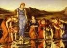

  
[Intangible Textual Heritage](../../../index)  [Legends and
Sagas](../../index)  [William Morris](../index)  [Index](index) 
[Previous](sunf00)  [Next](sunf02) 

------------------------------------------------------------------------

  
*The Sundering Flood*, by William Morris, \[1897\], at Intangible
Textual Heritage

------------------------------------------------------------------------

CONTENTS

[Map of the World of the Sundering Flood](sunf02.htm#an_fmap)

[Chapter I. Of a River Called the Sundering Flood, and of the Folk that
Dwelt Thereby](sunf03.htm#an_f01)

[Chapter II. Of Wethermel and the Child Osberne](sunf04.htm#an_f02)

[Chapter III. Wolves Harry the Flock](sunf05.htm#an_f03)

[Chapter IV. Surly John Falls Out with the Goodman](sunf06.htm#an_f04)

[Chapter V. Osberne Slays the Wolves](sunf07.htm#an_f05)

[Chapter VI. They Fare to the Cloven Mote](sunf08.htm#an_f06)

[Chapter VII. Of a Newcomer, and His Gift to Osberne](sunf09.htm#an_f07)

[Chapter VIII. The Goodman Gets a New Hired Man](sunf10.htm#an_f08)

[Chapter IX. The Bight of the Cloven Knoll](sunf11.htm#an_f09)

[Chapter X. Osberne and Elfhild Hold Converse
Together](sunf12.htm#an_f10)

[Chapter XI. Osberne Shoots a Gift Across the Flood](sunf13.htm#an_f11)

[Chapter XII. Of a Guest Called Waywearer](sunf14.htm#an_f12)

[Chapter XIII. Steelhead Gives Osberne the Sword
Boardcleaver](sunf15.htm#an_f13)

[Chapter XIV. The Gifts of Steelhead](sunf16.htm#an_f14)

[Chapter XV. Surly John Brings a Guest to Wethermel](sunf17.htm#an_f15)

[Chapter XVI. Hardcastle Would Seize Wethermel](sunf18.htm#an_f16)

[Chapter XVII. The Slaying of Hardcastle](sunf19.htm#an_f17)

[Chapter XVIII. Elfhild Hears of the Slaying](sunf20.htm#an_f18)

[Chapter XIX. The Winter Passes and Elfhild Tells of the Death of Her
Kinswoman](sunf21.htm#an_f19)

[Chapter XX. Osberne Fares to Eastcheaping and Brings Gifts for
Elfhild](sunf22.htm#an_f20)

[Chapter XXI. Warriors from Eastcheaping Ride into the
Dale](sunf23.htm#an_f21)

[Chapter XXII. Osberne Takes Leave of Elfhild](sunf24.htm#an_f22)

[Chapter XXIII. Osberne Is Chosen Captain of the
Dalesmen](sunf25.htm#an_f23)

[Chapter XXIV. A Skirmish with the Baron of Deepdale in the
Marshes](sunf26.htm#an_f24)

[Chapter XXV. Stephen Tells of an Adventure in the Camp of the
Foemen](sunf27.htm#an_f25)

[Chapter XXVI. They Bring the Baron into
Eastcheaping](sunf28.htm#an_f26)

[Chapter XXVII. They Parley from the Walls](sunf29.htm#an_f27)

[Chapter XXVIII. The Baron of Deepdale Makes Peace](sunf30.htm#an_f28)

[Chapter XXIX. Osberne and His Men Return to
Wethermel](sunf31.htm#an_f29)

[Chapter XXX. Osberne Goes to the Trysting-Place](sunf32.htm#an_f30)

[Chapter XXXI. They Meet Through Autumn and Winter](sunf33.htm#an_f31)

[Chapter XXXII. Foemen Among the West Dalers](sunf34.htm#an_f32)

[Chapter XXXIII. Osberne Seeks Tidings of Elfhild](sunf35.htm#an_f33)

[Chapter XXXIV. Osberne Sorrows for the Loss of
Elfhild](sunf36.htm#an_f34)

[Chapter XXXV. Osberne Seeks Counsel of Steelhead](sunf37.htm#an_f35)

[Chapter XXXVI. The Staves which Osberne Taught to the
Dalesmen](sunf38.htm#an_f36)

[Chapter XXXVII. Osberne Takes Leave of Wethermel](sunf39.htm#an_f37)

[Chapter XXXVIII. Osberne Parts from Stephen the
Eater](sunf40.htm#an_f38)

[Chapter XXXIX. Osberne Gets Him a New Master](sunf41.htm#an_f39)

[Chapter XL. Osberne Rides with Sir Godrick](sunf42.htm#an_f40)

[Chapter XLI. They Joust with the Knight of the Fish](sunf43.htm#an_f41)

[Chapter XLII. They Deliver the Thorp-Dwellers from the Black
Skinners](sunf44.htm#an_f42)

[Chapter XLIII. They Come to the Edge of the Wood
Masterless](sunf45.htm#an_f43)

[Chapter XLIV. They Reach Longshaw and Osberne Gets Him a New
Name](sunf46.htm#an_f44)

[Chapter XLV. The Red Lad Scatters the Host of the
Barons](sunf47.htm#an_f45)

[Chapter XLVI. Osberne Enters the City of the Sundering
Flood](sunf48.htm#an_f46)

[Chapter XLVII. The Battle in the Square](sunf49.htm#an_f47)

[Chapter XLVIII. Sir Godrick Is Chosen Burgreve of the
City](sunf50.htm#an_f48)

[Chapter XLIX. Of the City King and the Outland King](sunf51.htm#an_f49)

[Chapter L. The Red Lad Speaks Privily with Sir
Godrick](sunf52.htm#an_f50)

[Chapter LI. Osberne is Beguiled by Felons](sunf53.htm#an_f51)

[Chapter LII. The Meeting of Osberne and Elfhild](sunf54.htm#an_f52)

[Chapter LIII. Strangers Come to Wethermel](sunf55.htm#an_f53)

[Chapter LIV. The Carline Beginneth Her Tale](sunf56.htm#an_f54)

[Chapter LV. The Blue Knight Buys the Maiden of the
Chapman](sunf57.htm#an_f55)

[Chapter LVI. The Blue Knight Talks with the Maiden by the
Way](sunf58.htm#an_f56)

[Chapter LVII. They Come to Brookside](sunf59.htm#an_f57)

[Chapter LVIII. Peaceful Days in the Castle of
Brookside](sunf60.htm#an_f58)

[Chapter LIX. Tidings of Longshaw and of the Hosting of the Barons'
League](sunf61.htm#an_f59)

[Chapter LX. The Blue Knight Gathers Men and Departs from
Brookside](sunf62.htm#an_f60)

[Chapter LXI. The Maiden and the Carline Flee to the Grey
Sisters](sunf63.htm#an_f61)

[Chapter LXII. They Fall in with Three Chapmen](sunf64.htm#an_f62)

[Chapter LXIII. They Escape from the Chapmen by the Carline's
Wizardry](sunf65.htm#an_f63)

[Chapter LXIV. The Carline Endeth Her Tale](sunf66.htm#an_f64)

[Chapter LXV. Osberne and Elfhild Make Themselves Known to Their
People](sunf67.htm#an_f65)

[Chapter LXVI. The Lip of the Sundering Flood](sunf68.htm#an_f66)

[Chapter LXVII. A Friend at Need](sunf69.htm#an_f67)

[Chapter LXVIII. The Knight of Longshaw Gathereth
Force](sunf70.htm#an_f68)

------------------------------------------------------------------------

[Next: Map](sunf02)

