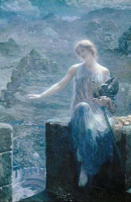

  
[Intangible Textual Heritage](../../../index)  [Legends and
Sagas](../../index)  [William Morris](../index) 

------------------------------------------------------------------------

<table width="75%">
<colgroup>
<col style="width: 50%" />
<col style="width: 50%" />
</colgroup>
<tbody>
<tr class="odd">
<td width="50%" data-valign="TOP"></td>
<td width="50%" data-valign="CENTER"><h1 id="the-house-of-the-wolfings" data-align="CENTER">The House of the Wolfings</h1>
<h2 id="by-william-morris" data-align="CENTER">by William Morris</h2>
<h4 id="section" data-align="CENTER">[1889]</h4></td>
</tr>
</tbody>
</table>

------------------------------------------------------------------------

[Contents](#contents)    [Start Reading](thow00)    [Text
\[Zipped\]](thow.txt.gz)

------------------------------------------------------------------------

This is one of William Morris' fantasy books, set in the world of the
ancient Germanic Gothic tribes. J.R.R. Tolkien acknowledged the literary
influence of this book, as well as [The Roots of the
Mountains](../rotm/index), published in the same year. In this book,
Morris' Goths live in a land called the Mark on a river in the forest of
Mirkwood, in ancent Germany. They worship the Germanic gods Tyr and Odin
by horse-sacrifice. Morris' Goths have shamans who can see the future.
They repel an invasion by the Romans, led by a war leader with a
mysterious piece of cursed dwarf-forged armor.

------------------------------------------------------------------------

 [Title Page](thow00)  
[Contents](thow01)  
[Chapter I—The Dwellings of Mid-Mark](thow02)  
[Chapter II—The Flitting of the War-Arrow](thow03)  
[Chapter III—Thiodolf Talketh with the Wood-Sun](thow04)  
[Chapter Iv—The House Fareth to the War](thow05)  
[Chapter V—Concerning the Hall-Sun](thow06)  
[Chapter VI—They Talk on the Way to the Folk-Thing](thow07)  
[Chapter VII—They Gather to the Folk-Mote](thow08)  
[Chapter VIII—The Folk-Mote of the Markmen](thow09)  
[Chapter IX—The Ancient Man of the Daylings](thow10)  
[Chapter X—That Carline Cometh to the Roof of the Wolfings](thow11)  
[Chapter XI—The Hall-Sun Speaketh](thow12)  
[Chapter XII—Tidings of the Battle in Mirkwood](thow13)  
[Chapter XIII—The Hall-Sun Saith Another Word](thow14)  
[Chapter XIV—The Hall-Sun is Careful Concerning the Passes of the
Wood](thow15)  
[Chapter XV—They Hear Tell of the Battle on the Ridge](thow16)  
[Chapter XVI—How the Dwarf-Wrought Hauberk Was Brought Away From the
Hall of the Daylings](thow17)  
[Chapter XVII—The Wood-Sun Speaketh With Thiodolf](thow18)  
[Chapter XVIII—Tidings Brought to the Wain-Burg](thow19)  
[Chapter XIX—Those Messengers Come to Thiodolf](thow20)  
[Chapter XX—Otter and His Folk Come into Mid-Mark](thow21)  
[Chapter XXI—They Bicker About the Ford](thow22)  
[Chapter XXII—Otter Falls on Against his Will](thow23)  
[Chapter XXIII—Thiodolf Meeteth the Romans in the Wolfing
Meadow](thow24)  
[Chapter XXIV—The Goths are Overthrown by the Romans](thow25)  
[Chapter XXV—The Host of the Markmen Cometh into the
Wild-Wood](thow26)  
[Chapter XXVI—Thiodolf Talketh with the Wood-Sun](thow27)  
[Chapter XXVII—They Wend to the Morning Battle](thow28)  
[Chapter XXVIII—Of the Storm of Dawning](thow29)  
[Chapter XXI—Of Thiodolf's Storm](thow30)  
[Chapter XXX—Thiodolf is Borne out of the Hall and Otter is Laid Beside
Him](thow31)  
[Chapter XXXI—Old Asmund Speaketh Over the War-Dukes: the Dead are Laid
in Mound](thow32)  
