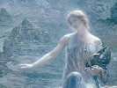

  
[Intangible Textual Heritage](../../../index)  [Legends and
Sagas](../../index)  [William Morris](../index)  [Index](index) 
[Previous](thow26)  [Next](thow28) 

------------------------------------------------------------------------

  
*The House of the Wolfings*, by William Morris, \[1889\], at Intangible
Textual Heritage

------------------------------------------------------------------------

CHAPTER XXVI—THIODOLF TALKETH WITH THE WOOD-SUN

Now were Thiodolf and the Hall-Sun left alone together standing by the
Speech-Hill; and the moon was risen high in the heavens above the tree-
tops of the wild-wood.  Thiodolf scarce stirred, and he still held his
head bent down as one lost in thought.

Then said the Hall-Sun, speaking softly amidst the hush of the camp:

"I have said that the minutes of this night are dear, and they are
passing swiftly; and it may be that thou wilt have much to say and to do
before the host is astir with the dawning.  So come thou with me a
little way, that thou mayst hear of new tidings, and think what were
best to do amidst them."

And without more ado she took him by the hand and led him forth, and he
went as he was led, not saying a word.  They passed out of the camp into
the wood, none hindering, and went a long way where under the
beech-leaves there was but a glimmer of the moonlight, and presently
Thiodolf's feet went as it were of themselves; for they had hit a path
that he knew well and over-well.

So came they to that little wood-lawn where first in this tale Thiodolf
met the Wood-Sun; and the stone seat there was not empty now any more
than it was then; for thereon sat the Wood-Sun, clad once more in her
glittering raiment.  Her head was sunken down, her face hidden by her
hands; neither did she look up when she heard their feet on the grass,
for she knew who they were.

Thiodolf lingered not; for a moment it was to him as if all that past
time had never been, and its battles and hurry and hopes and fears but
mere shows, and the unspoken words of a dream.  He went straight up to
her and sat down by her side and put his arm about her shoulders, and
strove to take her hand to caress it; but she moved but little, and it
was as if she heeded him not.  And the Hall-Sun stood before them and
looked at them for a little while; and then she fell to speech; but at
the first sound of her voice, it seemed that the Wood-Sun trembled, but
still she hid her face.  Said the Hall-Sun:

   "Two griefs I see before me in mighty hearts grown great;  
   And to change both these into gladness out-goes the power of fate.  
   Yet I, a lonely maiden, have might to vanquish one  
   Till it melt as the mist of the morning before the summer sun.  
   O Wood-Sun, thou hast borne me, and I were fain indeed  
   To give thee back thy gladness; but thou com'st of the Godhead's
seed,  
   And herein my might avails not; because I can but show  
   Unto these wedded sorrows the truth that the heart should know  
   Ere the will hath wielded the hand; and for thee, I can tell thee
nought  
   That thou hast not known this long while; thy will and thine hand
have wrought,  
   And the man that thou lovest shall live in despite of Gods and of
men,  
   If yet thy will endureth.  But what shall it profit thee then  
   That after the fashion of Godhead thou hast gotten thee a thrall  
   To be thine and never another's, whatso in the world may befall?  
   Lo! yesterday this was a man, and to-morrow it might have been  
   The very joy of the people, though never again it were seen;  
   Yet a part of all they hoped for through all the lapse of years,  
   To make their laughter happy and dull the sting of tears;  
   To quicken all remembrance of deeds that never die,  
   And death that maketh eager to live as the days go by.  
   Yea, many a deed had he done as he lay in the dark of the mound;  
   As the seed-wheat plotteth of spring, laid under the face of the
ground  
   That the foot of the husbandman treadeth, that the wind of the winter
wears,  
   That the turbid cold flood hideth from the constant hope of the
years.  
   This man that should leave in his death his life unto many an one  
   Wilt thou make him a God of the fearful who live lone under the
sun?  
   And then shalt thou have what thou wouldedst when amidst of the
hazelled field  
   Thou kissed'st the mouth of the helper, and the hand of the people's
shield,  
   Shalt thou have the thing that thou wouldedst when thou broughtest me
to birth,  
   And I, the soul of the Wolfings, began to look on earth?  
   Wilt thou play the God, O mother, and make a man anew,  
   A joyless thing and a fearful?  Then I betwixt you two,  
   'Twixt your longing and your sorrow will cast the sundering word,  
   And tell out all the story of that rampart of the sword!  
   I shall bid my mighty father make choice of death in life,  
   Or life in death victorious and the crowned end of strife."

Ere she had ended, the Wood-Sun let her hands fall down, and showed her
face, which for all its unpaled beauty looked wearied and anxious; and
she took Thiodolf's hand in hers, while she looked with eyes of love
upon the Hall-Sun, and Thiodolf laid his cheek to her cheek, and though
he smiled not, yet he seemed as one who is happy.  At last the Wood-Sun
spoke and said:

   "Thou sayest sooth, O daughter: I am no God of might,  
   Yet I am of their race, and I think with their thoughts and see with
their sight,  
   And the threat of the doom did I know of, and yet spared not to
lie:  
   For I thought that the fate foreboded might touch and pass us by,  
   As the sword that heweth the war-helm and cleaveth a cantle away,  
   And the cunning smith shall mend it and it goeth again to the fray;  
   If my hand might have held for a moment, yea, even against his
will,  
   The life of my beloved!  But Weird is the master still:  
   And this man's love of my body and his love of the ancient kin  
   Were matters o'er mighty to deal with and the game withal to win.  
   Woe's me for the waning of all things, and my hope that needs must
fade  
   As the fruitless sun of summer on the waste where nought is made!  
   And now farewell, O daughter, thou mayst not see the kiss  
   Of the hapless and the death-doomed when I have told of this;  
   Yet once again shalt thou see him, though I no more again,  
   Fair with the joy that hopeth and dieth not in vain."

Then came the Hall-Sun close to her, and knelt down by her, and laid her
head upon her knees and wept for love of her mother, who kissed her oft
and caressed her; and Thiodolf's hand strayed, as it were, on to his
daughter's head, and he looked kindly on her, though scarce now as if he
knew her.  Then she arose when she had kissed her mother once more, and
went her ways from that wood-lawn into the woods again, and so to the
Folk-mote of her people.

But when those twain were all alone again, the Wood-Sun spoke: "O
Thiodolf canst thou hear me and understand?"

"Yea," he said, "when thou speakest of certain matters, as of our love
together, and of our daughter that came of our love."

"Thiodolf," she said, "How long shall our love last?"

"As long as our life," he said.

"And if thou diest to-day, where then shall our love be?" said the Wood-
Sun.

He said, "I must now say, I wot not; though time was I had said, It
shall abide with the soul of the Wolfing Kindred."

She said: "And when that soul dieth, and the kindred is no more?"

"Time agone," quoth he, "I had said, it shall abide with the Kindreds of
the Earth; but now again I say, I wot not."

"Will the Earth hide it," said she, "when thou diest and art borne to
mound?"

"Even so didst thou say when we spake together that other night," said
he; "and now I may say nought against thy word."

"Art thou happy, O Folk-Wolf?" she said.

"Why dost thou ask me?" said he; "I know not; we were sundered and I
longed for thee; thou art here; it is enough."

"And the people of thy Kindred?" she said, "dost thou not long for
them?"

He said; "Didst thou not say that I was not of them?  Yet were they my
friends, and needed me, and I loved them: but by this evening they will
need me no more, or but little; for they will be victorious over their
foes: so hath the Hall-Sun foretold.  What then! shall I take all from
thee to give little to them?"

"Thou art wise," she said; "Wilt thou go to battle to-day?"

"So it seemeth," said he.

She said: "And wilt thou bear the Dwarf-wrought Hauberk? for if thou
dost, thou wilt live, and if thou dost not, thou wilt die."

"I will bear it," said he, "that I may live to love thee."

"Thinkest thou that any evil goes with it?" said she.

There came into his face a flash of his ancient boldness as he answered:
"So it seemed to me yesterday, when I fought clad in it the first time;
and I fell unsmitten on the meadow, and was shamed, and would have slain
myself but for thee.  And yet it is not so that any evil goes with it;
for thou thyself didst say that past night that there was no evil weird
in it."

She said: "How then if I lied that night?"

Said he; "It is the wont of the Gods to lie, and be unashamed, and men-
folk must bear with it."

"Ah! how wise thou art!" she said; and was silent for a while, and drew
away from him a little, and clasped her hands together and wrung them
for grief and anger.  Then she grew calm again, and said:

"Wouldest thou die at my bidding?"

"Yea," said he, "not because thou art of the Gods, but because thou hast
become a woman to me, and I love thee."

Then was she silent some while, and at last she said, "Thiodolf, wilt
thou do off the Hauberk if I bid thee?"

"Yea, yea," said he, "and let us depart from the Wolfings, and their
strife, for they need us not."

She was silent once more for a longer while still, and at last she said
in a cold voice; "Thiodolf, I bid thee arise, and put off the Hauberk
from thee."

He looked at her wondering, not at her words, but at the voice wherewith
she spake them; but he arose from the stone nevertheless, and stood
stark in the moonlight; he set his hand to the collar of the war-coat,
and undid its clasps, which were of gold and blue stones, and presently
he did the coat from off him and let it slide to the ground where it lay
in a little grey heap that looked but a handful.  Then he sat down on
the stone again, and took her hand and kissed her and caressed her
fondly, and she him again, and they spake no word for a while: but at
the last he spake in measure and rhyme in a low voice, but so sweet and
clear that it might have been heard far in the hush of the last hour of
the night:

   "Dear now are this dawn-dusk's moments as is the last of the light  
   When the foemen's ranks are wavering, and the victory feareth
night;  
   And of all the time I have loved thee of these am I most fain,  
   When I know not what shall betide me, nor what shall be my gain.  
   But dear as they are, they are waning, and at last the time is come  
   When no more shall I behold thee till I wend to Odin's Home.  
   Now is the time so little that once hath been so long  
   That I fain would ask thee pardon wherein I have done thee wrong,  
   That thy longing might be softer, and thy love more sweet to have.  
   But in nothing have I wronged thee, there is nought that I may
crave.  
   Strange too! as the minutes fail me, so do my speech-words fail,  
   Yet strong is the joy within me for this hour that crowns the tale."

Therewith he clipped her and caressed her, and she spake nothing for a
while; and he said; "Thy face is fair and bright; art thou not joyous of
these minutes?"

She said: "Thy words are sweet; but they pierce my heart like a sharp
knife; for they tell me of thy death and the ending of our love."

Said he; "I tell thee nothing, beloved, that thou hast not known: is it
not for this that we have met here once more?"

She answered after a while; "Yea, yea; yet mightest thou have lived."

He laughed, but not scornfully or bitterly and said:

"So thought I in time past: but hearken, beloved; If I fall to-day,
shall there not yet be a minute after the stroke hath fallen on me,
wherein I shall know that the day is won and see the foemen fleeing, and
wherein I shall once again deem I shall never die, whatever may betide
afterwards, and though the sword lieth deep in my breast?  And shall I
not see then and know that our love hath no end?"

Bitter grief was in her face as she heard him.  But she spake and said:
"Lo here the Hauberk which thou hast done off thee, that thy breast
might be the nearer to mine!  Wilt thou not wear it in the fight for my
sake?"

He knit his brows somewhat, and said:

"Nay, it may not be: true it is that thou saidest that no evil weird
went with it, but hearken!  Yesterday I bore it in the fight, and ere I
mingled with the foe, before I might give the token of onset, a cloud
came before my eyes and thick darkness wrapped me around, and I fell to
the earth unsmitten; and so was I borne out of the fight, and evil
dreams beset me of evil things, and the dwarfs that hate mankind.  Then
I came to myself, and the Hauberk was off me, and I rose up and beheld
the battle, that the kindreds were pressing on the foe, and I thought
not then of any past time, but of the minutes that were passing; and I
ran into the fight straightway: but one followed me with that Hauberk,
and I did it on, thinking of nought but the battle.  Fierce then was the
fray, yet I faltered in it; till the fresh men of the Romans came in
upon us and broke up our array.  Then my heart almost broke within me,
and I faltered no more, but rushed on as of old, and smote great strokes
all round about: no hurt I got, but once more came that ugly mist over
my eyes, and again I fell unsmitten, and they bore me out of battle:
then the men of our folk gave back and were overcome; and when I awoke
from my evil dreams, we had gotten away from the fight and the Wolfing
dwellings, and were on the mounds above the ford cowering down like
beaten men. There then I sat shamed among the men who had chosen me for
their best man at the Holy Thing, and lo I was their worst!  Then befell
that which never till then had befallen me, that life seemed empty and
worthless and I longed to die and be done with it, and but for the
thought of thy love I had slain myself then and there.

"Thereafter I went with the host to the assembly of the stay-at-homes
and fleers, and sat before the Hall-Sun our daughter, and said the words
which were put into my mouth.  But now must I tell thee a hard and evil
thing; that I loved them not, and was not of them, and outside myself
there was nothing: within me was the world and nought without me.  Nay,
as for thee, I was not sundered from thee, but thou wert a part of me;
whereas for the others, yea, even for our daughter, thine and mine, they
were but images and shows of men, and I longed to depart from them, and
to see thy body and to feel thine heart beating.  And by then so evil
was I grown that my very shame had fallen from me, and my will to die:
nay, I longed to live, thou and I, and death seemed hateful to me, and
the deeds before death vain and foolish.

"Where then was my glory and my happy life, and the hope of the days
fresh born every day, though never dying?  Where then was life, and
Thiodolf that once had lived?

"But now all is changed once more; I loved thee never so well as now,
and great is my grief that we must sunder, and the pain of farewell
wrings my heart.  Yet since I am once more Thiodolf the Mighty, in my
heart there is room for joy also.  Look at me, O Wood-Sun, look at me, O
beloved! tell me, am I not fair with the fairness of the warrior and the
helper of the folk?  Is not my voice kind, do not my lips smile, and
mine eyes shine?  See how steady is mine hand, the friend of the folk! 
For mine eyes are cleared again, and I can see the kindreds as they are,
and their desire of life and scorn of death, and this is what they have
made me myself.  Now therefore shall they and I together earn the merry
days to come, the winter hunting and the spring sowing, the summer
haysel, the ingathering of harvest, the happy rest of midwinter, and
Yuletide with the memory of the Fathers, wedded to the hope of the days
to be.  Well may they bid me help them who have holpen me!  Well may
they bid me die who have made me live!

"For whereas thou sayest that I am not of their blood, nor of their
adoption, once more I heed it not.  For I have lived with them, and
eaten and drunken with them, and toiled with them, and led them in
battle and the place of wounds and slaughter; they are mine and I am
theirs; and through them am I of the whole earth, and all the kindreds
of it; yea, even of the foemen, whom this day the edges in mine hand
shall smite.

"Therefore I will bear the Hauberk no more in battle; and belike my body
but once more: so shall I have lived and death shall not have undone me.

"Lo thou, is not this the Thiodolf whom thou hast loved? no changeling
of the Gods, but the man in whom men have trusted, the friend of Earth,
the giver of life, the vanquisher of death?"

And he cast himself upon her, and strained her to his bosom and kissed
her, and caressed her, and awoke the bitter-sweet joy within her, as he
cried out:

"O remember this, and this, when at last I am gone from thee!"

But when they sundered her face was bright, but the tears were on it,
and she said: "O Thiodolf, thou wert fain hadst thou done a wrong to me
so that I might forgive thee; now wilt thou forgive me the wrong I have
done thee?"

"Yea," he said, "Even so would I do, were we both to live, and how much
more if this be the dawn of our sundering day!  What hast thou done?"

She said: "I lied to thee concerning the Hauberk when I said that no
evil weird went with it: and this I did for the saving of thy life."

He laid his hand fondly on her head, and spake smiling: "Such is the
wont of the God-kin, because they know not the hearts of men.  Tell me
all the truth of it now at last."

She said:

   "Hear then the tale of the Hauberk and the truth there is to tell:  
   There was a maid of the God-kin, and she loved a man right well,  
   Who unto the battle was wending; and she of her wisdom knew  
   That thence to the folk-hall threshold should come back but a very
few;  
   And she feared for her love, for she doubted that of these he should
not be;  
   So she wended the wilds lamenting, as I have lamented for thee;  
   And many wise she pondered, how to bring her will to pass  
   (E'en as I for thee have pondered), as her feet led over the grass,  
   Till she lifted her eyes in the wild-wood, and lo! she stood before  
   The Hall of the Hollow-places; and the Dwarf-lord stood in the door  
   And held in his hand the Hauberk, whereon the hammer's blow  
   The last of all had been smitten, and the sword should be hammer
now.  
   Then the Dwarf beheld her fairness, and the wild-wood many-leaved  
   Before his eyes was reeling at the hope his heart conceived;  
   So sorely he longed for her body; and he laughed before her and
cried,  
   'O Lady of the Disir, thou farest wandering wide  
   Lamenting thy beloved and the folk-mote of the spear,  
   But if amidst of the battle this child of the hammer he bear  
   He shall laugh at the foemen's edges and come back to thy lily
breast  
   And of all the days of his life-time shall his coming years be
best.'  
   Then she bowed adown her godhead and sore for the Hauberk she
prayed;  
   But his greedy eyes devoured her as he stood in the door and said;  
   'Come lie in mine arms!  Come hither, and we twain the night to
wake!  
   And then as a gift of the morning the Hauberk shall ye take.'  
   So she humbled herself before him, and entered into the cave,  
   The dusky, the deep-gleaming, the gem-strewn golden grave.  
   But he saw not her girdle loosened, or her bosom gleam on his love,  
   For she set the sleep-thorn in him, that he saw, but might not
move,  
   Though the bitter salt tears burned him for the anguish of his
greed;  
   And she took the hammer's offspring, her unearned morning meed,  
   And went her ways from the rock-hall and was glad for her warrior's
sake.  
   But behind her dull speech followed, and the voice of the hollow
spake:  
   'Thou hast left me bound in anguish, and hast gained thine heart's
desire;  
   Now I would that the dewy night-grass might be to thy feet as the
fire,  
   And shrivel thy raiment about thee, and leave thee bare to the
flame,  
   And no way but a fiery furnace for the road whereby ye came!  
   But since the folk of God-home we may not slay nor smite,  
   And that fool of the folk that thou lovest, thou hast saved in my
despite,  
   Take with thee, thief of God-home, this other word I say:  
   Since the safeguard wrought in the ring-mail I may not do away  
   I lay this curse upon it, that whoso weareth the same,  
   Shall save his life in the battle, and have the battle's shame;  
   He shall live through wrack and ruin, and ever have the worse,  
   And drag adown his kindred, and bear the people's curse.'

   "Lo, this the tale of the Hauberk, and I knew it for the truth:  
   And little I thought of the kindreds; of their day I had no ruth;  
   For I said, They are doomed to departure; in a little while must they
wane,  
   And nought it helpeth or hindreth if I hold my hand or refrain.  
   Yea, thou wert become the kindred, both thine and mine; and thy
birth  
   To me was the roofing of heaven, and the building up of earth.  
   I have loved, and I must sorrow; thou hast lived, and thou must
die;  
   Ah, wherefore were there others in the world than thou and I?"

He turned round to her and clasped her strongly in his arms again, and
kissed her many times and said:

   "Lo, here art thou forgiven; and here I say farewell!  
   Here the token of my wonder which my words may never tell;  
   The wonder past all thinking, that my love and thine should blend;  
   That thus our lives should mingle, and sunder in the end!  
   Lo, this, for the last remembrance of the mighty man I was,  
   Of thy love and thy forbearing, and all that came to pass!  
   Night wanes, and heaven dights her for the kiss of sun and earth;  
   Look up, look last upon me on this morn of the kindreds' mirth!"

Therewith he arose and lingered no minute longer, but departed, going as
straight towards the Thing-stead and the Folk-mote of his kindred as the
swallow goes to her nest in the hall-porch.  He looked not once behind
him, though a bitter wailing rang through the woods and filled his heart
with the bitterness of her woe and the anguish of the hour of sundering.

------------------------------------------------------------------------

[Next: Chapter XXVII—They Wend to the Morning Battle](thow28)

