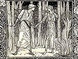

  
[Intangible Textual Heritage](../../../index)  [Legends and
Sagas](../../index)  [William Morris](../index)  [Index](index) 
[Next](wwe001) 

------------------------------------------------------------------------

  
*The Well at the World's End*, by William Morris, \[1896\], at
Intangible Textual Heritage

------------------------------------------------------------------------

The Well at the World's End

by William Morris

London ; New York : Longmans, Green, and Co.

\[1896\]

------------------------------------------------------------------------

[Next: Contents](wwe001)

