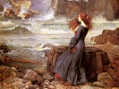

  
[Intangible Textual Heritage](../../../index)  [Legends and
Sagas](../../index)  [William Morris](../index)  [Index](index) 
[Previous](wwi000)  [Next](wwi002) 

------------------------------------------------------------------------

  
*The Water of the Wondrous Isles*, by William Morris, \[1897\], at
Intangible Textual Heritage

------------------------------------------------------------------------

The First Part: Of the House of Captivity

[Chapter I. Catch At Utterhay](wwi002.htm#an_f1_01)

[Chapter II. Now Shall Be Told of the House by the
Water-Side](wwi003.htm#an_f1_02)

[Chapter III. Of Skin-Changing](wwi004.htm#an_f1_03)

[Chapter IV. Of the Waxing of the Stolen Child](wwi005.htm#an_f1_04)

[Chapter V. Of Birdalone, and How She is Grown Into
Maidenhood](wwi006.htm#an_f1_05)

[Chapter VI. Herein Is Told of Birdalone's Raiment](wwi007.htm#an_f1_06)

[Chapter VII. Birdalone Hath an Adventure in the
Wood](wwi008.htm#an_f1_07)

[Chapter VIII. Of Birdalone and the Witch-Wife](wwi009.htm#an_f1_08)

[Chapter IX. Of Birdalone's Swimming](wwi010.htm#an_f1_09)

[Chapter X. Birdalone Comes on New Tidings](wwi011.htm#an_f1_10)

[Chapter XI. Of Birdalone's Guilt and the Chastisement
Thereof](wwi012.htm#an_f1_11)

[Chapter XII. The Words of the Witch-Wife to
Birdalone](wwi013.htm#an_f1_12)

[Chapter XIII. Birdalone Meeteth the Wood-Woman
Again](wwi014.htm#an_f1_13)

[Chapter XIV. Of Birdalone's Fishing](wwi015.htm#an_f1_14)

[Chapter XV. Birdalone Weareth Her Serpent-Ring](wwi016.htm#an_f1_15)

[Chapter XVI. Birdalone Meeteth Habundia Again; and Learneth Her First
Wisdom of Her](wwi017.htm#an_f1_16)

[Chapter XVII. The Passing of the Year into Winter](wwi018.htm#an_f1_17)

[Chapter XVIII. Of Spring-Tide and the Mind of
Birdalone](wwi019.htm#an_f1_18)

[Chapter XIX. They Bid Farewell, Birdalone and the
Wood-Mother](wwi020.htm#an_f1_19)

[Chapter XX. Of Birdalone and the Sending Boat](wwi021.htm#an_f1_20)

The Second Part: Of the Wondrous Isles

[Chapter I. The First Isle](wwi022.htm#an_f2_01)

[Chapter II. Birdalone Falleth in with New Friends](wwi023.htm#an_f2_02)

[Chapter III. Birdalone is Brought Before the Witch-Wife's
Sister](wwi024.htm#an_f2_03)

[Chapter IV. Of The Witch's Prison in the
Wailing-Tower](wwi025.htm#an_f2_04)

[Chapter V. They Feast in the Witch's Prison](wwi026.htm#an_f2_05)

[Chapter VI. Atra Tells of How They Three Came Unto the Isle of Increase
Unsought](wwi027.htm#an_f2_06)

[Chapter VII. The Three Damsels Take Birdalone out of the Witch's
Prison](wwi028.htm#an_f2_07)

[Chapter VIII. In What Wise Birdalone Was Clad, and How She Went Her
Ways From the Isle of Increase Unsought](wwi029.htm#an_f2_08)

[Chapter IX. How Birdalone Came to the Isle of the Young and the
Old](wwi030.htm#an_f2_09)

[Chapter X. Birdalone Comes to the Isle of the
Queens](wwi031.htm#an_f2_10)

[Chapter XI. And Now She Comes to the Isle of the
Kings](wwi032.htm#an_f2_11)

[Chapter XII. Of Birdalone, How She Came Unto the Isle of
Nothing](wwi033.htm#an_f2_12)

The Third Part: Of the Castle of the Quest

[Chapter I. Birdalone Comes to the Castle of the
Quest](wwi034.htm#an_f3_01)

[Chapter II. Of Birdalone, and How She Rested the Night Through in a
Bower Without the Castle of the Quest](wwi035.htm#an_f3_02)

[Chapter III. How Birdalone Dight Her For Meeting the Champions of the
Quest](wwi036.htm#an_f3_03)

[Chapter IV. And Now She Meets the Champions](wwi037.htm#an_f3_04)

[Chapter V. Birdalone Has True Tokens From the Champions of the
Quest](wwi038.htm#an_f3_05)

[Chapter VI. How The Champions Would Do Birdalone to be Clad Anew in the
Castle of the Quest](wwi039.htm#an_f3_06)

[Chapter VII. Of Birdalone, How She Told the Champions All Her
Tale](wwi040.htm#an_f3_07)

[Chapter VIII. In The Meanwhile of the Departing of the Champions, They
Would Pleasure Birdalone With Feats of Arms and Games of
Prowess](wwi041.htm#an_f3_08)

[Chapter IX. Birdalone Cometh Before the Champions In Her New
Array](wwi042.htm#an_f3_09)

[Chapter X. The Champions Go Their Ways in the Sending
Boat](wwi043.htm#an_f3_10)

The Fourth Part: Of the Days of Abiding

[Chapter I. Of Birdalone's Grief; and of Leonard the
Chaplain](wwi044.htm#an_f4_01)

[Chapter II. Birdalone Learneth Lore of the Priest. Ten Days of Waiting
Wear](wwi045.htm#an_f4_02)

[Chapter III. Now Would Birdalone Ride Abroad](wwi046.htm#an_f4_03)

[Chapter IV. Of Birdalone's Faring Abroad](wwi047.htm#an_f4_04)

[Chapter V. Sir Aymeris Showeth Birdalone the Mountains Afar
Off](wwi048.htm#an_f4_05)

[Chapter VI. Birdalone Heareth Tell Tales of the Black Valley of the
Greywethers](wwi049.htm#an_f4_06)

[Chapter VII. Birdalone Beguileth the Priest to Help Her to
Outgoing](wwi050.htm#an_f4_07)

[Chapter VIII. Birdalone Fares On Her Adventure](wwi051.htm#an_f4_08)

[Chapter IX. Birdalone Comes to the Black Valley](wwi052.htm#an_f4_09)

[Chapter X. How Birdalone Fell In With a Man in the Black Valley of the
Greywethers](wwi053.htm#an_f4_10)

[Chapter XI. Birdalone is Led Up the Black Valley](wwi054.htm#an_f4_11)

[Chapter XII. How Those Twain Get Them From out of the Black Valley of
the Greywethers](wwi055.htm#an_f4_12)

[Chapter XIII. Now They Rest For the Night in the Strait
Pass](wwi056.htm#an_f4_13)

[Chapter XIV. The Black Knight Tells the Truth of
Himself](wwi057.htm#an_f4_14)

[Chapter XV. The Black Knight Brings Birdalone to the Bower in the
Dale](wwi058.htm#an_f4_15)

[Chapter XVI. Yet a Day and a Night They Tarry in the
Dale](wwi059.htm#an_f4_16)

The Fifth Part: The Tale of the Quest's Ending

[Chapter I. Of Sir Leonard's Trouble and the Coming of the
Quest](wwi060.htm#an_f5_01)

[Chapter II. Now Ask They of Birdalone, and Sir Leonard
Speaks](wwi061.htm#an_f5_02)

[Chapter III. How They Follow the Slot of Birdalone and the Black
Knight](wwi062.htm#an_f5_03)

[Chapter IV. Of The Slaying of Friend and Foe](wwi063.htm#an_f5_04)

[Chapter V. They Come Home to the Castle of the
Quest](wwi064.htm#an_f5_05)

[Chapter VI. Of The Talk Betwixt Birdalone and
Viridis](wwi065.htm#an_f5_06)

[Chapter VII. Birdalone Telleth The tale of Her Wandering Up the Valley
of the Greywethers](wwi066.htm#an_f5_07)

[Chapter VIII. Atra and Birdalone Talk Together While the Lords Sit at
the Murder-Council](wwi067.htm#an_f5_08)

[Chapter IX. Hugh Tells The Story of the Quest's
Ending.](wwi068.htm#an_f5_09)

[Chapter X. How It Fared With the Three Ladies After the Escape of
Birdalone](wwi069.htm#an_f5_10)

[Chapter XI. Birdalone and the Black Squire Talk Together in the Hall of
the Castle.](wwi070.htm#an_f5_11)

[Chapter XII. The Knights and Their Fellows Betake Them to the
Assaulting of the Red Hold](wwi071.htm#an_f5_12)

[Chapter XIII. Birdalone Bethinks Her to Fulfil the Promise Made Unto
Atra](wwi072.htm#an_f5_13)

[Chapter XIV. Birdalone Leaves the Castle of the
Quest](wwi073.htm#an_f5_14)

The Sixth Part: The Days of Absence

[Chapter I. Birdalone Rides to Greenford and There Takes Leave of Arnold
and His Men](wwi074.htm#an_f6_01)

[Chapter II. Of Birdalone and Her Fellowship, Their Faring Over the
Downland](wwi075.htm#an_f6_02)

[Chapter III. They Come to the City of the Five Crafts, and Birdalone
Meets With the Poor-Wife](wwi076.htm#an_f6_03)

[Chapter IV. Of The Love of Gerard's Sons and of Jacobus for
Birdalone](wwi077.htm#an_f6_04)

[Chapter V. Of The Death of Audrey, Mother To Birdalone. She is Warned
in a Dream to Seek the Black Squire, and is Minded to Depart the City of
the Five Crafts, and Seek Again the Castle of the
Quest](wwi078.htm#an_f6_05)

[Chapter VI. Of The Sundering of Birdalone From Gerard and his
Sons](wwi079.htm#an_f6_06)

[Chapter VII. Birdalone Cometh to Greenford, and Hears of the Wasting of
the Castle of the Quest](wwi080.htm#an_f6_07)

[Chapter VIII. Birdalone Cometh to the Castle of the Quest, Heareth the
Tale Thereof From Leonard, and Departeth Thence by the Sending
Boat](wwi081.htm#an_f6_08)

[Chapter IX. Birdalone Findeth the Isle of Nothing Greatly Bettered, and
is Kindly Entreated There](wwi082.htm#an_f6_09)

[Chapter X. Of Birdalone's Flitting From the Isle of
Nothing](wwi083.htm#an_f6_10)

[Chapter XI. Coming to the Isle of Kings Birdalone Findeth There A Score
and Two of Fair Damsels Who Would Fain Have Her
Company](wwi084.htm#an_f6_11)

[Chapter XII. Birdalone Cometh Again to the Isle of Queens, and Findeth
a Perilous Adventure Therein](wwi085.htm#an_f6_12)

[Chapter XIII. Coming to the Isle of the Young and the Old, Birdalone
Findeth It Peopled With Children](wwi086.htm#an_f6_13)

[Chapter XIV. The Sending Boat Disappeareth From the Isle of Increase
Unsought, and Birdalone Seeketh to Escape Thence By
Swimming](wwi087.htm#an_f6_14)

[Chapter XV. Birdalone Lacketh Little of Drowning, but Cometh Latterly
to the Green Eyot](wwi088.htm#an_f6_15)

[Chapter XVI. Birdalone Findeth Her Witch-Mistress
Dead](wwi089.htm#an_f6_16)

[Chapter XVII. Birdalone Layeth to Earth the Body of the Witch, and
Findeth the Sending Boat Broken Up](wwi090.htm#an_f6_17)

[Chapter XVIII. The Wood-Mother Cometh to Birdalone and Heareth Her
Story](wwi091.htm#an_f6_18)

[Chapter XIX. Habundia Hideth Birdalone's Nakedness With Faery
Raiment](wwi092.htm#an_f6_19)

[Chapter XX. Birdalone Telleth Habundia of Her Love For Arthur, and
Getteth From Her Promise of Help Therein](wwi093.htm#an_f6_20)

[Chapter XXI. How The Wood-Wife Entered the Cot, and a Wonder that
Befell Thereon](wwi094.htm#an_f6_21)

[Chapter XXII. Birdalone Wendeth the Wildwood in Fellowship With
Habundia](wwi095.htm#an_f6_22)

[Chapter XXIII. The Wood-Wife Bringeth Birdalone to the Sight of Arthur
in the Wildwood](wwi096.htm#an_f6_23)

[Chapter XXIV. The Wood-Mother Changeth Her Form to That of a Woman
Stricken in Years](wwi097.htm#an_f6_24)

[Chapter XXV. The Wood-Wife Healeth and Tendeth the Black
Squire](wwi098.htm#an_f6_25)

[Chapter XXVI. The Black Squire Telleth the Wood-Wife of His Doings
Since Birdalone Went From the Castle of the Quest](wwi099.htm#an_f6_26)

[Chapter XXVII. Sir Arthur Cometh to the House Under the
Wood](wwi100.htm#an_f6_27)

[Chapter XXVIII. Fair Days in the House of Love](wwi101.htm#an_f6_28)

[Chapter XXIX. Those Twain Will Seek the Wisdom of the
Wood-Wife](wwi102.htm#an_f6_29)

[Chapter XXX. They Have Speech With Habundia Concerning the Green Knight
and his Fellows](wwi103.htm#an_f6_30)

[Chapter XXXI. Habundia Cometh with Tidings of Those Dear
Friends](wwi104.htm#an_f6_31)

[Chapter XXXII. Of The Fight in the Forest and the Rescue of Those
Friends From the Men of the Red Company](wwi105.htm#an_f6_32)

[Chapter XXXIII. Viridis Telleth the Tale of Their
Seeking](wwi106.htm#an_f6_33)

The Seventh Part: The Days of Returning

[Chapter I. Sir Hugh Asketh Birdalone Where She Would Have the Abode of
Their Fellowship to Be](wwi107.htm#an_f7_01)

[Chapter II. Birdalone Taketh Counsel With Her Wood-Mother Concerning
the Matter of Sir Hugh](wwi108.htm#an_f7_02)

[Chapter III. Of The Journeying Through the Forest of Evilshaw Unto the
Town of Utterhay](wwi109.htm#an_f7_03)

[Chapter IV. Of the Abiding in Utterhay in Love and
Contentment](wwi110.htm#an_f7_04)

------------------------------------------------------------------------

[Next: Chapter I. Catch At Utterhay](wwi002)

