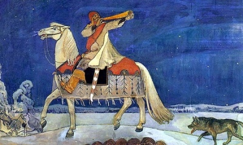

  
[Intangible Textual Heritage](../../index)  [Legends and
Sagas](../index) 

------------------------------------------------------------------------

<table width="75%">
<colgroup>
<col style="width: 50%" />
<col style="width: 50%" />
</colgroup>
<tbody>
<tr class="odd">
<td width="50%" data-valign="TOP"></td>
<td width="50%" data-valign="CENTER"><h1 id="magic-songs-of-the-west-finns-vol.-i" data-align="CENTER">Magic Songs of the West Finns, Vol. I</h1>
<h2 id="by-john-abercromby" data-align="CENTER">by John Abercromby</h2>
<h4 id="section" data-align="CENTER">[1898]</h4></td>
</tr>
</tbody>
</table>

------------------------------------------------------------------------

[Contents](#contents)    [Start Reading](ms100)    [Page
Index](pageidx)    [Text \[Zipped\]](ms1.txt.gz)

------------------------------------------------------------------------

This is the first volume of John Abercromby's extensive study of Finnish
magic songs and their background. First he details the history,
ethnography and linguistics of the Finns, indeed, constructs a
century-long history of the entire Finno-ugric group from the evolution
of vocabulary. Finally in the last (long) chapter he gets to the first
part of the exposition of the 'magic songs.' This is a summary of the
various characters in the songs including a whole range of Finnish gods,
goddesses, heroes, wizards, nature-spirits, and so on. He also goes into
detail about Finnish Shamanistic practices, including drumming, trance
ceremonies, and guide spirits. This book is a treasure trove of Finnish
lore, and invites repeated browsings.

------------------------------------------------------------------------

 [Title Page](ms100)  
[Preface](ms101)  
[Contents](ms102)  
[The Value of Additional Letters of the Alphabet](ms103)  
[Full Titles of Books Consulted and Referred to](ms104)  
[Illustrations](ms105)  
[Chapter I. Geographical Position and Craniology of the Finns](ms106)  
[Chapter II. The Neolithic Age in Finland](ms107)  
[Chapter III. Historical Notices of Classical Authors](ms108)  
[Chapter VI. The Prehistoric Civilisation of the Finns](ms109)  
[Chapter V. The Third or Iranian Period](ms110)  
[Chapter VI. Beliefs of the West Finns as Exhibited in the Magic
Songs](ms111)  
[Advertisements](ms112)  
