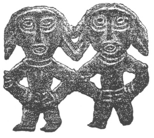

  
[Intangible Textual Heritage](../../index)  [Legends and
Sagas](../index)  [Index](index)  [Next](ms101) 

------------------------------------------------------------------------

  
*Magic Songs of the West Finns, Vol. I*, by John Abercromby, \[1898\],
at Intangible Textual Heritage

------------------------------------------------------------------------

# THE PRE- AND PROTO-HISTORIC FINNS

##### BOTH EASTERN AND WESTERN

###### WITH

# The Magic Songs

##### OF THE WEST FINNS

###### By the Honourable

## JOHN ABERCROMBY

###### COR. MEMBER OF THE FINNO-UGRIAN SOCIETY

 

#### IN TWO VOLUMES

#### VOL. I.

#### Published by David Nutt in the Strand, London

#### \[1898\]

Edinburgh: T. and A. Constable, Printers to Her Majesty

Scanned, proofed and formatted at Intangible Textual Heritage, February
2010, by John Bruno Hare. This text is in the public domain in the US
because it was published prior to 1923.

  [  
Click to enlarge](img/title.jpg)  
Title Page  

------------------------------------------------------------------------

[Next: Preface](ms101)

