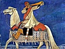

  
[Intangible Textual Heritage](../../index)  [Legends and
Sagas](../index)  [Index](index)  [Previous](ms100)  [Next](ms102) 

------------------------------------------------------------------------

  
*Magic Songs of the West Finns, Vol. I*, by John Abercromby, \[1898\],
at Intangible Textual Heritage

------------------------------------------------------------------------

p. v

### PREFACE

In this country the term Finn is
generally restricted to the natives of Finland, with perhaps those of
Esthonia thrown in. But besides these Western Finns there are other
small nationalities in Central and Northern Russia, such as the Erza and
Mokša Mordvins, the Čeremis, Votiaks, Permians, and Zịrians, to whom the
term is very properly applied, though with the qualifying
adjective—Eastern. Except by Folklorists, little attention is paid in
Great Britain to these peoples, and much that is written of them abroad
finds no response here, the 'silver streak' acting, it would seem, as a
non-conductor to such unsensational and feeble vibrations.

Although the languages of the Eastern and Western Finns differ as much
perhaps among themselves as the various members of the Aryan group, the
craniological and physical differences between any two Finnish groups is
very much less than between the Latin and the Teutonic groups, for
instance. All the Finns live nearly under the same latitudes, and in
pre- and proto-historic times, which are not so very

p. vi

remote, the differences in customs, religious and other beliefs, could
not have been very great. This is important; it allows us to supplement
what is missing or defective in one Finnish group by what is more
complete in another, with far greater certainty than when dealing under
similar circumstances with the Aryan-speaking groups. In the first five
chapters of the first volume I have tried, with the combined aid of
craniology, archæology, ethnography, and philology, brought up to date,
to sketch as succinctly as possible the pre- and proto-historic history
of the Eastern and Western Finns, showing the various stages of
civilisation to which they successively advanced after contact with
higher civilisations, at different periods of their evolution from
neolithic times to the middle ages. Chapters six and seven contain an
analysis of the beliefs of the Western Finns, so far as they can be
gathered from the text of the Magic Songs in the second volume; and a
perusal of them will facilitate the comprehension of the Magic Songs
themselves. The second volume, containing 639 magic songs, some of
considerable length, classed under 233 headings, is a translation of a
very large portion of the *Suomen kansan muinaisia Loitsurunoja*, edited
and published by the late Dr. Lönnrot in 1880. As the translation was
made for Folklorists it is as literal as possible,

p. vii

without additions, without subtractions, and the vocabulary employed is
in conformity with the subject, with the humble social status and homely
surroundings of the original composers. The metre of the original is the
same as in the Kalevala, which cannot be reproduced in a language like
English, where the ictus of the metre has to coincide with the natural
stress-accent of the words. But where it could be done without loss of
exactness a certain rhythm, generally three beats to a line, is given in
the translation, though to save space the lines are printed in prose
form.

In the work of translating the Magic Songs I owe a debt of gratitude to
Lektor Raitio, with whom I first began to study them a good many years
ago, for much friendly assistance. Finally, I acknowledge with thanks
the reproduction of four illustrations borrowed from Mr. J. R. Aspelin's
*Antiquités du Nord Finno-ougrien*, four from Mr. Kudriavtsev, three
from Mr. Inostrantsev, one from Mr. Spitsịn, and twelve from photographs
given me by Mr. Novokreščennịkh. The six illustrations from sketches
made by myself were made hurriedly, and are not absolutely correct,
though adequate, I hope, for the purpose.

Edinburgh, *August* 1898.

------------------------------------------------------------------------

[Next: Contents](ms102)

