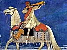

  
[Intangible Textual Heritage](../../index)  [Legends and
Sagas](../index)  [Index](index)  [Previous](ms104)  [Next](ms106) 

------------------------------------------------------------------------

  
*Magic Songs of the West Finns, Vol. I*, by John Abercromby, \[1898\],
at Intangible Textual Heritage

------------------------------------------------------------------------

p. xxiii

### ILLUSTRATIONS

FIG.

[1. Silhouette of a Seal from Ladoga. Ĭnostrantsev, Table XI. No.
1.](#img_fig01-03)

[2. Muzzle of a Dog or Bear from Ladoga. Ĭnostrantsev, p.
210.](#img_fig01-03)

[3. A Carved Piece of Bone from Ladoga. Ĭnostrantsev, Table XI. No.
2.](#img_fig01-03)

[4. Human Silhouette in Flint from Volósovo. Kudriavtsev, Fig.
17.](#img_fig04-07)

[5. Human Silhouette in Flint from Volósovo. Kudriavtsev, Fig.
18.](#img_fig04-07)

[6. Silhouette of a Goose in Flint from Volósovo. Kudriavtsev, Fig.
19.](#img_fig04-07)

[7. Silhouette of a Badger in Flint from Volósovo. Kudriavtsev, Fig.
20.](#img_fig04-07)

[8. Modern Vogul Idol in Wood. From a Sketch by the
Author.](#img_fig08-10)

[9. Copper Statuette of a Man from Galič. From Aspelin, No.
299.](#img_fig08-10)

[10. Copper Human Mask from Galič. From Aspelin, No.
299.](#img_fig08-10)

[11. Copper Statuette of a Man from the Government of Perm. Aspelin, No.
304.](#img_fig11)

[12. Bird-God from a Grave in the Government of Tomsk. Sketch by the
Author.](#img_fig12)

[13. Ornamented Bronze Knife. From a Photograph.](#img_fig13-17)

[14. Bronze Button from Ananino. From a Sketch by the
Author.](#img_fig13-17)

[15. Bronze Button from Koban. From a Sketch by the
Author.](#img_fig13-17)

[16. Ornamented Stone Whorl. Spitsịn, Table X. No. 12.](#img_fig13-17)

[17. Bronze Cheek of a Bit from Ananino. From Aspelin, No.
474.](#img_fig13-17)

[18. Earring from Gliadénova. From a Photograph.](#img_fig18-19)

[19. Head of a Man in Bronze. From a Sketch by the
Author.](#img_fig18-19)

[20. Two Human Figures in Bronze. From a Photograph.](#img_fig20-22)

[21. Head and Shoulders of a Bear.    „    „    ](#img_fig20-22)

[22. Bird with Human Face on its Breast.    „    „    ](#img_fig20-22)

[23. Bird with Human Face on its Breast.    „    „    ](#img_fig23-25)

[24. Double Bird.    „    „    ](#img_fig23-25)

[25. Three-headed Bird (7).    „    „    ](#img_fig23-25)

p. xxiv

FIG.

[26. Upper Part of a Water-Bird. From a Photograph.](#img_fig26-29)

[27. Man on Horseback.    „    „    ](#img_fig26-29)

[28. Man riding on an Animal.    „    „    ](#img_fig26-29)

[29. Double Bronze Button    „    „    ](#img_fig26-29)

[30. Circular Disc with Rings.    „    „    ](#img_fig30-33)

[31. A Bear in Bronze. From a Sketch by the Author.](#img_fig30-33)

[32. Human Figure.](#img_fig30-33)

[33. Circular Bronze Disc, with incised Ornaments.](#img_fig30-33)

[Excavations at Gliadénova, with Mr. Novokreščennịkh in Middle Distance.
From a Photograph by the Author.](ms107.htm#img_11800)

[Excavations at Gliadénova, with the Kama in the Distance. From a
Photograph by the Author.](ms107.htm#img_11801)

[The Sand-Dunes of Volósovo. From a Photograph by the
Author.](ms107.htm#img_06800)

MAPS

[1. Finland.](#img_map01)

[2. The Baltic Provinces, showing where Crania have been
discovered.](#img_map02)

[3. The Baltic Provinces, showing Archæological Finds.](#img_map03)

[4. Russia in Europe.](#img_map04)

  [  
Click to enlarge](img/map01.jpg)  
1. Finland.  

  [  
Click to enlarge](img/map02.jpg)  
2. The Baltic Provinces, showing where Crania have been discovered  

  [  
Click to enlarge](img/map03.jpg)  
3. The Baltic Provinces, showing Archæological Finds.  

  [  
Click to enlarge](img/map04.jpg)  
4. Russia in Europe.  

  [  
Click to enlarge](img/fig01-03.jpg)  
Figs. 1–3  

  [  
Click to enlarge](img/fig04-07.jpg)  
Figs. 4–7  

  [  
Click to enlarge](img/fig08-10.jpg)  
Figs. 8–10  

  [  
Click to enlarge](img/fig11.jpg)  
Fig. 11  

  [  
Click to enlarge](img/fig12.jpg)  
Fig. 12  

  [  
Click to enlarge](img/fig13-17.jpg)  
Figs. 13–17  

  [  
Click to enlarge](img/fig18-19.jpg)  
Figs. 18–19  

  [  
Click to enlarge](img/fig20-22.jpg)  
Figs. 20–22  

  [  
Click to enlarge](img/fig23-25.jpg)  
Figs. 23–25  

  [  
Click to enlarge](img/fig26-29.jpg)  
Figs. 26–29  

  [  
Click to enlarge](img/fig30-33.jpg)  
Figs. 30–33  

------------------------------------------------------------------------

[Next: Chapter I. Geographical Position and Craniology of the
Finns](ms106)

