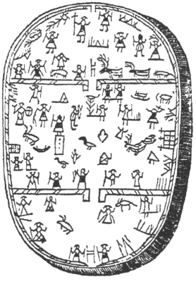

  
[Intangible Textual Heritage](../../index)  [Legends and
Sagas](../index)  [Index](index)  [Next](ms201) 

------------------------------------------------------------------------

  
*Magic Songs of the West Finns, Vol. 2*, by John Abercromby, \[1898\],
at Intangible Textual Heritage

------------------------------------------------------------------------

# THE

# Pre- and Proto-historic Finns

##### BOTH EASTERN AND WESTERN

###### WITH

# The Magic Songs

##### OF THE WEST FINNS

## By the Honourable JOHN ABERCROMBY

###### COR. MEMBER OF THE FINNO-UGRIAN SOCIETY

Facies adversa tympani

 

#### VOL. II.

#### Published by David Nutt

#### in the Strand, London

#### \[1898\]

Scanned, proofed and formatted at Intangible Textual Heritage, February
2010, by John Bruno Hare. This text is in the public domain in the US
because it was published prior to 1923.

  [  
Click to enlarge](img/title.jpg)  
Title Page  

###### Edinburgh: T. and A. Constable, Printers to Her Majesty

------------------------------------------------------------------------

[Next: Contents](ms201)

