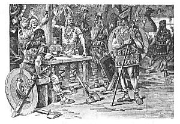

  
[Intangible Textual Heritage](../../index)  [Legends and
Sagas](../index)  [Iceland](../ice/index) 

------------------------------------------------------------------------

[Buy this Book on
Kindle](https://www.amazon.com/exec/obidos/ASIN/B002HK2G4O/internetsacredte)

------------------------------------------------------------------------

<table width="75%">
<colgroup>
<col style="width: 50%" />
<col style="width: 50%" />
</colgroup>
<tbody>
<tr class="odd">
<td width="50%" data-valign="TOP"></td>
<td width="50%" data-valign="CENTER"><h1 id="the-norse-discovery-of-america" data-align="CENTER">The Norse Discovery of America</h1>
<h5 id="by-arthur-middleton-reeves-north-ludlow-beamish-and-rasmus-b.-anderson" data-align="CENTER">by Arthur Middleton Reeves, 
North Ludlow Beamish, 
and Rasmus B. Anderson</h5>
<h4 id="section" data-align="CENTER">[1906]</h4></td>
</tr>
</tbody>
</table>

------------------------------------------------------------------------

[Contents](#contents)    [Start Reading](nda00)    [Page
Index](pageidx)    [Text \[Zipped\]](nda.txt.gz)

------------------------------------------------------------------------

|                                                                                                                           |
|---------------------------------------------------------------------------------------------------------------------------|
|  |

This is a collection of texts relating to the voyages of the Norse west
to America. A thousand years ago, nearly half a millennium before
Columbus, the Norse extended their explorations from Iceland and
Greenland to the shores of Northeastern North America, and, possibly,
beyond.

This volume from the Norroena collection contains all known sagas and
documentary fragments which relate to this legendary exploration. It
also contains analysis of the texts which should be read with a critical
eye. While it is now certain that the Norse reached Nova Scotia, the
claims in this book that they reached as far south as Boston--not to
mention Georgia or South Carolina--are still controversial. There is
also tangential discussion of whether the Irish managed to get to
America prior to the Norse, an even more contentious assertion.

Regardless, the texts in this three-part volume open up a window into a
vivid era, and give glimpses of religion, society and travel in the
period when the Norse were actively exploring the North Atlantic. They
contain one of the only detailed descriptions of a pagan women's
divination ritual, and deal with the expansion of Christianity from both
sides. There are bone-chilling stories of disease, murder and jealousy
in the small communities on the leading edge of Viking colonization.
Reading these sagas inspires deep understanding of the life and
motivations of the Scandinavian sea rovers and respect for their
accomplishments in the field of exploration.

--John Bruno Hare, February 18th, 2004

------------------------------------------------------------------------

 [Title Page](nda00)  
[List of Photogravures](nda01)  
[Contents](nda02)  
[Preface](nda03)  
[Introduction](nda04)  

### Book I. Arguments and Proofs That Support the Claim of Norse Discovery of America

[Chapter I. Early Fragmentary References to Wineland](nda05)  
[Chapter II. The Saga of Eric the Red](nda06)  
[Chapter III. The Wineland History of the Flatey Book](nda07)  
[Chapter IV. A Brief History of Eric the Red](nda08)  
[Chapter V. Wineland in the Icelandic Annals](nda09)  
[Chapter VI. Notices of Doubtful Value; Fictions](nda10)  
[Chapter VII. The Publication of the Discovery](nda11)  
[Notes](nda12)  

### Book II. Icelandic Records

[Arguments and Evidences Respecting the Wineland Discovery](nda13)  
[Introduction to a Study of Icelandic Records](nda14)  
[Second Period](nda15)  
[Third Period](nda16)  
[Last Period](nda17)  
[Saga of Erik the Red](nda18)  
[Voyage of Leif Erikson](nda19)  
[Saga of Thorfinn Karlsefne](nda20)  
[Voyage of Freydis, Helgi and Finnbogi](nda21)  
[Geographical Notices in Ancient Icelandic Manuscripts](nda22)  
[Monuments and Inscriptions](nda23)  
[Minor Narratives](nda24)  
[Voyage of Gudleif Gudlaugson to Great Ireland](nda25)  

### Book III. The Norsemen in America

[Chapter I. Norumbega](nda26)  
[Chapter II. Norse Voyages In The: Tenth And Following
Centuries](nda27)  
[Chapter III. Columbus and the Norsemen](nda28)  
[Chapter IV. Discovery of America by the Irish](nda29)  
