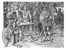

  
[Intangible Textual Heritage](../../index)  [Legends and
Sagas](../index)  [Iceland](../ice/index)  [Index](index) 
[Previous](nda12)  [Next](nda14) 

------------------------------------------------------------------------

[Buy this Book on
Kindle](https://www.amazon.com/exec/obidos/ASIN/B002HK2G4O/internetsacredte)

------------------------------------------------------------------------

  
*The Norse Discovery of America*, by A.M Reeves, N.L. Beamish and R.B.
Anderson, \[1906\], at Intangible Textual Heritage

------------------------------------------------------------------------

p. 148

# BOOK II.

### By NORTH LUDLOW BEAMISH.

ARGUMENTS and evidences respecting the claim that America was discovered
by Norsemen about A. D. 1000, and colonized about A. D. 1003, with
proofs submitted as to occupation of a part of the country, known as
Irland in Mikla, or Great Ireland, by the Irish, in the Eleventh
Century.

------------------------------------------------------------------------

[Next: Introduction to a Study of Icelandic Records](nda14)
