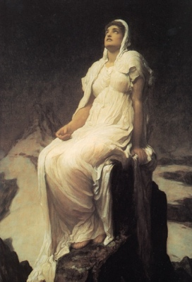

  
[Intangible Textual Heritage](../../index)  [Legends and
Sagas](../index)  [Iceland](../ice/index) 

------------------------------------------------------------------------

[Buy this Book at
Amazon.com](https://www.amazon.com/exec/obidos/ASIN/B0024NLGNQ/internetsacredte)

------------------------------------------------------------------------

<table width="75%">
<colgroup>
<col style="width: 50%" />
<col style="width: 50%" />
</colgroup>
<tbody>
<tr class="odd">
<td width="50%" data-valign="TOP"></td>
<td width="50%" data-valign="CENTER"><h1 id="the-poetic-edda">The Poetic Edda</h1>
<h2 id="translated-by-henry-adams-bellows">translated by Henry Adams Bellows</h2>
<h4 id="section">[1936] 
</h4></td>
</tr>
</tbody>
</table>

------------------------------------------------------------------------

[Contents](#contents)    [Start Reading](poe00)    [Page
Index](pageidx)    [Text \[Zipped\]](poe.txt.gz)    [\[PDF\]](poe.pdf)

------------------------------------------------------------------------

|                                                                                                                           |
|---------------------------------------------------------------------------------------------------------------------------|
|  |

The Poetic Eddas are the oral literature of Iceland, which were finally
written down from 1000 to 1300 C.E. The Eddas are a primary source for
our knowledge of ancient Norse pagan beliefs. This translation of the
Poetic Eddas by Henry Adams Bellows is highly readable.

The poems are great tragic literature, with vivid descriptions of the
emotional states of the protagonists, Gods and heroes alike. Women play
a prominent role in the Eddic age, and many of them are delineated as
skilled warriors.

The impact of these sagas from a sparsely inhabited rocky island in the
middle of the Atlantic on world culture is wide-ranging. Wagners' operas
are largely based on incidents from the Edda, via the Niebelungenlied.
J.R.R. Tolkien also plundered the Eddas for atmosphere, plot material
and the names of many characters in *the Hobbit*, and *the Lord of the
Rings*. -- John Bruno Hare

------------------------------------------------------------------------

 [Title Page](poe00)  
[Contents](poe01)  
[General Introduction](poe02)  
[Voluspo](poe03)  
[Hovamol](poe04)  
[Vafthruthnismol](poe05)  
[Grimnismol](poe06)  
[Skirnismol](poe07)  
[Harbarthsljoth](poe08)  
[Hymiskvitha](poe09)  
[Lokasenna](poe10)  
[Thrymskvitha](poe11)  
[Alvissmol](poe12)  
[Baldrs Draumar](poe13)  
[Rigsthula](poe14)  
[Hyndluljoth](poe15)  
[Svipdagsmol](poe16)  
[Völundarkvitha](poe17)  
[Helgakvitha Hjorvarthssonar](poe18)  
[Helgakvitha Hundingsbana I](poe19)  
[Helgakvitha Hundingsbana II](poe20)  
[Fra Dautha Sinfjotla](poe21)  
[Gripisspo](poe22)  
[Reginsmol](poe23)  
[Fafnismol](poe24)  
[Sigrdrifumol](poe25)  
[Brot Af Sigurtharkvithu](poe26)  
[Guthrunarkvitha I](poe27)  
[Sigurtharkvitha En Skamma](poe28)  
[Helreith Brynhildar](poe29)  
[Drap Niflunga](poe30)  
[Guthrunarkvitha II, En Forna](poe31)  
[Guthrunarkvitha III](poe32)  
[Oddrunargratr](poe33)  
[Atlakvitha En Grönlenzka](poe34)  
[Atlamol En Grönlenzku](poe35)  
[Guthrunarhvot](poe36)  
[Hamthesmol](poe37)  
[Pronouncing Index Of Proper Names](poe38)  
