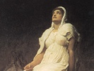

  
[Intangible Textual Heritage](../../index)  [Legends and
Sagas](../index)  [Iceland](../ice/index)  [Index](index) 
[Previous](poe28)  [Next](poe30) 

------------------------------------------------------------------------

[Buy this Book at
Amazon.com](https://www.amazon.com/exec/obidos/ASIN/B0024NLGNQ/internetsacredte)

------------------------------------------------------------------------

  
*The Poetic Edda*, by Henry Adams Bellows, \[1936\], at Intangible
Textual Heritage

------------------------------------------------------------------------

p. 442

# HELREITH BRYNHILDAR

### Brynhild's Hell-Ride

##### INTRODUCTORY NOTE

The little *Helreith Brynhildar* immediately follows the "short" Sigurth
lay in the *Codex Regius*, being linked to it by the brief prose note;
the heading, "Brynhild's Ride on Hel-Way," stands just before the first
stanza. The entire poem, with the exception of stanza. 6, is likewise
quoted in the *Nornageststhattr*. Outside of one stanza (No. 11), which
is a fairly obvious interpolation, the poem possesses an extraordinary
degree of dramatic unity, and, certain pedantic commentators
notwithstanding, it is one of the most vivid and powerful in the whole
collection. None the less, it has been extensively argued that parts of
it belonged originally to the so-called *Sigrdrifumol*. That it stands
in close relation to this poem is evident enough, but it is difficult to
believe that such a masterpiece of dramatic poetry was ever the result
of mere compilation. It seems more reasonable to regard the *Helreith*,
with the exception of stanza 11 and allowing for the loss of two lines
from stanza 6, as a complete and carefully constructed unit, based
undoubtedly on older poems, but none the less an artistic creation in
itself.

The poem is generally dated as late as the eleventh century, and the
concluding stanza betrays Christian influence almost unmistakably. It
shows the confusion of traditions manifest in all the later poems; for
example, Brynhild is here not only a Valkyrie but also a swan-maiden.
Only three stanzas have any reference to the Guthrun-Gunnar part of the
story; otherwise the poem is concerned solely with the episode of
Sigurth's finding the sleeping Valkyrie. Late as it is, therefore, it is
essentially a Norse creation, involving very few of the details of the
German cycle (cf. introductory note to *Gripisspo*).

\_\_\_\_\_\_\_\_\_\_\_\_\_\_\_\_\_\_

After the death of Brynhild there were made two bale-fires, the one for
Sigurth, and that burned first, and on the other was Brynhild burned,
and she was on a

p. 443

wagon which was covered with a rich cloth. Thus it is told, that
Brynhild went in the wagon on Hel-way, and passed by a house where dwelt
a certain giantess. The giantess spake:

1\. "Thou shalt not further \| forward fare,  
My dwelling ribbed \| with rocks across;  
More seemly it were \| at thy weaving to stay,  
Than another's husband \| here to follow.

2\. "What wouldst thou have \| from Valland here,  
Fickle of heart, \| in this my house?  
Gold-goddess, now, \| if thou wouldst know,  
Heroes' blood \| from thy hands hast washed."

Brynhild spake:  
3. "Chide me not, woman \| from rocky walls,  
Though to battle once \| I was wont to go;  
Better than thou \| I shall seem to be,  
When men us two \| shall truly know."

The giantess spake:  
4. "Thou wast, Brynhild, \| Buthli's daughter,

\[*Prose*. The prose follows the last stanza of *Sigurtharkvitha en
skamma* without break. *Two bale-fires*: this contradicts the statement
made in the concluding stanzas of *Sigurtharkvitha en skamma*, that
Sigurth and Brynhild were burned on the same pyre; there is no evidence
that the annotator here had anything but his own mistaken imagination to
go on.

2\. *Valland*: this name ("Land of Slaughter") is used else where of
mythical places; cf. *Harbarthsljoth*, 24, and prose introduction to
*Völundarkvitha*; it may here not be a proper name at all,
*Gold-goddess*: poetic circumlocution for "woman."\]

p. 444

For the worst of evils \| born in the world;  
To death thou hast given \| Gjuki's children,  
And laid their lofty \| house full low."

Brynhild spake:  
5. "Truth from the wagon \| here I tell thee,  
Witless one, \| if know thou wilt  
How the heirs of Gjuki \| gave me to be  
joyless ever, \| a breaker of oaths.

6\. "Hild the helmed \| in Hlymdalir  
They named me of old, \| all they who knew me.  
.    .    .    .    .        .    .    .    .    .  
.    .    .    .    .        .    .    .    .    .

7\. "The monarch bold \| the swan-robes bore  
Of the sisters eight \| beneath an oak;

\[6. In *Regius* these two lines stand after stanza 7, but most
editions; place them as here. They are not quoted in the
*Nornageststhattr*. Presumably two lines, and perhaps more, have been
lost. It has frequently been argued that all or part of the passage from
stanza 6 through stanza 10 (6-10, 7-10 or 8-10) comes originally from
the so-called *Sigrdrifumol*, where it would undoubtedly fit exceedingly
well. *Hild*: a Valkyrie name meaning "Fighter" (cf. *Voluspo*, 31). in
such compound names as Brynhild ("Fighter in Armor") the first element
was occasionally omitted. *Hlymdalir* ("Tumult-Dale"): a mythical name,
merely signifying the place of battle as the home of Valkyries.

7\. Regarding the identification of swan-maidens with Valkyries, and the
manner in which men could get them in their power by stealing their
swan-garments, cf. *Völundarkvitha*, introductory prose and note, where
the same thing happens. *The monarch*: perhaps Agnar, brother of Autha,
mentioned in Sigrdrifumol (prose and quoted verse following stanza 4) as
the warrior for \[fp. 445\] whose sake Brynhild defied Othin in slaying
Hjalmgunnar. *Eight*: the *Nornageststhattr* manuscripts have "sisters
of Atli" instead of "sisters eight."\]

p. 445

Twelve winters I was, \| if know thou wilt,  
When oaths I yielded \| the king so young.

8\. "Next I let \| the leader of Goths,  
Hjalmgunnar the old, \| go down to hell,  
And victory brought \| to Autha's brother;  
For this was Othin's \| anger mighty.

9\. "He beset me with shields \| in Skatalund,  
Red and white, \| their rims o'erlapped;  
He bade that my sleep \| should broken be  
By him who fear \| had nowhere found.

10\. "He let round my hall, \| that southward looked,  
The branches' foe \| high-leaping burn;  
Across it he bade \| the hero come  
Who brought me the gold \| that Fafnir guarded

11\. On Grani rode \| the giver of gold,

\[8. *Hjalmgunnar*: regarding this king of the Goths (the phrase means
little) and his battle with Agnar, brother of *Autha* cf.
*Sigrdrifumol*, prose after stanza 4. One *Nornageststhattr* manuscript
has "brother of the giantess" in place of "leader of Goths."

9\. Cf. *Sigrdrifumol*, prose introduction. *Skatalund* ("Warriors'
Grove"): a mythical name; elsewhere the place where Brynhild lay is
called Hindarfjoll.

10\. *Branches' foe*: fire. Regarding the treasure cf. *Fafnismol*.

11\. This stanza is presumably an interpolation, reflecting a different
version of the story, wherein Sigurth meets Brynhild at the home of her
brother-in-law and foster-father, Heimir (cf. \[fp. 446\] *Gripisspo*,
19 and 27). *Grani*: Sigurth's horse. *Danes*: nowhere else does Sigurth
appear in this capacity. Perhaps this is a curious relic of the Helgi
tradition.\]

p. 446

Where my foster-father \| ruled his folk;  
Best of all \| he seemed to be,  
The prince of the Danes, \| when the people met.

12\. "Happy we slept, \| one bed we had,  
As he my brother \| born had been;  
Eight were the nights \| when neither there  
Loving hand \| on the other laid.

13\. "Yet Guthrun reproached me, \| Gjuki's daughter,  
That I in Sigurth's \| arms had slept;  
Then did I hear \| what I would were hid,  
That they had betrayed me \| in taking a mate.

14\. "Ever with grief \| and all too long  
Are men and women \| born in the world;  
But yet we shall live \| our lives together,  
Sigurth and I. \| Sink down, Giantess!"

\[12. *Eight nights*: elsewhere (cf. *Gripisspo*, 4.2) the time is
stated as three nights, not eight. There is a confusion of traditions
here, as in *Gripisspo*. In the version of the story wherein Sigurth met
Brynhild before he encountered the Gjukungs, Sigurth was bound by no
oaths, and the union was completed; it is only in the alternative
version that the episode of the sword laid between the two occurs.

14\. The idea apparently conveyed in the concluding lines, that Sigurth
and Brynhild will be together in some future life, is utterly out of
keeping with the Norse pagan traditions, and the whole stanza indicates
the influence of Christianity.\]

------------------------------------------------------------------------

[Next: Drap Niflunga](poe30)
