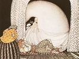

  
[Intangible Textual Heritage](../../index)  [Legends and
Sagas](../index)  [Index](index)  [Previous](ptn82)  [Next](ptn84) 

------------------------------------------------------------------------

[Buy this Book at
Amazon.com](https://www.amazon.com/exec/obidos/ASIN/048641812X/internetsacredte)

------------------------------------------------------------------------

[Buy this Book on
Kindle](https://www.amazon.com/exec/obidos/ASIN/B002H9XT7I/internetsacredte)

------------------------------------------------------------------------

  
*Popular Tales from the Norse*, by George Webbe Dasent, \[1904\], at
Intangible Textual Heritage

------------------------------------------------------------------------

p. 441

### NANCY FAIRY.

THERE was once an old woman called "Nancy Fairy." She was a witch, and
used to steal all the little babies as soon as they were born, and eat
them. One day she stole a little baby, who was so beautiful that she had
not the heart to eat her; but she took her home and brought her up. She
called her "daughter," named her "Nancy Fairy," after herself, and the
girl called the old woman "Granny."

So the girl grew up, and the more she grew the more beautiful she got.

The old woman never let her daughter know of her doings; but one day
when she had brought a baby home, and had locked herself in a room, her
daughter peeped through a chink to see what she was about, and the old
woman saw her shadow, and thought her daughter had seen what she was
doing, and the daughter thought her granny had seen her, and was very
much afraid.

So the old woman asked her, "Nancy Fairy, did you see what I was doing?"

"No, Granny."

She asked the girl several times, "Nancy Fairy, did you see what I was
doing?" and the girl always said, "No, Granny."

So the old woman took her up to a hut in a wood, and left her there as a
punishment; and she took her food every day.

One day it happened that the king's servant, going that way, saw the
beautiful girl come out of the hut. Next day he went again and saw the
same beautiful girl again. So he went home and told the prince that he
could show him in the wood a girl more beautiful than he had ever seen.
The prince went and

p. 442

saw the girl and then sent a band of soldiers to fetch her home, and
took her for his bride.

A year after she had a baby. Soldiers were set to keep guard at the
gate, and the room was full of nurses; but in the middle of the night
the old woman came in a whirlwind and put them all to sleep. She stole
the child, and on going away gave the mother a slap on the mouth, which
made her dumb.

Next morning there was a great stir, and they said the mother had eaten
the child. There was a trial, but the mother was let off that time.

Next year she had another baby, and the same thing happened again. The
old woman came in the middle of the night in a whirlwind, and put them
all to sleep. She stole the child, and struck the mother on the mouth,
which made it bleed.

In the morning there was a stir and the servant maid, who was jealous,
said the mother had eaten the child. All believed it, as her mouth was
covered with blood; and, besides, what would be expected of a girl
brought out of the wood? So she was tried again, and condemned to be
hanged.

Invitations were sent out to all the grand folk to come and see her
hanged; so many fine carriages came driving up. At last, just before the
time, there came a very grand carriage, all of gold, which glistened in
the sun. In it were the old woman and two children, dressed in fine
clothes, with the king's star on them. When the queen saw this grand
carriage she got her speech and sung,

"Do spare me till I see that grand carriage.

The old woman came into the courtyard, and asked the people if they saw
any likeness to any one in the children. They said, "they were like the
prince," and asked her how she came by them, and told her she had stolen
them. She said she had not stolen them; she had taken them, for they
were her own; the prince had taken away her daughter without her leave,
and so she had taken his children; but she was willing to give them
back, if they would allow that she was right.

p. 443

So they consented, and the old woman made the prince and his queen a
present of the grand carriage, and so they lived happily. The old man
was allowed to come and see the children whenever she liked. But the
servant girl, who said the queen had eaten her babies, was hanged.

------------------------------------------------------------------------

[Next: The Dancing Gang](ptn84)
