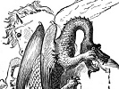

  
[Intangible Textual Heritage](../../index)  [Legends and
Sagas](../index)  [Index](index)  [Previous](rft00)  [Next](rft02) 

------------------------------------------------------------------------

[Buy this Book on
Kindle](https://www.amazon.com/exec/obidos/ASIN/B002IKKI4I/internetsacredte)

------------------------------------------------------------------------

  
*Roumanian Fairy Tales and Legends*, by E.B. Mawr, \[1881\], at
Intangible Textual Heritage

------------------------------------------------------------------------

p. vii

# PREFACE.

THE literature of Roumania is so little known in England, that I have
ventured to translate, and bring before the public, some of the popular
*Basme* (tales) and legends of the country.

I have kept to the original text as strictly as possible, but some of
the idioms are untranslatable.

Of the Poets, I have given no specimen, though there are many of
recognised talent.

A volume of Roumanian poems has just been put into the German tongue, by
the August Lady who permits me to dedicate this small effort to her, and
who is the patron of every good work.

By its bravery, and its stedfast perseverance in its onward path,
ROUMANIA has raised itself into a

p. viii

KINGDOM; and I have thought it well to insert in this little book "The
Martyrdom of Brancovan," and the Spartan courage of the "Mother of
Stefan the Great," to shew of what blood the true sons and daughters of
Roumania are made.

E. B. M.

BUCHAREST.  
        *April, 1881*.

------------------------------------------------------------------------

[Next: Contents](rft02)
