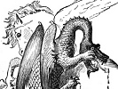

  
[Intangible Textual Heritage](../../index)  [Legends and
Sagas](../index)  [Index](index)  [Previous](rft01)  [Next](rft03) 

------------------------------------------------------------------------

[Buy this Book on
Kindle](https://www.amazon.com/exec/obidos/ASIN/B002IKKI4I/internetsacredte)

------------------------------------------------------------------------

  
*Roumanian Fairy Tales and Legends*, by E.B. Mawr, \[1881\], at
Intangible Textual Heritage

------------------------------------------------------------------------

p. ix

# CONTENTS.

|                                         |                           |
|-----------------------------------------|---------------------------|
| FAIRY TALES.                            |                           |
|                                         | PAGE                      |
| THE SLIPPERS OF THE TWELVE PRINCESSES   | [1](rft03.htm#page_1)     |
| THE UNGRATEFUL WOODCUTTER               | [21](rft04.htm#page_21)   |
| THE HERMIT'S FOUNDLING                  | [27](rft05.htm#page_27)   |
| THE DAUGHTER OF THE ROSE                | [42](rft06.htm#page_42)   |
| THE TWELVE-HEADED GRIFFIN               | [49](rft07.htm#page_49)   |
| VASILICA THE BRAVE                      | [58](rft08.htm#page_58)   |
| HANDSOME IS AS HANDSOME DOES            | [81](rft09.htm#page_81)   |
| THE FISHERMAN AND THE BOYARD'S DAUGHTER | [90](rft10.htm#page_90)   |
| LEGENDS.                                |                           |
| MANOLI                                  | [97](rft11.htm#page_97)   |
| HE FORTRESS OF POINARII                 | [106](rft12.htm#page_106) |
| THE GENTLE SHEPHERD                     | [112](rft13.htm#page_112) |
| p. x           |                           |
| HISTORIC TALES.                         |                           |
| DEATH OF CONSTANTIN II. BRANCOVAN       | [115](rft14.htm#page_115) |
| THE MOTHER OF STEPHEN THE GREAT         | [121](rft15.htm#page_121) |

 

p. xi

# ILLUSTRATIONS.

<table data-border="0" width="779">
<colgroup>
<col style="width: 50%" />
<col style="width: 50%" />
</colgroup>
<tbody>
<tr class="odd">
<td data-valign="TOP" width="75%">
 
</td>
<td data-valign="TOP" width="25%">
PAGE
</td>
</tr>
<tr class="even">
<td data-valign="TOP" width="75%">
QUEEN ELIZABETH OF ROUMANIA.
</td>
<td data-valign="TOP" width="25%"><em></em>

Frontispiece
</td>
</tr>
<tr class="odd">
<td data-valign="TOP" width="75%">
JONICA'S DREAM
</td>
<td data-valign="TOP" width="25%">
<a href="rft03.htm#page_8">8</a>
</td>
</tr>
<tr class="even">
<td data-valign="TOP" width="75%">
FIGHT OF HORSE AND DRAGON
</td>
<td data-valign="TOP" width="25%">
<a href="rft08.htm#page_60">60</a>
</td>
</tr>
<tr class="odd">
<td data-valign="TOP" width="75%">
MONASTERY OF ARGISCH
</td>
<td data-valign="TOP" width="25%">
<a href="rft11.htm#page_97">97</a>
</td>
</tr>
</tbody>
</table>

 

------------------------------------------------------------------------

[Next: The Slippers of the Twelve Princesses](rft03)
