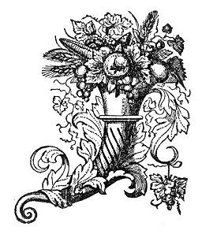

  
[Intangible Textual Heritage](../../index)  [Legends and
Sagas](../index)  [Index](index)  [Previous](rft03)  [Next](rft05) 

------------------------------------------------------------------------

[Buy this Book on
Kindle](https://www.amazon.com/exec/obidos/ASIN/B002IKKI4I/internetsacredte)

------------------------------------------------------------------------

  
*Roumanian Fairy Tales and Legends*, by E.B. Mawr, \[1881\], at
Intangible Textual Heritage

------------------------------------------------------------------------

p. 21

# THE UNGRATEFUL WOOD-CUTTER.

ONCE on a time there lived in a village, a Woodcutter, so poor, so poor,
that he had only his hatchet with which to gain bread for his wife and
children. With difficulty could he earn six-pence a day, and it needed
his wife and himself to rise early and go late to bed, so as to ensure
them the coarsest food. Repose they had none.

"What am I to do?" said he, one day, "I am worn out with fatigue, my
wife and children have nothing to eat, and I have no longer strength to
hold my hatchet, to earn even bitter black bread for my family. Ah! it
is very bad luck for the poor, when they are brought into this world."

While he was lamenting in this way, a voice called to him in a
compassionate tone: "What are you complaining of?"

"Am I not likely to complain, when I have no food?" said he. "Go home,"
said the voice, "dig up the earth in the corner of your garden, and you
will find under a dead branch, a treasure.

When the wood-cutter heard this, he threw himself on his knees, and
cried out: "Master, how do you call yourself? who are you with so kind a
heart?"

p. 22

"My name is Merlin," said the voice."

"Ah! Master, God will bless you if you will come to my aid, and save a
poor family from destitution."

"Go quickly," said the voice, "and in a year's time come back here, and
give me an account of what you have done with the money you will find in
the corner of the garden."

"Master, I will come in a year's time, or every day, if you command me."

So he went home, dug the earth in the corner pointed out to him, and
there found the promised treasure.

I leave it to you to picture his joy, and that of his whole family.

Not wishing his neighbours to know that he had become so suddenly rich,
he still continued to go to the wood, and gradually seemed to rise from
poverty to wealth.

### II.

At the end of the year, he went according to agreement to the forest.
The voice cried, "So, you have come!" "Yes, Master," "And how have you
fared?" "Well, Master, my family have good food and clothing, and we
have reason to thank you every day." "You are well off, then, now; but
tell me

p. 23

is there anything else you long for?" "Ah, yes, Master, I should like to
be made Mayor of the village."

"All right, in forty days you shall be named Mayor."

"Oh, a thousand thanks, my clear protector, you are as good as
newly-baked bread."

### III.

The second year, the rich wood-cutter came to the forest in fine new
clothes, and wearing, tied round his waist, the scarf of Mayor.

"Mr. Merlin," called he" come and speak to me."

"Here I am," said the voice, "what more do you wish?"

"Our Bishop died yesterday, and my son, with your aid, would like to
replace him. A fresh favour, then, I ask of your kindness."

"In forty days, it shall be done," said Merlin.

### IV.

Accordingly, in forty days, the son became a Bishop, and yet they were
not contented.

At the end of the third year, the wood-cutter

p. 24

sought his protector, and in a low voice, called . "Merlin, will you do
me another favour?"

"What is it?" said the voice.

"My daughter wishes to be the wife of a Director," said he. "So let it
be," replied Merlin, "in forty clays, the marriage shall take place."
And so it all came to pass.

### V.

Then the wood-cutter spoke in this wise to his wife: "Why should I go
again into the forest to speak to a creature whom I have never seen? I
am wealthy enough now, I have plenty of friends, and my name is
respected."

"Go once more," said she, "you ought to wish him good day, and thank him
for all his benefits."

So the wood-cutter mounted his horse, and followed by two servants,
entered the wood, and began to shout: "Merlot! Merlot! I have no more
need of you, for I am sufficiently rich now." Merlin replied, "It seems
that you have forgotten the time when you had not enough to eat,
possessed only your hatchet, and could scarcely earn sixpence a day! The
first service I rendered you, you went on your knees, and called me
'Master;' after the second, a little less polite, you said 'Mister;'
after

p. 25

the third, only plain 'Merlin,' and now you have the impudence to
address me as 'Merlot!' you think you have made your account well, and
have no longer need of me. We'll see to that! You have always been
heartless and stupid; continue to be stupid, and remain Poor as you were
when I took you up." The rich man laughed, shrugged his shoulders, and
did not believe a word that had been said to him.

He went back to his home. Soon his son, the Bishop died. His daughter,
the Director's wife, also had a bad illness, and she died too. To crown
his misfortunes, a war broke out, and the soldiers of each army entered
his cellars, consumed his wine and his granaries of corn, and burned his
maize in the field. His house also they set fire to, so he remained
penniless, and uncared for.

### VI.

When the time came for him to pay his taxes, he had no money in his
purse, and was obliged to sell his farm. "See," said the ungrateful man,
weeping, "I have lost all that I possessed--money, farm, house,
children! Why did I not believe Merlin? It only remains for me to die,
for I cannot bear this cursed life of a dog." "No, no," said his wife,
"we

p. 26

must set to work again." "With what?" said he, "we have not even a
donkey left!" "With what God gives us," said she.

God only gave them a basket, borrowed from a neighbour. With this on his
back, and his hatchet in hand, he set off once more to the wood, to try
to earn his sixpence a day.

Never more did he hear the voice of Merlin.

 

 

------------------------------------------------------------------------

[Next: The Hermit's Foundling with the Golden Hair](rft05)
