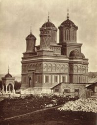
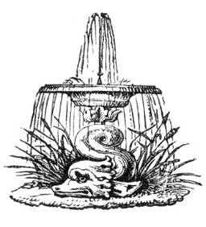

  
[Intangible Textual Heritage](../../index)  [Legends and
Sagas](../index)  [Index](index)  [Previous](rft10)  [Next](rft12) 

------------------------------------------------------------------------

[Buy this Book on
Kindle](https://www.amazon.com/exec/obidos/ASIN/B002IKKI4I/internetsacredte)

------------------------------------------------------------------------

  
*Roumanian Fairy Tales and Legends*, by E.B. Mawr, \[1881\], at
Intangible Textual Heritage

------------------------------------------------------------------------

p. 97

 
[  
Click to enlarge](img/monast.jpg)  
MONASTERY OF ARGISCH  
Built by Manoli; restored 1880.

 

# LEGENDS.

## MANOLI.

### A LEGEND OF THE 13TH CENTURY.

A BRILLIANT cortège winds along the banks of a river; a crowd of
powerful nobles respectfully surround their Chief, whose great height
and manly expression, seem to indicate him worthy of being the Commander
amongst them all. In his immediate neighbourhood, nine artizans may be
observed; they also yield obedience to a Chief, noted for his superior
experience and knowledge.

The river below, the river whose waters roll through a country so wild,
here shooting up into cascades, and there falling back murmuring on the
pointed rocks worn and sharpened by their beatings; lower down, flowing
evenly along--sometimes subdued, sometimes in revolt--emblematic alike
of life, will, impatience, and human resignation;--this river is the
Argis, and the country through which it flows is called *Lesser
Wallachia*.

The Chief whom we see surrounded by his nobles,

p. 98

mounted on their splendid horses, with gorgeous trappings, is *Radu the
Black*, Prince of the country, and founder of the Principality.

This brilliant cavalcade is in reality a pious pilgrimage, in search of
a suitable site, to be consecrated by the erection of a Monastery,
unequalled for beauty of position, and richness of design.

This is also why, amongst so illustrious a company are to be found the
nine masons, headed by the master hand of all the masons--the renowned
*Manoli*.

A young shepherd comes in sight, playing on his flute, a Doïna (National
wail) of his country.

"Shepherd," cried Radu, stopping him, "thou must often with thy flocks
have explored the banks of the Argis; tell me, hast thou never seen a
wall hidden amongst the green brushwood of the nut trees?"

"Yes, Prince, I have seen a wall which was begun to be built, and my
dogs howled at it, as if they had been howling for a death."

"Right," said the Prince, with satisfaction, "it is there that our
Monastery shall rise;" then calling Manoli and his masons, "Listen," he
said, "I wish you to build me an edifice, so noble and beautiful, that
its equal shall never be found, neither in the

p. 99

present nor in the future. I promise to you all, treasures, titles, and
estates, which shall make you equals with the Boyards of my court. I
promise, on the honour of a Prince, and you know you may rely on my
promises. Wait 1 don't thank me yet! My word is sacred, and again I say,
what I promise I always carry out; if you *do not succeed, I will have
you walled up living*, in the foundation of the Monastery, which shall
be built by cleverer hands than yours."

Terror, and ambition! two great incentives for all men! So the masons
get quickly to work; they measure the ground; they dig the soil; and
soon a majestic wall begins to rise.

Satisfied with their work, and certain of success, they fall asleep and
dream of the lands, and treasures, and titles, which their skilfulness
is to bring them.

Morning comes, the golden rays of the sun dart over the waters of the
Argis; the cool morning air, and the desire to continue their work--only
interrupted for needful repose--arouse the masons; they seize their
tools, and walk quickly to recommence their labours; but, alas! that
wall, those solid foundations, all, all, during the night, had crumbled
and disappeared.

p. 100

Instead of sitting down and complaining, the masons recommenced their
task; they think of the Prince, and of his oath, and they Work and
tremble, and tremble and work.

At length, at the end of the day--a long summer's clay, they have
repaired the terrible disaster, and when evening comes, they again seek
repose.

Again morning, and again sunlight reveals the crumbled walls!

In despair, the workmen recommence; for has not the Prince sworn his
terrible oath? But when night comes, they no longer dream of treasures
and titles, but of the terrible chastisement which awaits them.

When they again awake, all is ruin, and this happens four times to them.

The fourth night, notwithstanding his anxiety, Manoli sleeps, and he
dreams a strange and terrible dream. He awakes, and calls his comrades.
"Listen," he says, "to what has been told to me while I was asleep. A
voice whispered to me that all our work will be in vain; that each
night, the work of each day will be destroyed, unless we wall up,
living, in our edifice, the first woman, be she wife or sister, who in
the early morning comes to bring our food."

p. 101

The prospects of the honours which the construction of the Monastery was
to bring them; the riches and titles with which their work was to be
recompensed--decided the workmen, and they each swore a solemn oath, to
wall up while living, be she sister, or wife, the first woman who should
come amongst them next day.

Morning arrived, clear and pure, as if it would not light on one
despairing heart. Manoli anxiously looks into the distance, his oath
strikes him with terror; but he is ambitious, and why should he refuse
to sacrifice some one, to insure his own safety, and the success of his
labour? Looking at it in this light, the engagement becomes a sacred
duty; it is humane even, to secure the safety of several, at the price
of one, and Manoli begins to regard the proceeding as heroic.

Yet he is restless, and gets on a hillock to look around him, to see
still further; he oven mounts a scaffolding, and his eyes scan fearfully
the surrounding plain.

Distant, far distant, he sees something advancing. Who comes in such
haste? In truth, it is a woman, careful and diligent, bringing the early
morning meal to the man she loves. See, with light quick step, she comes
nearer and nearer, she is recognised. It is the beautiful Flora, the
wife of Manoli,

p. 102

Everything disappears from Manoli's sight, the sun is dark, and swollen;
instead of light, there is the darkness of the tomb.

He falls on his knees, and, joining his hands, calls, Oh, Lord, God;
open the cataracts of Heaven, shower on the earth torrents of water,
turn the streamlets into lakes, oh, Merciful Saviour, that my wife may
not be able reach me here!" Did God listen to his prayer? Shortly clouds
covered the sky, and heavy rain began to fall, but Flora continued her
way. Was not her husband waiting? What mattered these obstacles?

Against stream and torrent, she still advances, and Manoli watching her,
again kneels, joins his bands, and cries, "Oh, my God, send a wind to
twist and tear up the plantains, to overthrow the mountains, and to
force my wife to return to the valley!"

The wind rises and whistles in the forest, uproots the plantains, to
overthrow mountains, yet Flora only hastens more quickly to reach her
husband and at length arrives at the fatal spot. Then the masons tremble
at the sight, but tremble with joy.

While Manoli, grief stricken, takes his wife in his arms and says,
"Listen, my dear, to amuse ourselves, we are going to pretend to build
you up in

p. 103

these walls, it will be I, who will place you there, so remain very
quiet."

Flora laughingly consented, for she loved Manoli and had full confidence
in him. Manoli sighed heavily, but though sighing, began to build the
wall, which already reaches to the ankles of Flora--to her knees--higher
and higher. Flora laughs no longer, but, seized with terror, cries,
"Manoli, oh, Manoli, leave off this cruel joking, the wall presses on
me, it will crush me,"

Manoli is silent, but works on, the wall still rises, and is now level
with her waist.

Again she cries, "Manoli! Manoli! stay your hand; soon I shall no longer
see you; I love you so; you are sacrificing me, and yet you say you love
me too."

Manoli works on, and to console himself, thinks,

"Shortly I shall hear no longer her complaining; suffering is not so
bad, when one does not witness it."

The work proceeds--the wall rises even to her eye-brows--at length she
is hid from sight entirely. Manoli moves away, but still hears the faint
moaning voice of his wife. "Manoli, Manoli, the wall is pressing on me,
and my life is dying out."

\*     \*     \*     \*     \*

p. 104

The day was magnificent on which the Prince came to kneel and give
thanks at the beautiful Monastery the best proportioned, and the finest
in style and grandeur which had ever been built. The master masons,
Manoli amongst them, swelling with pride, waited, at the top of the
scaffolding, the visit, the praise, and the recompense of Radii their
Prince.

"Well, is it true," said the Prince, "that you could never imagine, or
construct, an edifice more splendid than this? Can no other Sovereign
signalise his power and his wealth by a finer building than this?"

The masons inflamed with pride and emulation, cried with a triumphant
air, "Know, Prince, that we are the Master Masons, whose science and
skill is unrivalled: we might be able, even, to create a greater work
than this."

The Prince turned aside with a wicked smile.

"Wait up here for me," he said, "I will go down to fully examine the
edifice from below, and I will come up again and make my observations to
you." Hurrying from the scaffolding, he gave a quick sign, and command
to the people below, who speedily knocked away, props, poles, and
planks, and the masons fell from the great height to an instantaneous
death. Manoli, alone caught at a projecting carving, and passing from
one to another, would soon have

p. 105

reached the ground, but there came from the wall which he was touching,
the cry, "Manoli, Manoli, the cold wall is pressing on me, my body is
crushed, and my life is dying out." At this sound, Manoli, turns giddy
and faint, and falls to the earth.

On the spot where he fell, there springs a fountain of clear sparkling
water, but its taste is salt and bitter, as the tears which are shed in
Roumania, even now, when any one relates the sorrows and the sacrifice
of Flora, the wife of Manoli.

 

 

------------------------------------------------------------------------

[Next: The Fortress of Poinarii](rft12)
