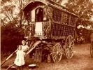

  
[Intangible Textual Heritage](../../../index) 
[Legends/Sagas](../../index)  [Roma](../index)  [Index](index) 
[Previous](gft045)  [Next](gft047) 

------------------------------------------------------------------------

[Buy this Book at
Amazon.com](https://www.amazon.com/exec/obidos/ASIN/B002BH3G88/internetsacredte)

------------------------------------------------------------------------

  
*Gypsy Folk Tales*, by Francis Hindes Groome, \[1899\], at Intangible
Textual Heritage

------------------------------------------------------------------------

### Questions of Date.

Sometimes, however, a date does seem to preclude the notion that the
dissemination of this or that folk-tale can have been due to Gypsies.
The 'Grateful Dead,' the first of our collection, is a case in point.
The Turkish-Gypsy version is excellent--as good, indeed, as any known to
me; but the story seems to have been current in England as early, at any
rate, as 1420--the date assigned to the metrical romance of 'Sir
Amadas.' Again, according to Mr. Jacobs' *More Celtic Fairy Tales*, p.
229, 'the most curious and instructive parallel to Campbell's West
Highland tale of "Mac Iain Direach" \[= our [No. 75](gft135.htm#an_75)\]
is that afforded by the Arthurian romance of Walewein or Gawain, now
only extant in Dutch, which, as Professor W. P. Ker has pointed out in
*Folk-Lore*, v. 121, exactly corresponds to the popular tale, and thus
carries it back in Celtdom to the early twelfth century at the latest.'
Only, how from Celtdom has the story wandered to the Polish Gypsies of
Galicia, whose tale of 'The Golden Bush and the Good Hare' ([No.
49](gft109.htm#an_49)) is clearly identical?

------------------------------------------------------------------------

[Next: Indian Parallels](gft047)
