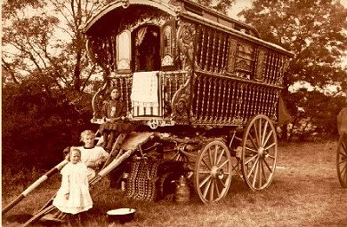

  
[Intangible Textual Heritage](../../../index) 
[Legends/Sagas](../../index)  [Roma](../index) 

------------------------------------------------------------------------

[Buy this Book at
Amazon.com](https://www.amazon.com/exec/obidos/ASIN/B002BH3G88/internetsacredte)

------------------------------------------------------------------------

<table width="75%">
<colgroup>
<col style="width: 50%" />
<col style="width: 50%" />
</colgroup>
<tbody>
<tr class="odd">
<td width="50%" data-valign="TOP"></td>
<td width="50%" data-valign="CENTER"><h1 id="gypsy-folk-tales" data-align="CENTER">Gypsy Folk Tales</h1>
<h2 id="by-francis-hindes-groome" data-align="CENTER">by Francis Hindes Groome</h2>
<h4 id="section" data-align="CENTER">[1899]</h4>
<h4 id="section-1"></h4></td>
</tr>
</tbody>
</table>

------------------------------------------------------------------------

[Contents](#contents)    [Start Reading](gft000)    [Text
\[Zipped\]](gft.txt.gz)

------------------------------------------------------------------------

|                                                                                                                           |
|---------------------------------------------------------------------------------------------------------------------------|
|  |

Francis Hindes Groome was one of the small group of 19th century
folklorists who immersed themselves in Roma (Gypsy) life. This was in
the heroic period of the study of folklore, when devoted scholars built
up the field from scratch. Even then, however, it was obvious that there
were universal story motifs that spanned continents and cultures. Groome
hypothesized that the nomadic Roma had been a primary conduit for the
transfer of a common body of stories across a broad region of Eurasia.

Today we know that many of these themes not only span Eurasia, but are
present in the folklore of people in Africa, Polynesia, Australia, and
the New World, who are separated by millennia and oceans from Europe.
The fairy-tale narrative of a protagonist of humble origin who goes on
magical journeys of transformation, aided by animal guides, tales of
tricksters, and evil step-relations are found around the world. So
diffusion is less attractive as a hypothesis. These stories seem to be
embedded in the deep structure of our consciousness.

This book is a treasure trove of classic 'Gypsyology', and makes
fascinating reading for everyone interested in the Roma people and
folklore in general. These are not watered down 'fairy tales,' but
sophisticated and often earthy stories, with 'Adult situations.' Groome
edited this material with a very light hand, and made no attempt to
correct plot holes or inconsistencies, as in the some of the more
bowdlerized 19th century folklore books. He simply lets the story teller
weave their spell on us.

------------------------------------------------------------------------

 [Title Page](gft000)  
[Pazorrhus](gft001)  
[Dedication](gft002)  

### Introduction

[Distribution of Gypsies](gft003)  
[Appearance in West](gft004)  
[At Bologna](gft005)  
[At Paris](gft006)  
[In England](gft007)  
[In Scotland](gft008)  
[In North America](gft009)  
[In South America.](gft010)  
[In Australia](gft011)  
[Transportation](gft012)  
[In Crete.](gft013)  
[In Corfu.](gft014)  
[In the Peloponnesus.](gft015)  
[In Roumania](gft016)  
[The Chaltsmide](gft017)  
[Athingani](gft018)  
[Atsincan](gft019)  
[Komodromoi](gft020)  
[Nails of Crucifixion](gft021)  
[Gypsy Language](gft022)  
[Gypsies as Nomads](gft023)  
[Caldarari](gft024)  
[Ciboure](gft025)  
['Greek Gypsies.'](gft026)  
[Eastern Gypsies in Galloway.](gft027)  
[Gypsy Folk-tales](gft028)  
[Campbell of Islay](gft029)  
[Dr. F. Müller](gft030)  
[Dr. Paspati](gft031)  
[Dr. Barbu Constantinescu](gft032)  
[Miklosich](gft033)  
[Wlislocki](gft034)  
[Dr. R. von Sowa](gft035)  
[Dr. Kopernicki](gft036)  
[John Roberts](gft037)  
[Mr. John Sampson](gft038)  
[Campbell of Islay](gft039)  
[Boat-dwelling Tinkers](gft040)  
[Kounavine](gft041)  
[Theory as to Gypsy Folk-tales](gft042)  
[Gypsy variants](gft043)  
[Unique Features](gft044)  
[Literary Sources](gft045)  
[Questions of Date](gft046)  
[Indian Parallels](gft047)  
[Tokens of Recent Diffusion](gft048)  
[The Anthropological Theory](gft049)  
[Gypsy savagery](gft050)  
[Cannibalism](gft051)  
[Gypsy Migrations](gft052)  
[Gypsy originality](gft053)  
[Gaelic and Welsh-Gypsy stories](gft054)  
[Other Parallels](gft055)  
[Irish and Gypsy Folk-tales](gft056)  
[Gypsy story-tellers](gft057)  
[Story-Telling a living Gypsy art](gft058)  
[Possible Gypsy influences](gft059)  
[Theory](gft060)  

### Chapter I. Turkish-Gypsy Stories

[No. 1.--The Dead Man's Gratitude](gft061)  
[No. 2.--Baldpate](gft062)  
[No. 3.--The Riddle](gft063)  
[No. 4.--Story of the Bridge](gft064)  

### Chapter II. Roumanian-Gypsy Stories

[No. 5.--The Vampire](gft065)  
[No. 6.--God's Godson](gft066)  
[No. 7.--The Snake who became the King's Son-in-law](gft067)  
[No. 8.--The Bad Mother](gft068)  
[No. 9.--The Mother's Chastisement](gft069)  
[No. 10.--The Three Princesses and the Unclean Spirit](gft070)  
[No. 11.--The Two Thieves](gft071)  
[No. 12.--The Gypsy and the Priest](gft072)  
[No. 13.--The Watchmaker](gft073)  
[No. 14.--The Red King and the Witch](gft074)  
[No. 15.--The Prince and the Wizard](gft075)  
[No. 16.--The Apples of Pregnancy](gft076)  

### Chapter III. Bukowina-Gypsy Stories

[No. 17.--It all comes to Light](gft077)  
[No. 18.--The Golden Children](gft078)  
[No. 19.--The Two Children](gft079)  
[No. 20.--Mare's Son](gft080)  
[No. 21.--The Deluded Dragon](gft081)  
[No. 22.--The Gypsy and the Dragon](gft082)  
[No. 23.--The Seer](gft083)  
[No. 24.--The Prince, his Comrade, and Nastasa the Fair](gft084)  
[No. 25.--The Hen that laid Diamonds](gft085)  
[No. 26.--The Winged Hero](gft086)  
[No. 27.--Tropsyn](gft087)  
[No. 28.--The Beautiful Mountain](gft088)  
[No. 29.--Pretty-face](gft089)  
[No. 30.--The Rich and the Poor Brother](gft090)  
[No. 31--The Three Brothers](gft091)  
[No. 32.--The Enchanted City](gft092)  
[No. 33.--The Jealous Husband](gft093)  
[No. 34.--Made over to the Devil](gft094)  
[No. 35.--The Lying Story](gft095)  
[No. 36.--Happy Boz’ll](gft096)  

### Chapter IV. Transylvanian-Gypsy Stories

[No. 37.--The Creation of the Violin](gft097)  
[No. 38.--The Three Golden Hairs of the Sun-King](gft098)  
[No. 39.--The Dog and the Maiden](gft099)  
[No. 40.--Death the Sweetheart](gft100)  

### Chapter V. Slovak, Moravian, and Bohemian Gypsy Stories

[No. 41.--The Three Girls](gft101)  
[No. 42.--The Dragon](gft102)  
[No. 43.--The Princess and the Forester's Son](gft103)  
[No. 44.--The Three Dragons](gft104)  

### Chapter VI. Polish-Gypsy Stories

[No. 45.--Tale of a Foolish Brother and of a Wonderful Bush](gft105)  
[No. 46.--Tale of a Girl who was sold to the Devil, and of her
Brother](gft106)  
[No. 47.--The Brigands and the Miller's Daughter](gft107)  
[No. 48.--Tale of a Wise Young Jew and a Golden Hen](gft108)  
[No. 49.--The Golden Bird and the Good Hare](gft109)  
[No. 50.--The Witch](gft110)  

### Chapter VII. English-Gypsy Stories

[No. 51.--Bobby Rag](gft111)  
[No. 52.--De Little Fox](gft112)  
[No. 53.--De Little Bull-calf](gft113)  

### Chapter VIII. Welsh-Gypsy Stories

[No. 54.--Jack and his Golden Snuff-box](gft114)  
[No. 55.--An Old King and his three Sons in England](gft115)  
[No. 56.--The Five Trades](gft116)  
[No. 57.--Ashypelt](gft117)  
[No. 58.--Twopence-Halfpenny](gft118)  
[No. 59.--The Old Smith](gft119)  
[No. 60.--The Old Soldier](gft120)  
[No. 61.--The Dragon](gft121)  
[No. 62.--The Green Man of Noman's Land](gft122)  
[No. 63.--The Black Lady](gft123)  
[No. 64.--The Ten Rabbits](gft124)  
[No. 65.--The Three Wishes](gft125)  
[No. 66.--Fairy Bride](gft126)  
[No. 67.--Cinderella](gft127)  
[No. 68.--Jack the Robber](gft128)  
[No. 69.--The Fool with the Sheep](gft129)  
[No. 70.--The Tinker and his Wife](gft130)  
[No. 71.--Winter](gft131)  
[No. 72.--The Black Dog of the Wild Forest](gft132)  

### Chapter IX. Scottish-Tinker Stories

[No. 73.--The Brown Bear of the Green Glen](gft133)  
[No. 74.--The Tale of the Soldier](gft134)  
[No. 75.--The Fox](gft135)  
[No. 76.--The Magic Shirt](gft136)  

### Appendix

[De New Han’](gft137)  
[John Bunyan](gft138)  

 

[Index](gft139)  
