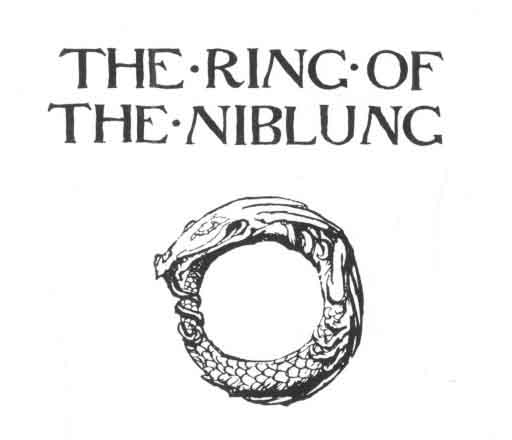
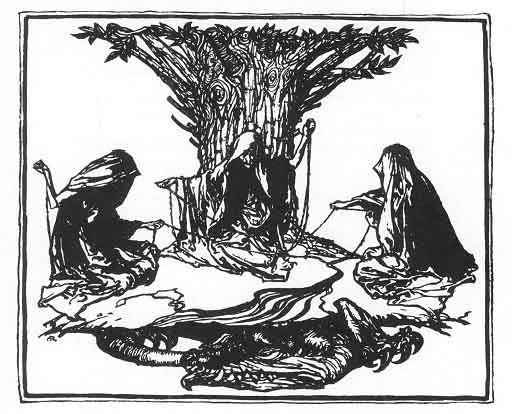
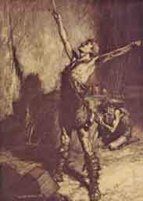

[Intangible Textual Heritage](../../index)  [Legends and
Sagas](../index)  [Index](index)  [Next](ron01) 

------------------------------------------------------------------------

p. title

 

### RICHARD WAGNER'S

# THE RING OF THE NIBLUNG

### SIEGFRIED & THE TWILIGHT OF THE GODS

#### TRANSLATED BY MARGARET ARMOUR

#### WITH ILLUSTRATIONS BY ARTHUR RACKHAM

 

#### ABARIS BOOKS; NEW YORK

#### \[1910\]

###### Scanned at sacred-text.com, March 2003. J. B. Hare, redactor. This text is in the public domain. These files may be used for any non-commercial purpose provided this notice of attribution is left intact.

 [  
Click to enlarge](img/front.jpg)

------------------------------------------------------------------------

[Next: List of Illustrations](ron01)
