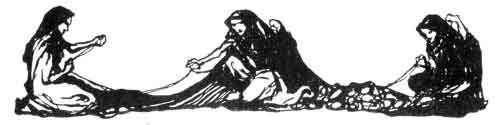
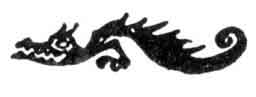

[Intangible Textual Heritage](../../index)  [Legends and
Sagas](../index)  [Index](index)  [Previous](ron06)  [Next](ron08) 

------------------------------------------------------------------------

p. 103

 

# PRELUDE

The curtain rises slowly. The scene is the same as at the close of the
second day, on the Valkyries' rock; night. In the background, from
below, firelight shines. The three Norns, tall women in long, dark,
veil-like drapery. The first (eldest) lies in the foreground, to the
right, under the spreading pine-tree; the second (younger) is stretched
on a shelving rock in front of the cave; the third (youngest) fits in
the centre at the back on a rock near the peak. Motionless, gloomy
silence.

The First Norn

What light glimmers there?

The Second Norn

Is it already dawn?

The Third Norn

Loge's host  
Glows in flame around the rock.  
It is night.  
Why spin we not, singing the while?

The Second Norn

\[*To the first*.\]

Where for our spinning and singing  
Wilt thou fasten the rope?

The First Norn

\[*While she loosens a golden ropes from herself and ties one end of it
to a branch of the pine-tree*.\]

I sing and wind the rope  
Badly or well, as may be.  
At the world-ash-tree  
Once I wove,  
When from the stem  
There bourgeoned strong  
The boughs of a sacred wood.  
In the shadows cool  
A fountain flowed;  
Wisdom whispered  
Low from its wave;  
Of holy things I sang.

p. 104

A dauntless God  
Came to drink at the well;  
For the draught he drank  
He paid with the loss of an eye.  
From the world-ash-tree  
Wotan broke a holy bough;  
From the bough he cut  
And shaped the shaft of a spear.

As time rolled on the wood  
Wasted and died of the wound;  
Sere, leafless and barren,  
Wan withered the tree;  
Sadly the flow  
Of the fountain failed;  
Troubled grew  
My sorrowful song.  
And now no more  
At the world-ash-tree I weave;  
I needs must fasten  
Here on the pine-tree my rope.  
Sing, O sister--  
Catch as I throw--  
Canst thou tell us why?

The Second Norn

\[*Winds the rope thrown to her round a projecting rock at the entrance
of the cave*.\]

Runes of treaties  
Well weighed and pondered  
Cut were by Wotan  
In the shaft,  
Which wielding, he swayed the world.  
A hero bold  
In fight then splintered the spear,  
The hallowed haft  
With its treaties cleaving in twain.  
Then bade Wotan  
Walhall's heroes

p. 105

Hew down the world-ash-tree  
Forthwith,  
Both the stem and boughs sere and barren.  
The ash-tree sank;  
Sealed was the fountain that flowed.  
Round the sharp edge  
Of the rock I wind the rope  
Sing, O sister,  
Catch as I throw;  
Further canst thou tell?

The Third Norn

\[*Catching the rope and throwing the end behind her*.\]

The castle stands  
By giants upreared.  
With the Gods and the holy  
Host of the heroes  
Wotan sits in his hall;  
And round the walls  
Hewn logs are heaped,  
High up-piled,  
Ready for burning:  
The world-ash-tree these were once.  
When the wood  
Flares up brightly and burns,  
In its fire  
Shall the fair hall be consumed.  
And then shall the high Gods' downfall  
Dawn in darkness for aye.  
Know ye yet more,  
Begin anew winding the rope;  
Again I throw it  
Back from the north.  
Spin and sing, O my sister.

\[*She throws the rope to the second Norn, and the second throws it to
the first, who loosens the rope from the bough and ties it on to
another*.\]

p. 106

The First Norn

\[*Looking towards the back*.\]

Is it the dawn,  
Or the firelight that flickers?  
Grief-darkened is my gaze.  
The holy past  
I can scarce remember,  
When Loge burst  
Of old into burning fire.  
Dost thou know how he fared?

The Second Norn

\[*Winding the rope which has been thrown to her round the rock
again*.\]

Overcome by Wotan's  
Spear and its magic,  
Loge worked for the God  
Then, to win his freedom  
Gnawed with his tooth  
The solemn runes on the shaft.  
So with the potent  
Spell of the spear-point  
Wotan confined him  
Flaming where Brünnhilde slumbered.  
Canst thou tell us the end?

The Third Norn

With the broken spear's  
Sharp-piercing splinters  
Wotan wounded  
The blazing one deep in the breast;  
Ravening fire  
Springs from the wound,  
And this is thrown  
'Mid the world-ash-tree's  
Hewn logs heaped ready for burning.  
Would ye know  
When that will be,  
Wind, O sisters, the rope!

\[*She throws the rope back; the second Norn winds it up and throws it
again to the first*.\]

p. 107

The First Norn

\[*Fastening the rope again*.\]

The night wanes,  
Dark grows my vision;  
I cannot find  
The threads of the rope;  
The strands are twisted and loose.  
A horrible sight  
Wildly vexes mine eyes:  
The Rhinegold  
That black Alberich stole.  
Knowest thou more thereof?

The Second Norn

\[*With laborious haste winds the rope round the jagged rock at the
mouth of the cave*.\]

The rock's sharp edge  
Is cutting the rope;  
The threads loosen  
Their hold and grow slack;  
They droop tangled and frayed.  
From woe and wrath  
Rises the Nibelung's ring  
A curse of revenge  
Ruthlessly gnaws at the strands:--  
Canst thou the end foretell?

The Third Norn

\[*Hastily catching the rope which is thrown to her*.\]

The rope is too short,  
Too loose it hangs;  
It must be stretched,  
Pulled straighter, before  
Its end can reach to the north!

\[*She pulls hard at the rope, which breaks*.\]

It breaks!

The Second Norn

It breaks!

The Third Norn

It breaks!

\[*They take the pieces of broken rope and bind their bodies together
with them*.\]

p. 108

The Three Norns

So ends wisdom eternal!  
The wise ones  
Will utter no more.  
Descend to Erda! Descend!

\[*They vanish. The dawn grows brighter; the firelight from the valley
gradually fades. Sunrise; then broad daylight.*\]

 

\[*Siegfried and Brünnhilde enter from the cave. He is fully armed; she
leads her horse by the bridle*.\]

Brünnhilde

Belovèd hero,  
Poor my love were  
Wert thou thereby  
Kept from new deeds.  
One single doubt  
Yet makes me linger:  
The fear my service  
Has been too small.  
The things the Gods taught me  
I could give:  
All the rich hoard  
Of holy runes;  
But by the hero  
Who holds my heart  
I have been robbed  
Of my maiden valour.  
In wisdom weak,  
Although strong in will;  
In love so rich,  
In power so poor--  
Must thou not scorn  
Her lack of riches  
Who, though so eager,  
Can give nothing more?

p. 109

Siegfried

Wonderful woman, more  
Thy gifts than I can guard!  
O chide not if thy teaching  
Has left me still untaught.

\[*With fire*.\]

That Brünnhilde lives for me--  
To that lore I hold fast;  
And one lesson I have learned--  
Brünnhilde to remember!

Brünnhilde

If thou wouldst truly love me,  
Think of thyself alone,  
And of thy deeds of daring!  
The raging fire remember  
That fearless thou didst fare through  
When around the rock it burned--

Siegfried

That I might conquer Brünnhild'!

Brünnhilde

Think too of the shield-hidden maid  
Thou didst find there lapped in slumber,  
And whose helmet hard thou didst break--

Siegfried

Brünnhilde to awaken!

Brünnhilde

Those oaths remember  
That unite us;  
The faith and truth  
That are between us,  
And evermore  
The love we live for;  
Brünnhilde in thy breast  
Will deeply bum then for aye!

\[*She embraces Siegfried*.\]

Siegfried

Must I leave thee, O love,  
In thy holy fortress of fire,

\[*He has taken Alberich's ring from his finger, and holds it out to
Brünnhilde*.\]

p. 110

This ring of mine I give thee;  
Let it pay for thy runes.  
Of whatever deeds I did  
The virtue lies therein.  
By my hand was the dragon grim,  
Who long had guarded it, slain;  
Keep thou the gold and its might  
As token true of my love!

Brünnhilde

\[*Putting on the ring in rapturous delight*.\]

I covet it more than all else!  
For the ring take Grane, my horse.  
Through the air with me  
He galloped once boldly,  
But lost with mine  
Was his magic art;  
Upon clouds and storm,  
Through thunder and lightning  
No more  
Gallantly now will he sweep!  
But if thou lead the way,  
Even through fire  
Fearlessly Grane will follow.  
For henceforth, hero,  
Thou art his master!  
Entreat him well;  
He knows thy voice;  
O, greet him often  
In Brünnhilde's name!

Siegfried

Then every deed that I dare  
Will be achieved through thy virtue;  
All my battles thou wilt choose,  
And my victories will be thine.  
Upon thy good horse riding,  
And sheltered by thy shield,  
No longer Siegfried am I,  
But only Brünnhilde's arm

p. 111

Brünnhilde

O were but Brünnhilde thy soul too!

Siegfried

Through her my courage burns high.

Brünnhilde

Then wert thou Siegfried and Brünnhild'.

Siegfried

Where I am, there thy abode is.

Brünnhilde

\[*With animation*.\]

Then a waste is my hall of rock?

Siegfried

Made one, both there abide.

Brünnhilde

\[*Greatly moved*.\]

Ye Gods, O ye holy  
Race of immortals,  
Feast ye your eyes  
On this love-hallowed pair!  
Apart--who shall divide us?  
Divided--still we are one!

Siegfried

Hail, O Brünnhilde,  
Beautiful star!  
Hail, love and its glory!

Brünnhilde

Hail, O Siegfried,  
Conquering light!  
Hail, life and its glory!  
Hail, conquering light!

Both

Hail! Hail! Hail! Hail!

\[*Siegfried leads the horse quickly to the edge of the sloping rock,
Brünnhilde following him. Siegfried disappears with the horse down
behind the projecting rock, so that he is no longer visible to the
audience. Brünnhilde is thus suddenly left standing alone on the edge of
the slope, and gazes down into the valley after Siegfried. Her gestures
show that Siegfried has vanished from her sight. Siegfried's horn is
heard from below. Brünnhilde listens, and steps further out on the
slope. She catches sight of Siegfried in the valley again, and waves to
him joyfully. Her happy smiles seem to reflect the air of the merrily
departing hero*.\]

------------------------------------------------------------------------

[Next: The First Act](ron08)
