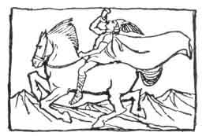
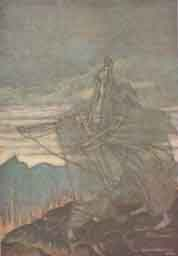
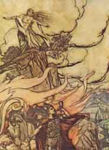
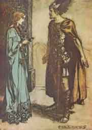
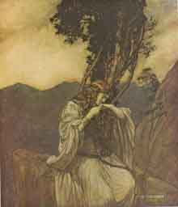
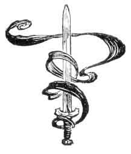

[Intangible Textual Heritage](../../index)  [Legends and
Sagas](../index)  [Index](index)  [Previous](ron07)  [Next](ron09) 

------------------------------------------------------------------------

p. 112

 

# THE FIRST ACT

 

The hall of the Gibichungs on the Rhine. This is quite open at the back.
A open shore stretching to the river occupies the background. Rocky
heights enclose the shore. Gunther and Gutrune on a throne at one side,
before which stands a table with drinking vessels on it. In front of
this Hagen is seated.

Gunther

Give ear, Hagen;  
Tell me the truth:  
Is my fame on the Rhine  
Worthy of Gibich's son?

Hagen

I envy thee  
Thy fame and thy glory;  
Thy great renown was foretold  
To me by Grimhild' our mother.

Gunther

I envy thee,  
So envy not me.  
1, as first-born, rule,  
But the wisdom is thine.  
Half-brother's feud  
Could scarce be laid better;  
Asking thus of my renown,  
'Tis thy wisdom that I praise.

Hagen

My words I withdraw,  
Thy fame might be more:  
I know of precious treasures  
That the Gibichung has not yet won.

Gunther

Hide these, and I  
Withdraw my praise.

 [  
Click to enlarge](img/11200.jpg)

The Norns vanish  
See [p. 108](ron07.htm#page_108)

 

p. 113

Hagen

In summer's full-ripened glory  
Blooms the Gibich stock,  
Thou, Gunther, still unwived,  
Thou, Gutrun', still unwed.

Gunther

Whom wouldst thou have me woo,  
To win more wide renown?

Hagen

One I know of,  
None nobler in the world.  
She dwells on soaring rocks,  
Her chamber is circled by fire;  
And he who would Brünnhild' woo  
Must break through the daunting flame.

Gunther

Suffices my strength for the task?

Hagen

For one stronger still it is decreed.

Gunther

Who is that hero unmatched?

Hagen

Siegfried, the Wälsung's son;  
He is the hero bold.  
A twin-born pair,  
Whom fate turned to lovers,  
Siegmund and Sieglinde,  
Had as their offspring this child.  
In the woods he grew and waxed strong.  
'Tis he that Gutrun' must wed.

Gutrune

\[*Shyly*.\]

Tell me what deed of high valour  
Made this hero the first in renown.

Hagen

At Neidhöhle  
A huge dragon lay,  
Who guarded the Nibelung's gold.  
He was slain,  
And his horrid jaws closed  
By Siegfried's invincible sword.

p. 114

From this colossal deed  
The fame of the hero dawned.

Gunther

\[*Thoughtfully*.\]

They say that a priceless treasure  
The Niblungs had in their hoard.

Hagen

The man who could use its spell  
Were lord of the world evermore.

Gunther

And Siegfried won it in fight?

Hagen

He has the Niblungs in thrall.

Gunther

And Brünnhild' no other can win?

Hagen

To no other will the flames yield.

Gunther

\[*Rises angrily from his seat*.\]

Why wake dissension and doubt?  
Why stir up my desire  
And yearning for joys  
That cannot be won?

\[*He walks to and fro much agitated*.\]

Hagen

\[*Without leaving his seat causes Gunther to pull up as he approaches
him, by a gesture of mysterious import*.\]

Would not Brünnhilde  
Be thy bride,  
Were she by Siegfried brought home?

Gunther

\[*Turns away doubtful and angry*.\]

But how could I force this man  
To woo the bride for me?

Hagen

\[*As before*.\]

Thy simple prayer would force him,  
Gutrun' winning him first.

Gutrune

Thou mockest, cruel Hagen!  
What arts have I to bind him?  
The greatest hero  
In all the world  
Has long ere this by the fairest  
Women on earth been loved.

 [  
Click to enlarge](img/11400.jpg)

Siegfried leaves Brünnhilde in search of adventure.  
    See [p. 111](ron07.htm#page_111).

 

p. 115

Hagen

\[*Bending confidentially towards Gutrune*.\]

What of the drink in the chest?

\[*More secretly*.\]

In me who won it have more faith.  
To thee in love it will bind  
Him whom thy heart most desires.

\[*Gunther has come to the table again, and, leaning against it, pays
close attention*.\]

Hither did Siegfried come,  
And taste of this potion of herbs,  
He would straight forget he had looked  
On any woman before,  
Or been by woman approached.  
Now answer:  
Think ye my counsel good?

Gunther

\[*Starting up suddenly*.\]

Now Grimhild' be praised,  
Who for brother gave us thee.

Gutrune

Siegfried fain I would behold!

Gunther

But how can he be found?

\[*A horn on the stage, from the background on the left, very loud but
distant*.\]

Hagen

\[*Listens and turns to Gunther*.\]

Merrily hunting  
After renown  
Across the world  
As through a wood,  
Belike in his chase he will come  
To the Gibich's realm on the Rhine.

Gunther

Heartily welcome were he.

\[*A horn on the stage, nearer, but still distant. Both listen*.\]

A horn from the Rhine I hear.

p. 116

Hagen

\[*Looks down the river and calls towards the back*.\]

A man and horse on board a boat  
His horn how gaily he winds!

\[*A horn on the stage sounds nearer. Gunther stops halfway
listening*.\]

See the leisurely stroke,  
And the indolent arm  
Against the stream  
Urging the boat!  
So skilful a hand  
On the swinging oar  
Can be but his  
Who the dragon slew:--  
It is Siegfried-surely no other!

Gunther

Will he go by?

Hagen

\[*Making a trumpet of his hands, calls towards the river*.\]

Hoiho! Blithe hero,  
Whither bound?

Siegfried

\[*From the distance*.\]

I seek the son of Gibich.

Hagen

I bid thee welcome to Gunther's hall.

\[*Siegfried in a boat appears at the shore*.\]

This way! Stop here and land!

\[*Siegfried brings his boat to the shore. Hagen makes it fast with the
chain. Siegfried springs ashore with his horse. Gunther has come down
and joined Hagen*.\]

Hagen

Hail, Siegfried, hero bold!

\[*Gutrune gazes at Siegfried from the throne in astonishment. Gunther
prepares to offer him friendly greetings. All stand fixed in silent
mutual contemplation*.\]

Siegfried

Who is Gibich's son?

\[*Leaning on his horse, remains quietly standing by the boat*.\]

 [  
Click to enlarge](img/11600.jpg)

Siegfried hands the drinking-horn back to Gutrune and gazes at her with
sudden passion  
      See [p. 119](#page_119).

 

p. 117

Gunther

I am he thou dost seek.

Siegfried

Thy fame has reached me  
From the Rhine;  
Now fight with me,  
Or be my friend.

Gunther

Be thou mine;  
Thou art welcome!

Siegfried

Where stable my horse?

Hagen

Leave him to me.

Siegfried

\[*Turning to Hagen*.\]

My name thou knowest;  
Where have we met?

Hagen

I guessed from thy strength  
Who thou must be.

Siegfried

\[*As he hands over the horse to Hagen*.\]

Be careful of Grane,  
For thou hast never  
Led by the rein  
So noble a steed.

\[*Hagen leads the horse away. While Siegfried looks thoughtfully after
him, Gutrune, obeying a sign of Hagen's which Siegfried does not notice,
goes to her room through a door on the left. Gunther comes into the hall
with Siegfried, whom he has invited to accompany him*.\]

Gunther

My father's ancient hall,  
O hero, greet in gladness!  
All thou beholdest,  
Where'er thou art,  
Treat as thine own henceforward  
Thine is my kingdom--  
Land and folk;  
By my body I swear it!  
Yea, myself I am thine.

p. 118

Siegfried

Nor land nor folk have I to give,  
Nor father's house nor hall;  
In my body  
Is all my wealth;  
As I live it grows less.  
But a sword have I  
Which I welded;  
Let my sword be my witness!--  
That and myself I bestow.

Hagen

\[*Who has come back and now stands behind Siegfried*.\]

Of the Nibelungs' treasure  
Rumour names thee the lord.

Siegfried

\[*Turning round to Hagen*.\]

I almost forgot the hoard,  
So lightly I prize its worth.  
I left it lying in a cavern,  
Where a dragon once held watch.

Hagen

And nothing took at all?

Siegfried

Only this, not knowing its use.

Hagen

It is the Tarnhelm,  
The gem of the Nibelung's art;  
Its use, when worn on thy head,  
Is to change thy shape as thou wilt;  
If fain to be borne afar,  
In a flash lo! thou art there!  
Didst thou take nothing besides?

Siegfried

Yes, a ring.

Hagen

Which safe thou dost hold?

Siegfried

\[*Tenderly*.\]

'Tis held by a woman fair.

Hagen

\[*Aside*.\]

Brünnhild'!

p. 119

Gunther

Nay, Siegfried, let us not barter;  
All I have a bauble poor,  
Matched with thy treasure, would be.  
I will serve thee without reward.

\[*Hagen has gone to Gutrune's door, and now opens it*.\]

Gutrune

\[*Enters carrying a full drinking horn, with which she approaches
Siegfried*.\]

Welcome, O guest,  
To Gibich's house!  
'Tis his daughter gives thee to drink.

Siegfried

\[*Bows in a friendly manner and takes the horn, which he holds
thoughtfully before him*.\]

Were all forgot  
Thou gavest to me,  
One lesson  
I will never forget;  
So this first draught  
With love undying,  
Brünnhild', I drink to thee!

\[*He puts the drinking-horn to his lips and takes a long draught; then
he hands it back to Gutrune, who, ashamed and confused, casts down her
eyes. Siegfried gazes at her with sudden passion*.\]

Siegfried

O thou who dost scorch  
And blind with thine eyes,  
Why sink them abashed by my gaze?

\[*Gutrune, blushing, looks up at him*.\]

O lovely maid,  
Lower thine eyes;  
My heart is aflame,  
Burnt by their light;  
They kindle my blood; it flows  
In devouring torrents of fire.

\[*With a trembling voice*.\]

Gunther, what name is thy sister's?

p. 120

Gunther

Gutrune.

Siegfried

\[*Softly*.\]

Can those be good runes  
That in her eyes I am reading?

\[*He ardently seizes Gutrune's hand*.\]

With thy brother I was fain to serve;  
His pride my prayer scorned.  
Were I to pray the same of thee,  
Wouldst thou like him be proud?

\[*Gutrune, involuntarily meets Hagen's eye. She bows her head humbly,
and, expecting her feeling of unworthiness with a gesture, leaves the
hall with faltering steps*.\]

Siegfried

\[*Attentively watched by Hagen and Gunther, gazes after Gutrune as if
entranced*.\]

Gunther, hast thou a wife?

Gunther

I am not wed,  
Nor, it would seem,  
Likely to find a wife!  
My heart on one I have set  
Whom there is no way to win.

Siegfried

\[*Turns with animation to Gunther*.\]

In what canst thou fail  
With me for friend?

Gunther

On rocky heights her home;  
Surrounded by fire her hall;

Siegfried

\[*Interrupting in wondering haste*.\]

"On rocky heights her home  
Surrounded by fire her hall" . . .?

Gunther

He only who braves the fire . . .

Siegfried

"He only who braves the fire" . . . ?

\[*As if making an intense effort to remember something*.\]

p. 121

Gunther

May Brünnhilde's wooer be.

\[*Siegfried shows by a gesture that at the mention of Brünnhilde's name
all remembrance of her has faded*.\]

I dare not essay the dread mountain  
The flames would not fall for me.

Siegfried

\[*Awakens from his dreamy state, and turns to Gunther high spirited and
gay*.\]

For thee I will win her,  
Of fire I have no fear;  
For thy man am I,  
And my strength is thine,  
If Gutrun' I win as my wife.

Gunther

Gutrune gladly I grant thee

Siegfried

Thou shalt have Brünnhilde then.

Gunther

But how wilt deceive her?

Siegfried

I will wear the Tarnhelm,  
And appear in thy form.

Gunther

Then let the oath now be sworn!

Siegfried

Blood-brotherhood  
Sworn be by oath!

\[*Hagen fills a drinking-horn with fresh wine; he holds it out to
Siegfried and Gunther, who cut their arms with their swords and hold
them for a short pace over the horn; then they each lay two fingers on
the horn, which Hagen continues to hold between them*.\]

Siegfried and Gunther

Quickening blood  
Of blossoming life  
Lo! I drop in the horn!  
Bravely mixed  
In brotherly love,

 [  
Click to enlarge](img/12100.jpg)

Brünnhilde kisses the ring that Siegfried has left with her  
                                                  See p. 124

 

p. 122

Bloom our blood in the draught!  
Troth I drink to the friend  
Glad and free  
To-day from the bond  
Blood-brotherhood spring!  
But if broken the bond,  
Or if faithless the friend,  
What in drops to-day  
We drink kindly  
In torrents wildly shall flow,  
Paying treachery's wage.  
So--sealed be the bond!  
So--pledged be my faith!

\[*Gunther drinks and hands the horn to Siegfried, who finishes the
draught, and holds out the empty horn to Hagen. Hagen breaks the horn in
two with his sword. Gunther and Siegfried join hands*.\]

Siegfried

\[*Observes Hagen, who, while the oath was being sworn, has stood behind
him*.\]

Why hast not thou plighted thy troth?

Hagen

My blood had soured the good draught.  
It flows not pure  
And noble like yours;  
Stubborn and cold,  
Slow it runs,  
My cheek refusing to redden.  
I hold aloof  
From hot-blooded bonds.

Gunther

\[*To Siegfried*.\]

Heed not him and his spleen.

Siegfried

\[*Puts on his shield again*.\]

Up, then, and off!  
Back to the boat!  
Sail swift to the mountain!

\[*He steps nearer to Gunther and points at him*.\]

p. 123

By the bank one night  
On board thou shalt tarry,  
And then bring home the bride.

\[*He turns to go, and beckons Gunther to follow him*.\]

Gunther

Wilt thou not rest awhile?

Siegfried

I am eager to be back.

\[*He goes to the shore to unmoor the boat*.\]

Gunther

Thou, Hagen, keep guard o'er the homestead.

\[*He follows Siegfried to the shore. Whilst Siegfried and Gunther,
after laying their arms in the boat, are hoisting the sail and making
ready for departure, Hagen takes up his spear and shield. Gutrune
appears at the door of her chamber just as Siegfried is pushing of the
boat, which immediately glides into the middle of the stream*.\]

Gutrune

So swiftly whither haste they?

Hagen

To woo Brünnhild' for bride.

\[*While he seats himself comfortably with shield and spear in front of
the hall*.\]

Gutrune

Siegfried?

Hagen

See how he hastes,  
For wife seeking to win thee!

Gutrune

Siegfried--mine?

\[*She returns to her room greatly excited. Siegfried has seized an oar
and rows the boat down-stream, so that it is soon lost to view*.\]

Hagen

\[*Sits motionless, his back against the door-post of the hall*.\]

On guard here I sit  
Watching the house,  
Warding the hall from the foe;  
Gibich's son

p. 124

Is sped by the wind,  
And sails away for a wife;  
A hero bold  
Of the helm has charge,  
And danger braves for his sake;  
His bride once loved  
He brings to the Rhine;  
With her he brings me--the ring.  
O merry comrades,  
Freeborn and honoured,  
Gaily speed on in your pride!  
Base though ye deem him,  
The Niblung's son  
Shall yet be your lord.

\[*A curtain which frames the front of the hall is drawn, and cuts the
stage off from the audience*.\]

 

The curtain is raised again. The rocky height as in the Prelude.
Brünnhilde  
sits at the entrance to the cave in silent contemplation of
Siegfried's  
ring. Moved by blissful memories, she covers the ring with kisses.  
Distant thunder is heard; she looks up and listens. She turns to  
the ring again. A flash of lightning. Again she listens, and looks  
into the distance, whence a dark thundercloud is approaching the rock.

Brünnhilde

On my ear from afar  
Falls an old sound familiar.  
A horse comes flying  
Swift through the air;  
On the clouds it sweeps  
In storm to the rock.  
Who seeks the lonely one here?

Waltraute's voice

\[*From the distance*.\]

Brünnhilde, sister,  
Wake if thou sleepest!

p. 125

Brünnhilde

\[*Starts from her seat*.\]

Waltraute's call!  
How welcome the sound!

\[*Calling to the wing, and then hastening to the edge of the rock*.\]

Dost thou, sister,  
Boldly swinging come this way?  
In the wood--  
Still dear to thee--  
Halt and dismount,  
And leave thy courser to rest.

\[*She runs into the wood, from which a loud sound like a thunder-clap
is heard. She returns in great agitation with Waltraute, and remains
joyfully excited without noticing the latter's anxious fear*.\]

Art thou so bold  
That thou art come  
Brünnhild' to greet,  
Thy love unconquered by dread?

Waltraute

Thou alone  
Art cause of my haste!

Brünnhilde

For Brünnhild's sake Warfather's ban  
Hast thou thus bravely broken?  
Or perchance--O say!--

\[*With some hesitation*.\]

Has he at last  
Softened to his child?  
When against the God  
I sought to shield Siegmund,  
Vainly--I know it--  
My deed fulfilled his desire.  
And I know that his anger  
Was assuaged,  
For albeit in slumber deep  
Here to the rock I was bound,

p. 126

Doomed to be thrall to the man  
Who should wake the maid as he passed,  
To my anguished prayer  
He granted grace;  
With ravening fire  
He surrounded the rock,  
To bar to all cowards the road.  
Bane and chastisement  
Turned so to blessing;  
A hero unmatched  
Has won me as wife;  
Blest by his love,  
In light and laughter I live.

\[*She embraces Waltraute with wild manifestations of joy, which the
latter tries with anxious impatience to repress*.\]

Hast thou been lured by my lot,  
And wouldst thou, sister,  
Feast on my gladness,  
Sharing in my delight?

Waltraute

\[*Vehemently*.\]

Sharing the frenzy  
That has maddened thee, fool!  
Far other the cause why I come,  
Defying Wotan in fear.

Brünnhilde

\[*Here, for the first time, notices with surprise Waltraute's wildly
excited state*.\]

Art afraid?  
Anguished with terror?  
So the stern one does not forgive?  
Thou fearest his punishing wrath?

Waltraute

\[*Gloomily*.\]

Might I but fear it,  
At an end were my distress.

Brünnhilde

I am perplexed and amazed.

p. 127

Waltraute

Calm thou thy frenzy;  
Mark with care what I say!  
The fear that drove me  
Hither to thee  
Drives me back to Walhall again.

Brünnhilde

\[*Alarmed*.\]

What ails, then, the Gods everlasting?

Waltraute

Give earnest heed to what I tell thee!  
Since from thee Wotan parted,  
No more has he sent  
Us to battle;  
Anxious and bewildered  
We rode to the field.  
Shunned are Walhall's bold heroes  
By Warfather;  
Riding alone,  
Without pause or rest  
He wandered and roamed through the world.  
At last he returned  
With his spear splintered;  
In his hand the pieces;  
A hero had cleft it asunder.  
With silent sign  
Walhall's heroes  
Then he sent forth  
To hew down the world-ash-tree.  
He bade them pile  
The logs as they hewed them,  
Until they were heaped  
High round the hall of the blest.  
The Gods he next  
Called to a council;  
The high seat  
He solemnly took,

p. 128

Bidding them  
Who gathered in fear sit beside him.  
The heroes filled  
The hall, ranged round in their order.  
So sits he,  
Speaks no word,  
Upon his high seat  
Grave and mute,  
The splintered spear  
Held fast in his hand,  
Holda's apples  
Touching no more.  
Fear and amazement  
Hold the Gods fast fettered.  
He has sent his ravens  
Forth to seek tidings;  
If they return  
And bring him comforting news,  
Then the God will  
With soul serene  
Smile evermore and be glad.  
Round his knees in sorrow  
Twined lie the Valkyries;  
He heeds not  
Our glances beseeching;  
By terror and wild anguish  
We all are consumed.  
Against his breast  
Weeping I nestled,  
Then soft grew his gaze:  
He remembered, Brünnhilde, thee.  
He closed his eyes  
As if dreaming,  
Heavily sighed  
And whispered these words:  
"If to the deep Rhine's daughters

p. 129

She would restore the ring that was theirs,  
From the grievous curse  
Both God and world were freed!"  
Then I took thought,  
And from his side  
Through the silent ranks  
Stole noiselessly forth.  
In haste, unseen,  
I mounted my horse,  
And stormed in tumult to thee.  
Grant, O sister,  
The boon I beg  
What thou canst do,  
Undaunted perform!  
End thou the grief of the Gods!

\[*She has thrown herself down before Brünnhilde*.\]

Brünnhilde

\[*Quietly*.\]

What dreadful dream-born fancies,  
Sad one, are those thou dost tell?  
The high Gods' holy  
And cloud-paved heaven  
Is no longer my home.  
I grasp not what thou art saying;  
Dark its sense,  
Wild and confused.  
Within thine eyes,  
So over-weary,  
Gleams wavering fire;  
With thy wan visage,  
O pale-faced sister,  
What wouldst thou, wild one, of me?

Waltraute

\[*Vehemently*.\]

The ring upon thy hand--  
'Tis that: ah, be implored!  
For Wotan fling it away!

Brünnhilde

The ring--away?

p. 130

Waltraute

To the Rhine-daughters give it again.

Brünnhilde

The Rhine-daughters--I--the ring?  
Siegfried's love-pledge?  
Hast thou gone crazy?

Waltraute

Hear me! Hear my despair!  
On this hangs  
The world's undoing and woe.  
Throw it from thee  
Into the water;  
End the anguish of Walhall;  
The accurst thing cast in the waves!

Brünnhilde

Ha! dost thou know what 'twould mean?  
How shouldst thou,  
Maid unloving and cold!  
Much is Walhall's rapture,  
Much is the fame of the Gods;  
More is my ring.  
One glance at its shining gold,  
One flash of its sacred fire  
Is more precious  
Than bliss of all the Gods  
Enduring for aye!  
For Siegfried's dear love  
Shines from it bright and blessed.  
Love of Siegfried!  
Ah, could I but utter the rapture  
Bound up in the ring!

Go back to the holy  
Council of Gods;  
Repeat what I have told thee  
Of my ring:  
That love I will not forswear,  
Of love they never shall rob me;

p. 131

Sooner shall Walhall's glory  
Perish and pass!

Waltraute

This is thy faith, then?  
To her sorrow  
Thus coldly thou leavest thy sister?

Brünnhilde

Up and away!  
Swiftly to horse!  
I will not part with the ring.

Waltraute

Woe's me! Woe's me!  
Woe to thee, sister!  
Woe to Walhall's Gods!

\[*She rushes away. A storm-cloud immediately rises from the wood,
accompanied by thunder*.\]

Brünnhilde

\[*As she looks after the brightly lit, retreating thunder-cloud, which
soon vanishes in the distance*.\]

Borne by the wind  
In storm and lightning,  
Haste away, cloud,  
And may I see thee no more!

\[*Twilight has fallen. The light of the fire gradually shines more
brightly from below. She gazes quietly out on the landscape*.\]

Eventide shadows  
Dim the heavens,  
And more brightly  
The flames that encircle me glow.

\[*The firelight approaches from below. Ever-brightening tongues of
flame shoot up over the edge of the rock*.\]

Why leap so wildly  
The billows that blaze round the rock?  
Up here to the peak  
Surges the fiery flood!

\[*Siegfried's horn is heard from the valley. Brünnhilde starts up in
delight*.\]

Siegfried?  
Siegfried returned?

p. 132

With his horn greeting he sends!  
Up! Out to the welcome!  
Swift to my God's embrace!

\[*She hastens joyfully to the edge of the crag. Flames leap up, out of
which Siegfried springs forward on to a high rock, whereupon the flames
immediately withdraw and again only shine up from below. Brünnhilde
recoils in terror, flies to the foreground, and from there, in
speechless astonishment, stares at Siegfried, who, wearing the Tarnhelm,
which covers the upper half of his face, leaving only his eyes free,
appears in Gunther's form*.\]

Brünnhilde

Betrayed! Who seeks me here?

Siegfried

\[*Remaining on the rock at the back, motionless and leaning on his
shield, regards Brünnhilde. In a feigned (harsher) voice*.\]

Brünnhild'! A wooer comes  
Whom thy fire did not dismay.  
I want thee for my wife;  
Consent to follow me!

Brünnhilde

\[*Trembling violently*.\]

What man has done  
This deed undaunted  
That the boldest only dares?

Siegfried

\[*As before*.\]

A hero who will tame  
Thy pride by force at need.

Brünnhilde

A monster stands  
Upon yonder stone;  
An eagle has come  
To rend me in pieces!  
Who art thou, frightful one?  
Art thou a mortal,  
Or dost thou hie  
From Hella's dark host?

Siegfried

\[*As before, beginning with a slightly tremulous voice, but continuing
with more confidence*.\]

A Gibichung am I,  
And Gunther is his name  
Whom thou must follow hence.

p. 133

Brünnhilde

\[*Breaking out in despair*.\]

Wotan! Thou cruel,  
Merciless God!  
Woe! Now I see  
How thine anger works!  
To scorn and sorrow  
I am condemned.

Siegfried

\[*Springs down from the stone and approaches*.\]

Night falls apace;  
Within thy cave  
Thou must receive thy husband.

Brünnhilde

\[*Stretching out with a threatening gesture the finger on which she
wears Siegfried's ring*.\]

Stand back! Fear thou this token!  
While I am shielded by this,  
Thou canst not force me to shame.

Siegfried

Wife it shall make thee to Gunther;  
With this ring thou shalt be wed.

Brünnhilde

Stand back, base robber!  
Impious thief!  
Nor dare, overbold, to draw near!  
Stronger than steel  
Made by the ring,  
I never will yield!

Siegfried

That it must be mine  
I learn from thy lips.

\[*He presses towards her, There is a struggle. Brünnhilde wrenches
herself free, flies and turns round as if to defend herself. Siegfried
seizes her again. She flies; he reaches her. They wrestle violently
together. Siegfried catches her hand and draws the ring from her finger.
She gives a loud scream. As she sinks helpless into his arms her
unconscious look meets Siegfried's eyes. Siegfried lays her fainting on
the stone bench at the entrance to the cave*.\]

p. 134

Siegfried

Now thou art mine!  
Brünnhilde, Gunther's bride,  
Lead me the way to thy cave!'

Brünnhilde

\[*Stares, as if fainting, before her; exhausted*.\]

O woman undone,  
Where now thy defence?

Siegfried

\[*Drives her on with a gesture of command. Trembling and with tottering
steps she goes into the cave. In his natural voice*.\]

Now, Nothung, witness thou  
That chastely I have wooed,  
And loyal been to my brother;  
Lie betwixt me and his bride!

\[*He follows Brünnhilde. The curtain falls*.\]

 

------------------------------------------------------------------------

[Next: The Second Act](ron09)
