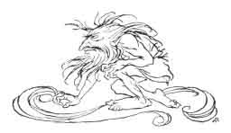
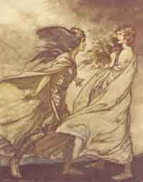
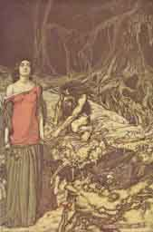
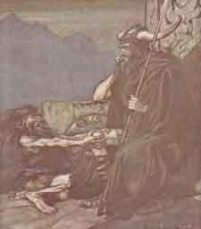
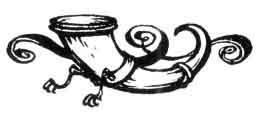

[Intangible Textual Heritage](../../index)  [Legends and
Sagas](../index)  [Index](index)  [Previous](ron08)  [Next](ron10) 

------------------------------------------------------------------------

p. 135

 

# THE SECOND ACT

A open space on the shore in front of the Gibichungs' hall; to the right
the open entrance to the hall, to the left the bank of the Rhine. From
the latter, crossing the stage and mounting towards the back, rises a
rocky height, cut by several mountain-paths. There an altar-stone to
Fricka is visible, as well as one, higher up, to Wotan, and one at the
side to Donner. It is night. Hagen, his arm round his spear and his
shield by his side, sits against one of the pillars of the hall asleep.
The moon shines out suddenly and throws a vivid light on Hagen and his
immediate surroundings. Alberich is seen crouching in front of him,
leaning his arms on Hagen's knees.

Alberich

\[*Softly*.\]

Hagen, son, art asleep?  
Betrayed by drowsiness  
And rest thou dost not hear?

Hagen

\[*Softly, without moving, so that he seems to sleep on although his
eyes are open*.\]

I hear thee, O baleful Niblung;  
What wouldst thou tell me while I slumber?

Alberich

Remember the might  
Thou art endowed with,  
If thou art valiant  
As thy mother bore thee to me.

Hagen

\[*Still as before*.\]

Though courage she bestowed,  
I have no cause to thank her  
For falling under thy spell;

p. 136

Soon old, wan and pale,  
Hating the happy,  
Where is my joy?

Alberich

\[*As before*.\]

Hagen, my son,  
Hate thou the happy;  
This joyless and  
Sorrow-laden one,  
Him alone thou shalt love.  
Be thou strong  
And bold and wise!  
Those whom with weapons  
Of darkness we fight  
Already our hate has dismayed.  
And he who captured my ring,  
Wotan, the ravening robber,  
By one of his sons  
In fight has been vanquished;  
He has lost  
Through the Wälsung power and might.  
With the whole immortal race  
He awaits in anguish his downfall.  
Him I fear no more:  
He and all his must perish!  
Hagen, son, art asleep?

Hagen

\[*Remains motionless as before*.\]

The might of the Gods  
Who then shall wield?

Alberich

I--and thou!  
The world we shall own,  
If in thy truth  
I rightly trust,  
Sharest thou my hate and wrath.  
Wotan's spear  
Was splintered by Siegfried,

 [  
Click to enlarge](img/13600.jpg)

The ravens of Wotan  
             See [p. 128](ron08.htm#page_128)

 

p. 137

The hero who won  
As booty the ring  
When Fafner, the dragon, he slew.  
Power supreme  
He has attained to;

\[*Still mysteriously*.\]

Walhall and Nibelheim bow to his will.  
On this hero undaunted  
My curse falls in vain,  
For he knows not  
The ring's true worth,  
Nor makes use  
Of its wonderful spell;  
Laughing he burns life away,  
Caring only for love.  
Nothing can serve us  
But his undoing!

Sleepest, Hagen, my son?

Hagen

\[*As before*.\]

Already he speeds  
Through me to his doom.

Alberich

The golden ring--  
'Tis that that we must capture!  
The Wälsung  
By a wise woman is loved.  
If, urged by her,  
To the Rhine's fair daughters  
--Who bewitched me once  
Below in the waves--  
The stolen ring he restored,  
Forever lost were the gold,  
And no guile could win it again.  
Wherefore with ardour  
Aim for the ring.

p. 138

I gat thee  
A stranger to fear,  
That against heroes  
Thou mightst uphold me.  
I had not the strength,  
Indeed, to despatch,  
Like the Walsung, Fafner in fight;  
But I reared Hagen  
To deadly hatred,  
And he shall avenge me--  
Shall win the ring,  
Putting Wälsung and Wotan to scorn!  
Swear to me, Hagen, my son!

\[*From this point Alberich is covered by an ever-deepening shadow. At
the same time day begins to dawn*.\]

Hagen

\[*Still as before*.\]

The ring shall be mine yet;  
Quietly wait!

Alberich

Swear to me, Hagen, my son!

Hagen

To myself swear I;  
Make thy mind easy!

Alberich

\[*Still gradually disappearing, and his voice, as he does so, becoming
more and more inaudible*.\]

Be true, Hagen, my son!  
Trusty hero, be true!  
Be true!--True!

\[*Alberich has quite disappeared. Hagen, who has never changed
position, looks with fixed eyes and without moving towards the Rhine,
over which the light of dawn is spreading*.\]

 [  
Click to enlarge](img/13800.jpg)

"The ring upon my hand--  
. . . ah, be implored!  
For Wotan fling it away!"  
                  See [p. 129](ron08.htm#page_129)

 

p. 139

The gradually brightening red of dawn is reflected in the Rhine.
Siegfried  
steps out suddenly from behind a bush close to the shore. He appears  
in his own shape, but has the Tarnhelm on his head still; he takes  
this off, and, as he comes forward, hangs it on his girdle.

Siegfried

Hoioh! Hagen!  
Weary man!  
Where is thy welcome?

Hagen

\[*Rising in a leisurely fashion*.\]

Hei! Siegfried?  
Swift-footed hero,  
Whence stormest thou now?

Siegfried

From Brünnhilde's rock.  
'Twas there that I drew the breath  
I called to thee with;  
A quick passage I made!  
Slower behind me a pair  
On board a vessel come.

Hagen

Hast thou won Brünnhild'?

Siegfried

Wakes Gutrune?

Hagen

\[*Calling towards the hall*.\]

Hoiho! Gutrune!  
Haste and come!  
Siegfried is here.  
Why dost delay?

Siegfried

\[*Turning to the hall*.\]

How Brünnhild' yielded  
Ye shall both be told.

\[*Gutrune comes from the hall to meet him*.\]

Siegfried

Give me fair greeting,  
Gibich's child!  
I come to thee with joyful news.

Gutrune

Freia greet thee  
To the honour of all women!

p. 140

Siegfried

To thy lover glad  
Be gracious;  
For wife I have won thee to-day.

Gutrune

Comes then Brünnhild' with my brother?

Siegfried

None ever wooed with more ease.

Gutrune

Was he not scorched by the fire?

Siegfried

It had not burnt him, I trow;  
But I broke through it instead,  
That I for wife might win thee.

Gutrune

And no harm didst thou take?

Siegfried

I laughed 'mid the surge of the flames.

Gutrune

Did Brünnhild' think thee Gunther?

Siegfried

Like were we to a hair;  
The Tarnhelm saw to that,  
As Hagen truly foretold.

Hagen

I gave thee counsel good.

Gutrune

And so the bold maid was tamed?

Siegfried

Her pride--Gunther broke.

Gutrune

Did she give herself to thee?

Siegfried

Through the night the vanquished Brünnhild'  
To her rightful husband belonged.

Gutrune

For her husband thou didst pass?

Siegfried

By Gutrune sojourned Siegfried.

Gutrune

But 'twas Brünnhild' lay beside thee.

 [  
Click to enlarge](img/14000.jpg)

The wooing of Grimhilde, the mother of Hagen  
                                       See [p. 135](#page_135)

 

p. 141

Siegfried

\[*Pointing to his sword*.\]

Far as north from east and west,  
So far was Brünnhild' removed.

Gutrune

But how got Gunther his wife from thee?

Siegfried

Through the flames of the fire as they faded,  
When day dawned, through the mist  
She followed me down the hill;  
When near the shore,  
None observing,  
I gave Gunther my place,  
And by the Tarnhelm's magic  
Wished myself straight to thee.  
A strong wind drives the lovers  
Merrily down the Rhine;  
Prepare to greet them with joy.

Gutrune

Siegfried! Such is thy might,  
I am afraid of thee!

Hagen

\[*Calling from the shore*.\]

I can see a sail in the distance.

Siegfried

Now be the envoy thanked!

Gutrune

Let us give her gracious greeting,  
That glad and gay she here may tarry!  
Thou, Hagen, prithee  
Summon the men  
To the hall here for the wedding,  
While blithe maids  
To the feast I bid;  
Our joy they will merrily share.

\[*As she goes towards the hall she turns round again*.\]

Wilt thou rest, wicked man?

p. 142

Siegfried

Helping thee is rest enough.

\[*He gives her his hand and accompanies her into the hall*.\]

 

Hagen

\[*Has mounted a rock at the back, and starts blowing his cow-horn*.\]

Hoiho! Hoiho! Hoho!  
Ye Gibich vassals,  
Up and prepare!  
Woeful tidings!  
Weapons! Weapons!  
Arm through the land!  
Goodly weapons,  
Mighty weapons  
Sharp for strife!  
Dire the strait!  
Woe! Danger! Danger!  
Hoiho! Hoiho! Hoho!

\[*Hagen remains where he is on the rock. Armed men arrive in haste by
different paths; first singly, and then in larger and larger groups*.\]

The Vassals

Why sounds the horn?  
Who calls us to arms?  
We come with our arms,  
We come with our weapons.  
Hagen! Hagen!  
Hoiho! Hoiho!  
Who hath suffered scathe  
Say, what foe is nigh?  
Who forces war?  
Is Gunther sore pressed?  
We come with our weapons,  
With weapons keen!  
Hoiho! Ho! Hagen!

 [  
Click to enlarge](img/14200.jpg)

"Swear to me Hagen, my son!"  
                      See [p. 138](#page_138)

 

p. 143

Hagen

\[*Still from the rock*.\]

Come fully armed  
Without delay!  
Welcome Gunther, your lord:  
A wife Gunther has wooed.

The Vassals

Is he in straits,  
Pressed by the foe?

Hagen

A woman hard won  
With him he brings.

The Vassals

Her kinsmen and vassals  
Follow for vengeance?

Hagen

No one follows  
But his bride.

The Vassals

Then the peril is past,  
And the foe put to flight?

Hagen

The dragon-slayer  
Helped him at need;  
Siegfried, the hero,  
Kept him from harm.

The Vassals

How then can his vassals avail him?  
And why hast callèd us here?

Hagen

Sturdy oxen  
Ye shall slaughter;  
On Wotan's altar  
Their blood be shed!

The Vassals

And after that, Hagen? Say, what next?

Hagen

After that for Froh  
A boar ye shall fell,  
And a full-grown and strong  
He-goat for Donner;

p. 144

But for Fricka  
Sheep ye shall slaughter,  
That she may smile on the marriage!

The Vassals

\[*With increasing cheerfulness*.\]

What shall we do  
When the beasts we have slain?

Hagen

The drink-horn take  
That women sweet  
With wine and mead  
Blithely have filled.

The Vassals

The drink-horn in hand,  
What task awaits us still?

Hagen

Gaily carouse  
Until tamed by wine:  
Drink, that the Gods, duly honoured,  
Grace may accord to this marriage.

The Vassals

\[*Burst into ringing laughter*.\]

Good luck and joy  
Laugh on the Rhine,  
If Hagen, the grim one,  
So merrily jests!  
To wedding-feasts  
Hagen invites;  
His prick the hedge-thorn,  
Hagen, has lost!

Hagen

\[*Who has remained very grave, has come down to the men, and now stands
among them*.\]

Now cease from laughing,  
Doughty vassals!  
Receive Gunther's bride;  
Yonder come Brünnhild' and he.

\[*He points towards the Rhine. Some of the men hurry to the height;
others range themselves on the shore to watch the arrival. Hagen goes up
to some of the men*.\]

p. 145

Be to your lady  
Loyal and true;  
Suffers she wrong,  
Swiftly avenge her!

\[*He turns slowly aside and moves towards the back. The boat arrives
with Gunther and Brünnhilde. Those who have been looking out from the
height come down to the shore. Some vassals spring into the water and
pull the boat to land. All press closer to the bank*.\]

The Vassals

Hail! Hail! Hail!  
Be greeted! Be greeted!  
Welcome, O Gunther!  
Hail! Hail! Hail!

 

Gunther steps out of the boat with Brünnhilde.

The Vassals

\[*Range themselves respectfully to receive them*.\]

Welcome, Gunther!  
Health to thee and to thy bride!

\[*They strike their weapons loudly together*.\]

Gunther

\[*Presenting Brünnhilde, who follows him with pale face and lowered
eyes, to the men*.\]

Brünnhild', a peerless bride,  
Here to the Rhine I bring.  
No man ever won  
A nobler woman!  
The Gods have shown from of old  
Grace to the Gibichung stock.  
To fame unmatched  
Now may it mount!

The Vassals

\[*Solemnly clash their weapons*.\]

Hail! O hail, happy Gibichung!

p. 146

Gunther

\[*Leads Brünnhilde who never raises her eyes, to the hall, from which
Siegfried and Gutrune, attended by women, now come forth*.\]

Dear hero, greetings glad!  
I greet thee, fair sister!  
By him who won thee for wife  
I joyfully see thee stand.  
Two happy pairs  
Here radiant are shining:

\[*He draws Brünnhilde forward*.\]

Brünnhild'--and Gunther,  
Gutrun'--and Siegfried.

\[*Brünnhilde, startled, looks up and sees Siegfried. Her eyes remain
fixed on him in amazement. Gunther, who has released her violently
trembling hand, shows, as do all present, blank astonishment at her
behaviour*.\]

The Vassals and Women

What ails her?  
Has she gone mad?

Siegfried

Why looks Brünnhild' amazed?

\[*Goes a few steps towards Brünnhilde, who has begun to tremble*.\]

Brünnhilde

Siegfried . . . here? Gutrune . . . ?

\[*Scarcely able to control herself*.\]

Siegfried

Gunther's gentle sister,  
Wed to me  
As thou to him.

Brünnhilde

\[*With fearful vehemence*.\]

I? Gunther? 'Tis false.

\[*She sways and seems about to fall. Siegfried supports her*.\]

Light fades from mine eyes . . .

\[*In Siegfried's arms, looking faintly up at him*.\]

Siegfried . . . knows me not?

Siegfried

Gunther, see, thy wife is swooning!

\[*Gunther comes to them*.\]

p. 147

Wake, Brünnhild', wake!  
Here stands thy husband.

Brünnhilde

\[*Perceives the ring on Siegfried's outstretched finger, and starts up
with terrible vehemence*.\]

Ha! The ring  
Upon his hand!  
He . . . Siegfried?

The Vassals

What's wrong?

Hagen

\[*Coming among the vassals from behind*.\]

Now pay good heed  
To the woman's tale.

Brünnhilde

\[*Mastering her terrible excitement, tries to control herself*.\]

On thy hand there  
I beheld a ring.  
'Twas wrested from me  
By this man here;

\[*Pointing to Gunther*.\]

'Tis not thine.  
How camest thou by  
The ring thou hast on?

Siegfried

\[*Attentively regarding the ring on his finger*.\]

'Twas not from him  
I got the ring.

Brünnhilde

\[*To Gunther*.\]

Thou who didst seize the ring  
With which I wedded thee,  
Declare to him thy right,  
Make him yield up the pledge!

Gunther

\[*In great perplexity*.\]

The ring? No ring I gave him,  
Though thou dost know it well.

Brünnhilde

Where hast thou hid the ring  
That thou didst capture from me?

\[*Gunther, greatly confused, does not answer*.\]

p. 148

Brünnhilde

\[*Breaking out furiously*.\]

Ha! He it was  
Who despoiled me of the ring-  
Siegfried, the treacherous thief!

\[*All look expectantly at Siegfried, who seems to be lost in far-off
thoughts as he contemplates the ring*.\]

Siegfried

No woman gave  
The ring to me,  
Nor did I wrest it  
From a woman's grasp.  
This ring, I know,  
Was the booty won  
When at Neidhöhl' boldly I fought,  
And the mighty dragon was slain.

Hagen

\[*Stepping between them*.\]

Brünnhild', dauntless queen,  
Knowest thou this ring well?  
If it was by Gunther won,  
Then it is his,  
And Siegfried has got it by guile.  
For his guilt must the traitor pay.

Brünnhilde

\[*Shrieking in terrible anguish*.\]

Betrayed! Betrayed!  
Shamefully betrayed!  
Deceived! Deceived!  
Wrong too deep for revenge!

Gutrune

A wrong? To whom?

Vassals and Women

Deceit? To whom?

Brünnhilde

Holy Gods!  
Ye heavenly rulers!  
Whispered ye this  
In councils dark?  
If I must bear  
More than ever was borne,

p. 149

Bowed by a shame  
None ever endured,  
Teach me such vengeance  
As never was raved!  
Kindle such wrath  
As can never be calmed!  
Order Brünnhild's  
Poor heart to be broken,  
Bring ye but doom  
On him who betrayed!

Gunther

Brünnhild', dear wife,  
Control thyself!

Brünnhilde

Away, betrayer!  
Self-betrayed one!  
All of you, hearken!  
Not he,  
But that man there,  
Won me to wife.

Vassals and Women

Siegfried? Gutrune's lord?

Brünnhilde

He forced delight  
And love from me.

Siegfried

Dost thou so lightly  
Hold thine honour,  
The tongue that thus defames it  
I must convict of its falsehood.  
Hear whether faith I broke!  
Blood-brotherhood  
I have sworn unto Gunther;  
Nothung, my trusty sword,  
Guarded the sacred vow;  
'Twixt me and this sad woman distraught  
Its blade lay sharp.

p. 150

Brünnhilde

Behold how thou liest,  
Crafty man,  
Vainly as witness  
Citing thy sword!  
Full well I know its keenness,  
And also the scabbard  
Wherein so snugly  
Hung on the wall  
Nothung, the faithful friend,  
When its lord won the woman he loved.

The Vassals and Women

\[*Crowd together in violent indignation*.\]

What! Siegfried a traitor?  
Has he stained Gunther's honour?

Gunther

\[*To Siegfried*.\]

Disgraced were I  
And sullied my name,  
Were not the slander  
Cast in her teeth!

Gutrune

Siegfried faithless?  
False to his vow?  
Ah, prove thou that worthless  
Is her word!

The Vassals

Clear thyself straight;  
If thou art wronged  
Silence the slander;  
Sworn be the oath!

Siegfried

If I must swear,  
The slander to still,  
Which of you offers  
His sword for the oath?

Hagen

Swear the oath upon

p. 151

The point of my spear;  
Bad faith 'twill surely avenge.

\[*The vassals form a ring round Siegfried and Hagen. Hagen holds out
the spear; Siegfried lays two fingers of his right hand upon the
point*.\]

Siegfried

Shining steel!  
Weapon most holy,  
Witness my oath sworn for ever!  
On this spear's sharp point  
I solemnly swear;  
Spear-point, mark thou my words!  
If weapon must pierce me,  
Thine be the point!  
When by death I am stricken  
Strike thou the blow,  
If what she tells is true,  
And I broke faith with my friend!

Brünnhilde

\[*Strides furiously into the ring, tears Siegfried's hand from the
spear, and grasps the point with her own*.\]

Shining steel!  
Weapon most holy,  
Witness my oath sworn for ever!  
On this spear's sharp point  
I solemnly swear!  
Spear-point, mark thou my words!  
Devoted be thy might  
To his undoing!  
Be thy sharpness blessed by me,  
That it may slay him!  
For broken his oaths have been all,  
And false is what he has sworn.

The Vassals

Help, Donner!  
Roar with thy thunder  
To silence this terrible shame!

p. 152

Siegfried

Gunther, look to this woman  
Who falsely slanders thy name.  
Let her rest awhile,  
The untamed mountain maid,  
That the unbridled rage some demon  
In malice has  
Against us roused  
May have the chance to subside.  
Ye vassals, go ye your ways;  
Let the womenfolk scold.  
Like cravens gladly we yield,  
Comes it to fighting with tongues.

\[*He goes up to Gunther*.\]

Thou art not so vexed as I  
That I beguiled her ill;  
The Tarnhelm must, I fear,  
But half have hid my face.  
Still, women's wrath  
Soon is appeased:  
That I won her for thee  
Thankful thy wife will be yet.

\[*He turns again to the vassals*.\]

Follow me, men,  
With mirth to the feast!

\[*To the women*.\]

Gaily, women,  
Help at the wedding!  
Joyfully laugh  
Love and delight!  
In hall and grove  
There shall be none  
This day more merry than I!  
Ye whom love has blessed,

p. 153

Like myself light-hearted,  
Follow and share in my mirth!

\[*He throws his arm in the highest spirits round Gutrune and draws her
into the hall. The vassals and women follow, carried away by his
example. All go off, except Brünnhilde, Gunther, and Hagen. Gunther, in
deep shame and dejection, with his face covered, has seated himself on
one side. Brünnhilde, standing in the foreground, gazes for some time
sorrowfully after Siegfried and Gutrune, then droops her head*.\]

 

Brünnhilde

\[*Lost in thought*.\]

What dread demon's might  
Moves here in darkness?  
By what wizard's spell  
Worked was the woe?  
How weak is my wisdom  
Faced by this puzzle!  
And where shall I find  
The runes for this riddle?  
Oh, sorrow! Sorrow!  
Woe's me! Woe's me!  
I gave all my wisdom to him;

\[*With increasing emotion*.\]

The maid in his power  
He holds.  
Fast in his fetters  
Bound is the booty  
That, weeping her grievous shame,  
Gaily to others he gives!  
Will none of you lend a sword  
With which I may sever my bonds?

p. 154

Hagen

\[*Going close to Brünnhilde*.\]

Leave that to me,  
O wife betrayed;  
I will avenge  
Thy trust deceived.

Brünnhilde

\[*Looking round dully*.\]

On whom?

Hagen

On Siegfried, traitor to thee.

Brünnhilde

On Siegfried? Thou?

\[*Smiling bitterly*.\]

One single flash  
Of his eye and its lightning--  
Which streamed in its glory on me  
Even through his disguise--  
And thy heart would fail,  
Shorn of its courage.

Hagen

But to my spear  
His perjury gives him.

Brünnhilde

Truth and falsehood--  
What matter words!  
To arm thy spear  
Seek for something stronger,  
Strength such as his to withstand!

Hagen

Well know I Siegfried's  
Conquering strength:  
How hard in battle to slay him;  
But whisper to me  
Some sure device  
For speeding him to his doom.

Brünnhilde

Ungrateful, shameful return!  
I taught him all  
The arts I know,  
To preserve his body from harm.

p. 155

He bears unwitting  
A charmed life  
And safely walks by spells enwound.

Hagen

Then no weapon forged could wound him?

Brünnhilde

In battle none;--yet--  
Did the blow strike his back!  
Never--I knew that--  
Would he give way,  
Or turn and fly, the foe pursuing,  
So there I gave him no blessing.

Hagen

And there shall my spear strike!

\[*He turns quickly from Brünnhilde to Gunther*.\]

Up, Gunther,  
Noble Gibichung!  
Here stands thy valiant wife.  
Why hang thy head in grief?

Gunther

\[*Starting up passionately*.\]

O shame!  
Dishonour!  
Woe is me!  
No man has known such sorrow!

Hagen

In shame thou liest--  
That is true.

Brünnhilde

\[*To Gunther*.\]

O craven man!  
Falsest of friends!  
Hidden behind  
The hero wert thou  
While won were for thee  
The prize and the glory.  
Low indeed  
The race must have sunk  
That breeds such cowards as thou!

p. 156

Gunther

\[*Beside himself*.\]

Deceived am I--and deceiver!  
Betrayed am I--and betrayer!  
My strength be consumed,  
And broken my heart!  
Help, Hagen!  
Help for my honour!  
Help, for my mother was thine--  
Thee too she bore!

Hagen

No help from head  
Or hand will suffice:  
'Tis Siegfried's death we need.

Gunther

\[*Seized with horror*.\]

Siegfried's death?

Hagen

Unpurged else were thy shame.

Gunther

\[*Staring before him*.\]

Blood-brotherhood  
He and I swore.

Hagen

Who broke the bond  
Pays with his blood.

Gunther

Broke he the bond?

Hagen

In betraying thee.

Gunther

Was I betrayed?

Brünnhilde

He betrayed thee,  
And me ye all are betraying!  
If I were just,  
All the blood of the world  
Would not atone for your guilt!

p. 157

But the death of one  
Is all I ask for.  
Dying, Siegfried  
Atones for himself and you!

Hagen

\[*Turning to Gunther and appealing to him secretly*.\]

His death would profit thee;  
Boundless were indeed thy might  
If thou couldst capture the ring,  
Which, alive, he never will yield.

Gunther

\[*Softly*.\]

Brünnhilde's ring?

Hagen

The ring the Niblung wrought.

Gunther

\[*Sighing deeply*.\]

'Twould be the end of Siegfried.

Hagen

His death would serve us all.

Gunther

But Gutrun', to whom  
He has been given!  
How could we look in her face  
If her husband we had slain?

Brünnhilde

\[*Starting up furiously*.\]

What wisdom forewarned of,  
And runes hinted darkly,  
In helpless despair  
Is plain to me now.

\[*Passionately*.\]

Gutrune is the spell  
That stole my husband's heart away!  
Woe be her lot!

Hagen

\[*To Gunther.*\]

If this grief we must give her,  
Conceal how Siegfried died.

p. 158

We go to-morrow  
Merrily hunting;  
The hero gallops ahead;  
We find him slain by a boar.

Brünnhilde and Gunther

So shall it be!  
Perish Siegfried!  
Purged be the shame  
He brought on me!  
Faith sworn by oath  
He has broken;  
Now with his blood  
Let him atone!  
Avenging,  
All-hearing God!  
Oath-witness,  
And lord of vows!  
Wotan, come at my call!  
Send thou thine awful  
Heavenly host  
Hither to hear  
While I vow revenge!

Hagen

Doomed let him die,  
The hero renowned!  
Mine is the hoard,  
And mine I shall hold it!  
From him the ring  
Shall be wrested!  
Niblung father!

O fallen prince!  
Night warder  
Nibelung lord  
Alberich! Hear thou thy son!

p. 159

Ruling again  
O'er the Nibelung host,  
Bid them obey thee,  
The ring's dread lord!

\[*As Gunther turns impetuously towards the hall with Brünnhilde they
are met by the bridal procession coming out. Boys and girls, waving
flower-wreathed staves, leap merrily in front. The vassals are carrying
Siegfried on a shield and Gutrune on a seat. On the rising ground at the
back men-servants and maids are taking implements and beasts for
sacrifice, by the various mountain-paths, to the altars, which they deck
with flowers. Siegfried and the vassals blow wedding-calls on their
horns. The women invite Brünnhilde to accompany them to Gutrune's side.
Brünnhilde stares blankly at Gutrune, who beckons her with a friendly
smile. Is Brünnhilde is about to step back angrily Hagen comes quickly
between them and presses her to wards Gunther, who takes her hand again,
whereupon he allows himself to be raised on a shield by the men. Is the
procession, scarcely interrupted, moves on quickly again towards the
height, the curtain falls*.\]

 

------------------------------------------------------------------------

[Next: The Third Act](ron10)
