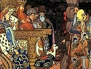
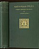

  
[Intangible Textual Heritage](../../index)  [Legends and
Sagas](../index)  [Index](index)  [Next](sfs01) 

------------------------------------------------------------------------

[Buy this Book at
Amazon.com](https://www.amazon.com/exec/obidos/ASIN/B00260GTCA/internetsacredte)

------------------------------------------------------------------------

  
*Sixty Folk-Tales from Exclusively Slavonic Sources*, by A.H. Wratislaw,
\[1890\], at Intangible Textual Heritage

------------------------------------------------------------------------

# SIXTY FOLK-TALES

###### FROM

### EXCLUSIVELY SLAVONIC SOURCES.

##### Translated, with Brief Introduction and Notes,

###### BY

## A. H. WRATISLAW, M.A.,

*Sometime Fellow and Tutor of Christ's College, Cambridge;  
Late Head Master of Felsted and Bury St. Edmund's Schools;  
Corresponding Member of the Royal Bohemian Society of Sciences*.

#### BOSTON:

#### HOUGHTON, MIFFLIN AND COMPANY.

#### New York: 11, East Seventeenth Street,

#### The Riverside Press, Cambridge.

#### \[1890\]

 

Scanned, proofed and formatted at Intangible Textual Heritage, January,
2006, by John Bruno Hare. This text is in the public domain in the
United States because it was published prior to 1923.

 

 
[  
Click to enlarge](img/cover.jpg)  
Cover  

  [  
Click to enlarge](img/title.jpg)  
Title Page. NOTE: Blank Verso  

------------------------------------------------------------------------

[Next: Preface](sfs01)
