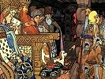

  
[Intangible Textual Heritage](../../index)  [Legends and
Sagas](../index)  [Index](index)  [Previous](sfs64)  [Next](sfs66) 

------------------------------------------------------------------------

[Buy this Book at
Amazon.com](https://www.amazon.com/exec/obidos/ASIN/B00260GTCA/internetsacredte)

------------------------------------------------------------------------

  
*Sixty Folk-Tales from Exclusively Slavonic Sources*, by A.H. Wratislaw,
\[1890\], at Intangible Textual Heritage

------------------------------------------------------------------------

### XLIX.--KURENT THE PRESERVER.

MANKIND perished by the flood, and there was only one who survived, and
this was Kranyatz. Kranyatz fled higher

p. 257

and higher, till the water flooded the last mountain. The poor wretch
saw how the pines and shrubs were covered; one vine, and one only, was
still dry. To it he fled, and quickly seized hold of it, not from
necessity, but from excessive terror; but how could it help him, being
so slender and weak? Kurent observed this, for the vine was his stick,
when he walked through the wide world. It was agreeable to him that man
should be thought to seek help from him. It is true that Kurent was a
great joker; but he was also of a kindly nature, and was always glad to
deliver anyone from distress. Hearing Kranyatz lamenting, he
straightened the vine, his stick, and lengthened it more and more, till
it became higher than the clouds. After nine years the flood ceased, and
the earth became dry again. But Kranyatz preserved himself by hanging on
the vine, and nourishing himself by its grapes and wine. When all became
dry, he got down, and thanked Kurent as his preserver. But this didn't
please Kurent. 'It was the vine that rescued you,' said he to Kranyatz;
'thank the vine, and make a covenant with it, and bind yourself and your
posterity, under a curse, that you will always speak its praises and
love its wine more than any other food and drink.' Very willingly did
the grateful Kranyatz make the engagement for both himself and his
posterity, and to this day his descendants still keep faith, according
to his promise, loving wine above all things, and joyfully commemorating
Kurent, their ancient benefactor.

------------------------------------------------------------------------

[Next: L. Kurent and Man](sfs66)
