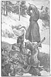

  
[Intangible Textual Heritage](../../index)  [Legends & Sagas](../index) 
[Index](index)  [Next](srf01) 

------------------------------------------------------------------------

# STORIES OF RUSSIAN FOLK-LIFE

## by Donald A. Mackenzie

#### London, Blackie and Son, Limited.

#### \[1916\]

###### NOTICE OF ATTRIBUTION Scanned at Intangible Textual Heritage, December 2004. John Bruno Hare, redactor. This text is in the public domain in the US because it was published prior to 1922. These files may be used for any non-commercial purpose, provided this notice of attribution is left intact in all copies.

[  
Click to enlarge](img/front.jpg)  
PETRUSHKA HOLDS THE WOLVES AT BAY  

------------------------------------------------------------------------

[Next: Contents](srf01)
