[Intangible Textual Heritage](../../index)  [Legends & Sagas](../index) 
[Index](index)  [Previous](srp12)  [Next](srp14) 

------------------------------------------------------------------------

p. 440

# APPENDIX B.

A few words about the measures of the songs may be considered useful.
The following specimens are given by Sakharof in his *Pyesni Russkago
Naroda* [1](#fn_341).

The Khorovod Songs are as follows:--

 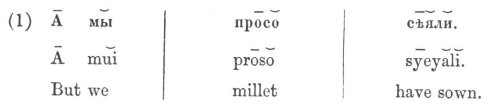

 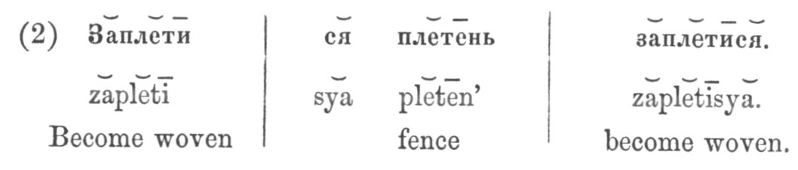

 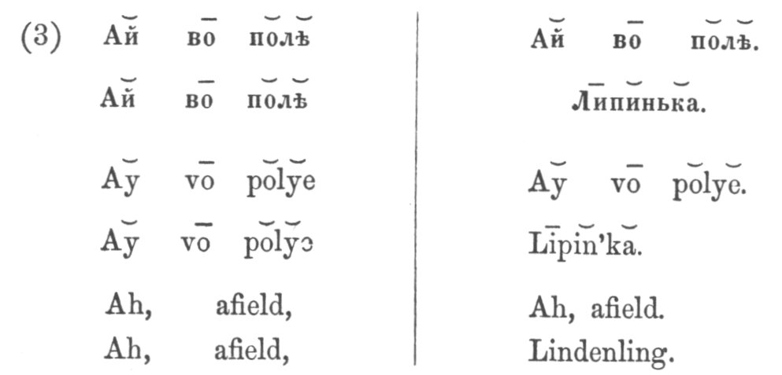

The "Dance Songs " are usually in one of the following metres;--

 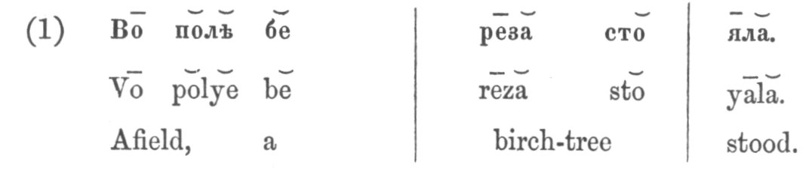

p. 441

 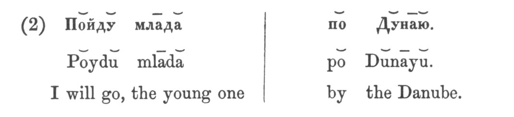

 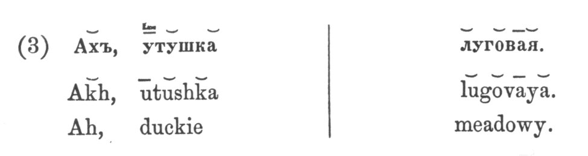

 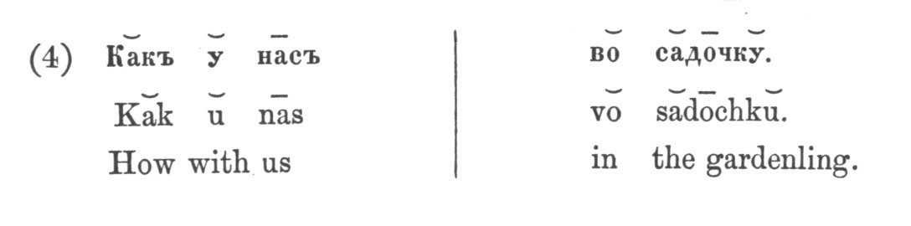

Of the Svyatki songs, sung at Christmas, Sakharof gives the following
specimens in his *Skazaniya Russkago Naroda* [1](#fn_342), the work to which such frequent
reference has already been made:--

 

p. 442

 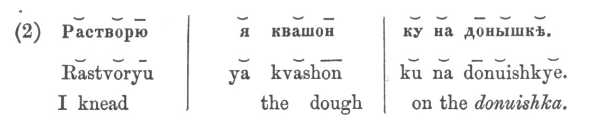

 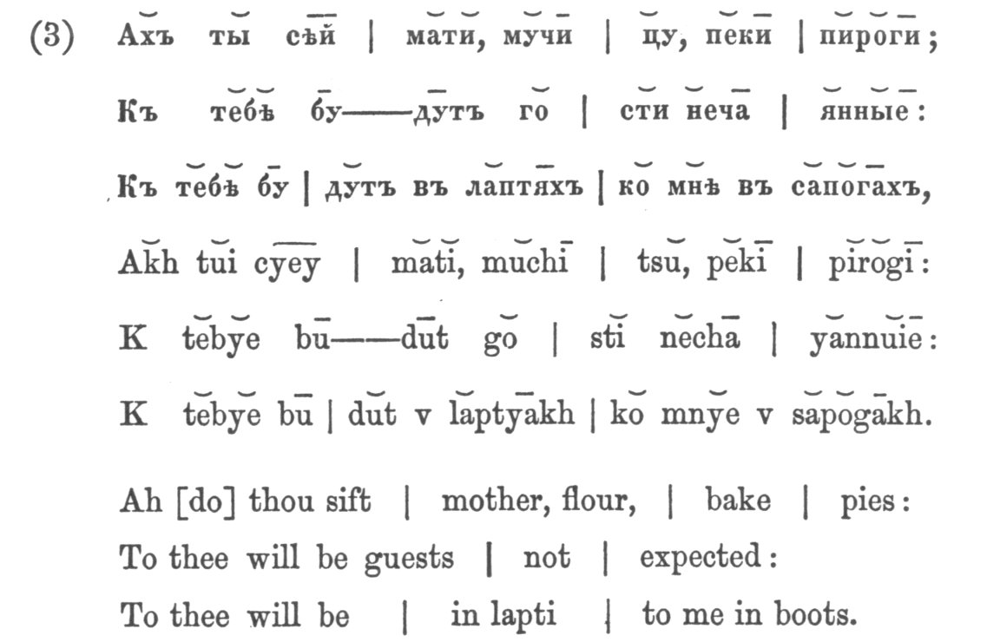

 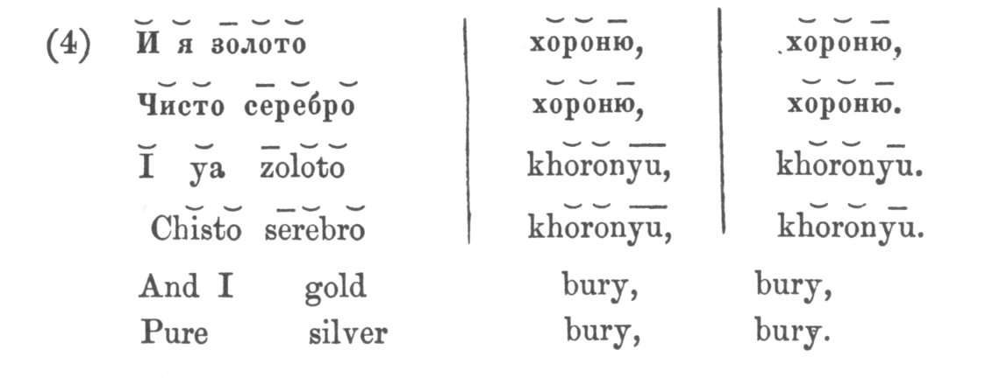

 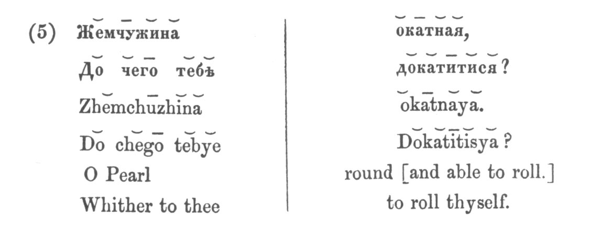

------------------------------------------------------------------------

### Footnotes

[440:1](srp13.htm#fr_341) II. 51-53.

[441:1](srp13.htm#fr_342) I. iii. 10

------------------------------------------------------------------------

[Next: Index](srp14)
