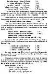
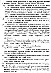

  
[Intangible Textual Heritage](../../index)  [Legends/Sagas](../index) 
[Index](index)  [Previous](tai21)  [Next](tai23) 

------------------------------------------------------------------------

[Buy this Book at
Amazon.com](https://www.amazon.com/exec/obidos/ASIN/087501061X/internetsacredte)

------------------------------------------------------------------------

### IV. THE COMPOSITION OF THE POEM.

### (A) THE VERSIFICATION.

The principal authority on this head is Korš, whose edition of the text
is virtually a monograph and metrical reconstruction. With his bold
interpolations and omissions it would be premature to agree; his
accentual lore one must gratefully follow.

The metrical basis consists of two main accents, the first of which may
be preceded, by one, two or more enclitic syllables, each foot usually

p. xi

 

being dactylic: these two accents are followed by a caesura, after which
comes a third subsidiary dactylic ending, such as is always found in the
ballad metre. Examples of such perfect lines are

[  
Click to enlarge](img/_04000.jpg)

p. xli

[  
Click to enlarge](img/_04100.jpg)

To analyse the metre in full would betray me into a discussion, too long
for this introduction; and I rather doubt whether it would be
profitable, either to truth, or the advancement of the subject. The few
hints given in this section are all derived from Korš; for the rest the
reader had far better trust to his own ear; and the richness of this
three-beat

p. xlii

measure will ring out. The position of the accented syllable in the foot
is variable, as also, within reason,--unlike the style of the later
*bylíny*,--the number of the unaccented syllables.

The regularity of the alliteration approximates the metre to that of the
old German poems; but the freedom of the Slav has released this Russian
verse from the stiffness and artificiality that characterize some of the
Early English alliterative poems.

Later, this Russian liberty of accent and syllabization developed into
anarchy in the popular ballads; and form had to be restored to Russian
verse in the eighteenth century by the imitation of Western models.

The Slóvo is important in the history of early Slav literature, not
least as an instance of native poetry with the just balance of form and
license.

------------------------------------------------------------------------

[Next: Style and Authorship](tai23)
