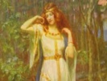

  
[Intangible Textual Heritage](../../index)  [Legends and
Sagas](../index)  [Index](index)  [Previous](tml30)  [Next](tml32) 

------------------------------------------------------------------------

[Buy this Book at
Amazon.com](https://www.amazon.com/exec/obidos/ASIN/B002DYIXO6/internetsacredte)

------------------------------------------------------------------------

  
*Teutonic Myth and Legend*, by Donald A. Mackenzie, \[1912\], at
Intangible Textual Heritage

------------------------------------------------------------------------

p. 292

### CHAPTER XXVI

# How Sigmund was Avenged

The Forest Hut--Waiting the Day of Vengeance--Signy's Sons--Why they
were slain--Sinfjotle, the Volsung--The Were-wolves--Attack on King
Siggeir's Hall--Avengers buried alive--Their Escape--Siggeir's
Fate--Signy's Tragic Farewell--Sigmund returns to his Kingdom--Usurper
overthrown.

FOR long years, through summer's heat and winter cold, did Sigmund dwell
in his forest hut, biding his time. Signy had two sons, and it was her
heart's hope that their Volsung blood would stir them up to avenge her
sire's death. She set at length to proving their worth. On their hands
she put winter gloves, which she sewed through their flesh. But they
cried out thereat, and she feared that they had more of Siggeir's nature
than that of her kin.

When the eldest was ten years old she sent him unto Sigmund, so that it
might be found whether he was fit to give service n the work of blood
vengeance. Sigmund greeted the lad and took him within his hut. Then
secretly he placed a venomous serpent in the meal sack, and having
bidden Signy's son to bake bread, he went through the forest to gather
firewood.

In time he returned, and he found that no bread had been baked, so he
asked why it was not ready.

"I feared to place my hand in the meal sack," said the lad, "because
something darted quickly in it."

p. 293

Sigmund knew then that the lad lacked courage, and when he met with
Signy he said her son was unworthy to be a Volsung.

"Then he is unworthy to live," his mother cried angrily. So Sigmund slew
him.

Another winter came, and Signy sent her second son unto her brother; but
he proved to be timorous like the first, and was put to death also.

Signy next conspired with a witch, and they changed shapes. The witch
lived in Siggeir's hall as his queen. and Signy went through the forest
towards Sigmund's secret dwelling. She begged for food and shelter, nor
did her brother have knowledge of who she was. For three nights she
dwelt in the underground hut and then returned to her home, where she
again changed shapes with the witch.

In time Signy's third son was born, and he was indeed of Volsung blood.
The name he received was Sinfjotle, and he grew up to pleasure his
mother's heart, fair as her kin and strong and without fear. In secret
she told him of her sire, and of how he died through Siggeir's
treachery, and she told him of the wolf which devoured her fettered
brothers. She filled his heart with the glory of the Volsungs and he
took pride in their fame. One day she set to proving him, and she sewed
gloves on his hands and wrists, piercing his flesh with the needle. But
he twitched not a muscle, and her heart was gladdened. Then she tore off
the gloves, and the raw flesh was laid bare.

"I have given thee sufficient pain," she said.

But the youth smiled. "Volsung", said he, "would shrink not from wounds
so slight."

Soon afterwards Sinfjotle was sent by his mother unto Sigmund, and he
was received as were the others, and set

p. 294

to bake bread. A venomous serpent was again placed in the meal sack.

When Sigmund returned with firewood, he found that the bread was made
ready.

"Found ye aught in the sack?" he asked the lad.

"Something darted quickly through the meal," Sinfjotle answered, "but I
paused not to discover what it was, and it is baked in the bread."

Volsung's great son was well pleased with the lad, but he warned him not
to partake of the bread, because he could resist not the poison. But
Sigmund ate of it himself, because he was of such great strength that
the venom could harm him not.

Signy's son remained with Sigmund, who trained him in feats of strength.
Together they robbed and murdered men in the forest, and the lad proved
his worth and grew speedily to full strength. Sigmund thought sure he
was a son of Siggeir, and he ever prompted him to avenge the death of
Volsung, for he feared that the lad was but a Gaut at heart. So he
regarded the lad with suspicion, and was watchful lest he might prove
treacherous like to Siggeir.

It chanced that on a darksome night they came together to a house in
which robbers lay asleep. There they found two wolfskins, which gave
those who wore them power to change their shapes. These they took away,
and when they put them on, Sigmund and Sinfjotle were transformed into
were-wolves. Then were they fierce indeed. Between them they made a
compact that one would call upon the other if confronted by seven men,
and then they parted to prowl for their prey in the deep forest.

Ere long Sigmund had to fight against seven men. He set up the loud wolf
howl, and Sinfjotle hastened

p. 295

to his aid, and between them they slew all the band. After that they
parted, and then Sinfjotle had to contend against eleven men. But
Signy's wolf son uttered no cry. He fought fiercely and alone, and
slaughtered all his opponents. Then wearily he lay down to rest.

Sigmund came towards him soon afterwards, and when he found that
Sinfjotle had surpassed him in valour he sprang upon the youth with wolf
anger and did him grievous injury. But he speedily repented what he had
done, and carried his companion to the underground dwelling, where he
lay nigh unto death. In sore distress was Sigmund, and he vowed never
again to go forth as a wolf. Then it chanced that he saw two weasels who
fought together. One seized the other as he had done to Signy's son, but
it ran speedily to find a herb which restored its companion to full
strength again. He sought to find the healing herb, and a raven [1](#fn_91) flew towards him bearing a leaf in its
beak, which it let fall at his feet. Perceiving that it was of the herb
he desired to find, Sigmund hastened to his hut and laid the leaf upon
Sinfjotle's wounds. The youth was at once healed and the affliction
passed.

Together the heroes waited until they could regain their wonted shape
again. Then they destroyed the wolfskins, lest the one should slay the
other.

Sigmund perceived that the lad was his equal in strength, and deemed
that the time had come when they could wreak Volsung vengeance against
Siggeir, King of the Gauts. So they armed themselves and went forth.
When they reached the hall they concealed themselves among the mead
casks which stood along the entrance way. But ere night fell two of
Siggeir's children, who played with a golden ball, cried out because

p. 296

that they saw two grim warriors in shining armour crouching behind the
casks. Sinfjotle sought to slay them, but Sigmund disdained to shed
their blood. So the alarm was raised and Siggeir and his war-men issued
forth to contend against the intruders. The avengers sprang up with
drawn swords. They feared not the overwhelming force that clamoured for
their blood. Sinfjotle first slew Siggeir's two children and then the
fight raged fierce and fast. Many warriors fell. Sigmund and his
companion made great slaughter, but their foemen were so numerous that
in the end they were taken captive and bound.

Then did Siggeir and his nobles take counsel together to devise how the
twain might be given the most cruel death, and it was decreed that they
should be buried alive.

In the morning two stone grave chambers were made, one beside the other,
and in these were Sigmund and Sinfjotle laid. Ere the slab and earth
were placed over them, Signy came forth with flesh wrapped in straw and
flung it into the graves. There was it allowed to remain, so that their
torture might be prolonged. Then the barrows were covered over.

The buried heroes spake out one to another in the darkness, and Sigmund
bethought him at length to partake of the flesh. So he cast aside the
straw, and when he had done that he discovered that a sword was thrust
through the flesh. He knew by the hilt that it was Gram, and his heart
leapt within him.

With the wondrous sword the two men sawed through the great slab which
covered the grave chambers, and when darkness fell they came forth.

It was the night of Volsung vengeance, long desired, long waited for.
Sigmund and Sinfjotle hewed logs with

p. 297

\[paragraph continues\] Gram, and heaped
the wood splinters round the hall. Then they put fire to them, and soon
the dwelling of King Siggeir was wrapped in flames.

The king woke up, and through the smoke he cried in anguish: "Who hath
come against me with fire? Now death assaileth me!"

Sigmund heard him, and in triumph he answered: "Now dost thou know, O
treacherous man, that a son of Volsung remains alive. I am Sigmund, and
Sinfjotle, son of Signy, is here with me."

The flames spread. Death encompassed all that were in the hall. None
could escape, because the avengers guarded the door. But Sigmund was
loath that Signy should perish, and he called to her to make escape with
all the treasure she could seize. The queen heard her brother's voice
amidst the roar of flames, and she came to the door with empty hands.

"Full well thou knowest," she said unto Sigmund, "that I never forgot
how Siggeir killed King Volsung. My very children I had slain because
they were too weakly to avenge my sire's death. But behold! Sinfjotle is
a mighty warrior indeed, for he is not only mine own son, but a son of a
son of King Volsung also. For vengeance have I striven through long
years, so that Siggeir might have his deathdue in the end. Now my labour
is finished and my purpose is achieved. I have no need of longer days,
nor do I desire to live now. By compulsion was my life spent with
Siggeir; now that I have free choice I shall die gladly with him. . . .
Fare thee well."

So saying she kissed Sigmund and Sinfjotle, and hastening back to her
husband she perished with him in the flames. . . . Thus was the death of
King Volsung avenged.

p. 298

Sigmund was now free to return to his own land, and with his son he
crossed the sea. A usurper sat upon Volsung's throne, but he was
speedily overcome by the avenging heroes, and the glory that had
departed from Hunaland was restored once again.

------------------------------------------------------------------------

### Footnotes

[295:1](tml31.htm#fr_91) One of Odin's ravens.

------------------------------------------------------------------------

[Next: Chapter XXVII. Helgi Hundingsbane](tml32)
