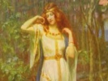

  
[Intangible Textual Heritage](../../index)  [Legends and
Sagas](../index)  [Index](index)  [Previous](tml31)  [Next](tml33) 

------------------------------------------------------------------------

[Buy this Book at
Amazon.com](https://www.amazon.com/exec/obidos/ASIN/B002DYIXO6/internetsacredte)

------------------------------------------------------------------------

  
*Teutonic Myth and Legend*, by Donald A. Mackenzie, \[1912\], at
Intangible Textual Heritage

------------------------------------------------------------------------

p. 299

### CHAPTER XXVII

# Helgi Hundingsbane

Helgi's Youth--Hunding slain in Battle--Wooing of the Valkyrie
Maid--Hodbrod, the Rival--How Sigrun was won--Dag's Vengeance--Helgi is
slain--Sigrun's Curse--She sorrows for her Husband--Helgi's
Ghost--Meeting with Sigrun--The Love Song at the Grave--Lovers born
again.

SIGMUND became a mighty ruler, and he made Borghild his queen. In
happiness they dwelt together, and they had two sons who were named
Helgi and Hamund. At Helgi's birth norns came and foretold that he would
achieve great renown, as indeed he did, for while, he was yet a youth he
became a far-famed warrior, strong-armed and fierce, in battle prowness
surpassing even his sire.

In time, Helgi was chosen to be chief leader of the army, and so
fiercely did he fight against King Hunding that he was surnamed
Hundingsbane.

Now Helgi in his boyhood had gone in disguise to Hunding's hall, where
he was reared and trained in feats of strength. The day came when he was
ready to wield arms against his country's foe, so he took his departure.
As he left the Hall, he sent a message to King Hunding, making known
whom he had fostered. The king was wroth, and he sent out warriors to
slay the lad. But Helgi disguised himself as a bondmaid, and when his
pursuers entered the house in which he had taken refuge they saw a woman
grinding corn.

p. 300

"The bondmaid hath fierce eyes," they said. "She is not the daughter of
a peasant. Her hands are more fitted for the sword."

So strong was Helgi, and so swiftly did he work, that the millstones
were broken. It is not a warrior's task to grind corn.

In the war that followed a great battle was fought, and Helgi slew
Hunding. Several of the king's sons fell by his sword in another battle,
and those who survived vowed blood vengeance against him.

As Helgi left the battlefield he clad himself in a wolfskin, and in a
forest he met a fair princess who was named Sigrun. She rode on a white
horse and her maidens rode behind her. King Hogni, against whom Helgi
had fought, was her sire, and she was a valkyrie and a swan maid.

The young warrior was heart-stricken with love for the fair princess,
and he besought her to be his bride. But she told him that her sire had
already promised her to Hodbrod, son of King Granmar; whereat Helgi
vowed that he would go against his rival in battle. Then did Sigrun
promise to be his bride when he had slain the hated Hodbrod.

So it fell that Helgi Hundingsbane warred against Hodbrod and his
allies, the kinsfolk of Sigrun. He crossed the seas with Sinfjotle and a
strong army; but a great tempest broke forth, and the ships would have
been foundered had not the valkyrie maid come to protect them. After
enduring great tribulation Helgi reached the kingdom of Granmar, where
he fought a great battle. Sigrun hovered in mid-air, and gave her lover
sure protection, and he prevailed over Hodbrod and slew him. Then was
Hogni slain also, and all his sons fell with him save Dag.

Sigrun hailed her lover and gave him praise because

p. 301

that he had slain the mighty Hodbrod, yet did she mourn for her sire and
her brothers.

Helgi comforted her, saying: "The norns have not given thee good fortune
in all things. I have slain thy kindred. Thou couldst not choose
otherwise, because it was thy doom from birth to be the cause of great
bloodshed. For thy sake have warriors striven. Weep not, Sigrun; heroes
must die at their appointed time."

Sigrun embraced her lover and said: "Although those who have fallen were
still alive, I would love but Helgi."

Then Helgi reigned over the land which he had conquered, and Sigrun was
his queen. With Dag he took vows of fellowship and spared his life; but
Hogni's son deemed that the call of blood vengeance was stronger than
the oaths he had taken, even although he had sworn by Hela's holy river,
and he resolved in his heart to take Helgi's life.

Now it fell that Odin intervened. He gave to Dag his great spear
Gungner, and as the youth went with the king through a forest grove, he
drave the spear through Helgi's back, so that he fell dying upon the
green sward. Thus was Hogni avenged.

But great was Sigrun's grief when Dag came to her with tidings that he
had slain the world's best king. On his head she heaped curses, nor
could she be consoled.

"May thine oaths smite thee," she cried: "all the oaths thou didst swear
with Helgi by Hela's shining stream. May thy ship sink with thee,
although fair winds prevail. May thy horse stumble when thou art pursued
by thy foes. May thy sword in battle wound none but thyself. The death
of Helgi must be avenged against thee, and thou shalt be a wolf in the
forest. . . .

p. 302

\[paragraph continues\] Be thy life empty
of all thou dost desire. May thy food be the flesh of dead men."

"Wouldst thou call down such ill upon thy brother?" Dag pleaded with
her. "The hand of Odin hath been laid heavily on Helgi. I shall give to
thee golden rings, and half of the kingdom for thyself and thy sons."

But Sigrun wailed in her grief: "Oh! never again can I be glad, neither
by day nor by night. I love not life any more, for I shall ne'er behold
my shining hero who was blithe in the hall and valorous in battle. High
was Helgi above all other men as the ash tree is high above shrubs. . .
. Never again can I see him alive."

A grave mound was raised over Helgi's body, and his spirit went to
Valhal. Odin made him chief ruler, and he gave Hunding a bondsman's
tasks, for he set him to hew wood, to leash the hounds, and groom the
horses, and ere he went to sleep to give mash to the swine.

But Helgi could not be happy even in Valhal, because that Sigrun cried
ever for him; as bitterly and oft as her tears fell his wounds bled
afresh. By nighttime he rode to the grave mound with many followers.
There was no rest for Helgi among the dead.

Sigrun's bondmaid beheld the ghastly warriors riding round the mound,
and she cried to them: "Why ride ye forth, ye dead men? Can slain
warriors return home again? Or hath the world's end come at length?"

"The world's end hath come not yet," the slain warmen made answer, "but
dead heroes would fain return home. . . . The wounds of Helgi bleed
afresh because of Sigrun's sorrow. Bid her come hither to stay the
unceasing flow of anguish."

Then did the bondmaid go unto Sigrun. "Hasten thee to the grave mound,"
she cried. "Dead men are

p. 303

abroad, and thou mayest behold the king once more. Helgi is there; his
wounds bleed ever because of thy tears, and he would fain that thou
wouldst give him healing."

Sigrun's tears ceased falling awhile. "Glad am I to go forth even in
darkness unto Helgi," she cried, "and may the dews never shine to the
dawn. His cold lips shall I kiss; I shall embrace my dead hero."

So she hastened unto the grave mound, and there she beheld her lord. Wan
and pale was he indeed, and sorrow-stricken and cold. Sigrun kissed him
and embraced him, and cried:

"O Helgi, thy hair is white with rime; thou art drenched with the dews
of death. Cold, cold are thy hands; they are dripping blood. How shall I
heal thee, O my hero?

Helgi made answer: "Bright flower of the south, thy tears have made me
wet; thy sorrow hath drenched me with the dews of death. Ere thou dost
sleep, O gold-decked maid. thou dost ever weep most bitter tears, and
they fall upon my breast; as drops of blood they fall: they are cold and
they pierce me: heavy are they and sharp as is thine anguish. . . .
Grieve not although life and kingdom be lost; sing not the dirge of
mourning although my wounds are deep, for know that dead men have brides
and kings' dead daughters are with them."

Sigrun spread out a smooth grave bed for Helgi, and said to him,
speaking low:

"A bed without pain I have made for thee, Helgi in comfort thou shalt
rest upon it, O son of the Volsungs. O my king, O my love, I shall lie
in thy bosom. I shall take thee in mine arms as if thou wert still
alive."

"White maid whom I loved," spake Helgi, "strange would it indeed be if
the high-born daughter of King

p. 304

\[paragraph continues\] Hogni were laid
while yet alive in a dead man's arms. . . . Now forth must I ride on the
dawn-red road. I must climb, on my steed, the bridge of the gods, ere
the shining cock of Asgard awakens the heroes in Valhal."

So they parted there at the grave mound, and Helgi, mounting on his
steed, vanished in mid-air.

But when the day passed, and the night fell, Sigrun again returned to
the grave mound of Helgi. She wept no tears and waited, but her hero
came not nigh. All through the hours of darkness she waited, until the
dawn broke faintly through the trees. Sitting there by her husband's
grave mound, the love-lorn lady sang:

Ah! would that he came  
  For fain would I greet him;  
He would come if he knew  
  That I wait here to meet him;  
He'd come were he hearing--  
  Heart-hearing my call,  
The son of great Sigmund,  
  From Odin's high hall.

O Helgi, mine own,  
My fair one, my rare one--  
Helgi, mine own.

Now waneth my hope  
  Of Helgi's returning,  
For the eagles awake  
  And the dawn fires are burning;  
My love hath not heard me,  
  He comes not to-night. . . .  
All the elf folk and death folk  
  To Dreamland take flight.

O Helgi, mine own,  
My white one, my bright one--  
Helgi, mine own.

p. 305

The bondswoman soothed Sigrun, and 'twas thus she sang to her:--

Oh! hush thee. Oh! hush . . . who maketh thy moan,  
            White Queen of the Southland,  
Fair Sigrun who waiteth in darkness alone,  
            O loved one of Helgi;  
Thy heart should be filled, not with hope, but with dread--  
'T is well that dawn cometh and black night hath fled--  
More fearsome and fierce are the warriors dead  
              In darkness than day-shine.

But Sigrun would not be comforted, and she died of sorrow, Sad
minstrels, singing to harp music in the feasting hall, have told that
Helgi and Sigrun were born to life again.

### Clerk Saunders

Clerk Saunders and May Margaret  
  Walked ower yon garden green;  
And sad and heavy was the love  
  That fell thir twa between.

   .       .       .       .       .       .

It was about the midnight hour,  
  When they asleep were laid,  
When in came her seven brothers  
  Wi' torches burning red.

   .       .       .       .       .       .

Then up and gat the seventh o' them,  
  And never a word spake he;  
But he has striped his bright brown brand  
  Out through Clerk Saunders' fair bodye.

Clerk Saunders he started and Margaret she turned  
  Into his arms as asleep she lay; p. 306  
And sad and silent was the night  
  That was atween thir twae.

   .       .       .       .       .       .

The clinking bell gaed through the town,  
  To carry the dead corpse to the clay;  
And Clerk Saunders stood at May Margaret's window  
  I wot, an hour before the day.

"Are ye sleeping, Margaret?" he says,  
  "Or are ye waking presentlie?  
Give me my faith and troth again,  
  I wot, true love, I gied to thee."

"Your faith and troth ye sall never get,  
  Nor our true love sall never twin,  
Until ye come within my bower  
  And kiss me cheek and chin."

"My mouth it is full cold, Margaret,  
  It smells now o' the ground;  
And if I kiss thy comely mouth  
  Thy days o' life will no' be lang.

"O, cocks are crowing a merry midnight,  
  I wot the wild fowls are boding day;  
Give me my faith and troth again,  
  And let me fare me on my way."--

"Thy faith and troth thou sall na get,  
  And our true love shall never twin,  
Until ye tell what comes o' women,  
  I wot, who die in strong traivelling?"

"Their beds are made in heaven high,  
  Down at the foot of our good Lord's knee,  
Weel set about wi' gilly flowers;  
  I wot sweet company for to see.

p. 307

"O, cocks are crowing at merry midnight,  
  I wot the wild fowl are boding day;  
The psalms of heaven will soon be sung,  
  And I, ere now, will be miss'd away.

Then she has ta'en a crystal wand,  
  And she has stroken her troth thereon;  
She has given it him out at the shot-window,  
  Wi' mony a sad sigh, and heavy groan.

"I thank ye, Marg'ret; I thank ye, Margaret;  
  And aye I thank ye heartilie;  
Gin ever the dead come for the quick,  
  Be sure, Marg'ret, I'll come for thee."--

It 's hosen and shoon, and gown alone,  
  She climb'd the wall, and followed him,  
Until she came to the green forest,  
  And there she lost the sight o' him.

"Is there ony room at your head, Saunders?  
  Is there ony room at your feet ,  
Or ony room at your side, Saunders,  
  Where fain, fain I would sleep?"--

"There's nae room at my bead, Marg'ret,  
  There's nae room at my feet;  
My bed it is full lowly now:  
  Amang the hungry worms I sleep.

"Cauld mould is my covering now,  
  But and my winding-sheet;  
The dew it falls nae sooner down  
  Than my resting-place is weet.

"But plait a wand o' bonny birk,  
  And lay it on my breast;  
And shed a tear upon my grave,  
  And wish my soul gude rest.

p. 308

"And fair Marg'ret and rare Marg'ret,  
  And Marg'ret o' veritie,  
Gin e'er ye love another man,  
  Ne'er love him as ye did me."--

Then up and crew the milk-white cock,  
  And up and crew the grey;  
Her lover vanish'd in the air,  
  And she gaed weeping away,  
                           --*Scottish Border Ballad*

 

------------------------------------------------------------------------

[Next: Chapter XXVIII. Sigurd the Dragon Slayer](tml33)
