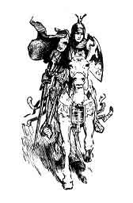
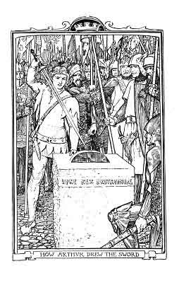

[Intangible Textual Heritage](../../index)  [Legends & Sagas](../index) 
[Index](index)  [Previous](trt02)  [Next](trt04) 

------------------------------------------------------------------------

p. 3

# KING ARTHUR.

#### Tales of the Round Table

 

# THE DRAWING OF THE SWORD

LONG, long ago, after Uther Pendragon died, there was no King in
Britain, and every Knight hoped to seize the crown for himself. The
country was like to fare ill when laws were broken on every side, and
the corn which was to give the poor bread was trodden underfoot, and
there was none to bring the evildoer to justice. Then, when things were
at their worst, came forth Merlin the magician, and fast he rode to the
place where the Archbishop of Canterbury had his dwelling. And they took
counsel together, and agreed that all the lords and gentlemen of Britain
should ride to London and meet on Christmas Day, now at hand, in the
Great Church. So this was done. And on Christmas morning, as they left
the church, they saw in the churchyard a large stone, and on it a bar of
steel, and in the steel a naked sword was held, and about it was written
in letters of gold, 'Whoso pulleth out this sword is by right of birth
King of England.' They marvelled at these words, and called for the
Archbishop, and brought him into the place where the stone stood. Then
those Knights who fain would be King could not hold themselves back, and
they tugged at the sword with all their might; but it never stirred. The
Archbishop watched them in silence, but when they were faint from
pulling he spoke: 'The man is not here who shall lift out that sword,
nor do I know where to find him. But this is my counsel--that two
Knights be chosen, good and true men, to keep guard over the sword.'

Thus it was done. But the lords and gentlemen-at-arms

p. 4

cried out that every man had a right to try to win the sword, and they
decided that on New Year's Day a tournament should be held, and any
Knight who would, might enter the lists.

So on New Year's Day, the Knights, as their custom was, went to hear
service in the Great Church, and after it was over they met in the field
to make ready for the tourney. Among them was a brave Knight called Sir
Ector, who brought with him Sir Kay, his son, and Arthur, Kay's
foster-brother. Now Kay had unbuckled his sword the evening before, and
in his haste to be at the tourney had forgotten to put it on again, and
he begged Arthur to ride back and fetch it for him. But when Arthur
reached the house the door was locked, for the women had gone out to see
the tourney, and though Arthur tried his best to get in he could not.
Then he rode away in great anger, and said to himself, 'Kay shall not be
without a sword this day. I will take that sword in the churchyard, and
give it to him'; and he galloped fast till he reached the gate of the
churchyard. Here he jumped down and tied his horse tightly to a tree,
then, running up to the stone, he seized the handle of the sword, and
drew it easily out; afterwards he mounted his horse again, and delivered
the sword to Sir Kay. The moment Sir Kay saw the sword he knew it was
not his own, but the sword of the stone, and he sought Out his father
Sir Ector, and said to him, 'Sir, this is the sword of the stone,
therefore I am the rightful King.' Sir Ector made no answer, but signed
to Kay and Arthur to follow him, and they all three went back to the
church. Leaving their horses outside, they entered the choir, and here
Sir Ector took a holy book and bade Sir Kay swear how he came by that
sword. 'My brother Arthur gave it to me,' replied Sir Kay. 'How did you
come by it?' asked Sir Ector, turning to Arthur. 'Sir,' said Arthur,
'when I rode home for my brother's sword I found no one to deliver it to
me, and as I resolved he should not

p. 5

 

p. 7

be swordless I thought of the sword in this stone, and I pulled it out.'
'Were any Knights present when you did this?' asked Sir Ector. 'No,
none,' said Arthur. 'Then it is you,' said Sir Ector, 'who are the
rightful King of this land.' 'But why am I the King?' inquired Arthur.
'Because,' answered Sir Ector, 'this is an enchanted sword, and no man
could draw it but he who was born a King. Therefore put the sword back
into the stone, and let me see you take it out.' 'That is soon done,'
said Arthur, replacing the sword, and Sir Ector himself tried to draw
it, but he could not. 'Now it is your turn,' he said to Sir Kay, but Sir
Kay fared no better than his father, though he tugged with all his might
and main. 'Now you, Arthur,' and Arthur pulled it out as easily as if it
had been lying in its sheath, and as he did so Sir Ector and Sir Kay
sank on their knees before him. 'Why do you, my father and brother,
kneel to me?' asked Arthur in surprise. 'Nay, nay, my lord,' answered
Sir Ector, 'I was never your father, though till to-day I did not know
who your father really was. You are the son of Uther Pendragon, and you
were brought to me when you were born by Merlin himself, who promised
that when the time came I should know from whom you sprang. And now it
has been revealed to me.' But when Arthur heard that Sir Ector was not
his father, he wept bitterly. 'If I am King,' he said at last, I ask
what you will, and I shall not fail you. For to you, and to my lady and
mother, I owe more than to anyone in the world, for she loved me and
treated me as her son.' 'Sir,' replied Sir Ector, 'I only ask that you
will make your foster-brother, Sir Kay, Seneschal [1](#fn_0) of all your lands.' 'That I will readily,'
answered Arthur,' and while he and I live no other shall fill that
office.'

Sir Ector then bade them seek out the Archbishop with him, and they told
him all that had happened concerning the sword, which Arthur had left
standing in the

p. 8

stone. And on the Twelfth Day the Knights and Barons came again, but
none could draw it out but Arthur. When they saw this, many of the
Barons became angry and cried out that they would never own a boy for
King whose blood was no better than their own. So it was agreed to wait
till Candlemas, when more Knights might be there, and meanwhile the same
two men who had been chosen before watched the sword night and day; but
at Candlemas it was the same thing, and at Easter, And when Pentecost
came, the common people who were present, and saw Arthur pull out the
sword, cried with one voice that he was their King, and they would kill
any man who said differently. Then rich and poor fell on their knees
before him, and Arthur took the sword and offered it upon the altar
where the Archbishop stood, and the best man that was there made him
Knight. After that the crown was put on his head, and he swore to his
lords and commons that he would be a true King, and would do them
justice all the days of his life.

------------------------------------------------------------------------

### Footnotes

[7:1](trt03.htm#fr_0) 'Seneschal' means steward.

------------------------------------------------------------------------

[Next: The Questing Beast](trt04)
