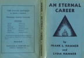
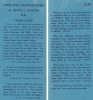

  
[Intangible Textual Heritage](../../index)  [New Thought](../index) 
[Index](index)  [Previous](aec16) 

------------------------------------------------------------------------

*An Eternal Career*, by Frank and Lydia Hammer, \[1947\], at Intangible
Textual Heritage

------------------------------------------------------------------------

[  
Click to enlarge](img/jacket.jpg)  
Dust Jacket  

[  
Click to enlarge](img/flaps.jpg)  
Flaps  

Advertisement on back of dust jacket

"LIFE AND ITS MYSTERIES"

By FRANK L. HAMMER

Illuminating—Inspiring—Convincing

CONTENTS

|           |               |
|-----------|---------------|
| BIRTH     | MIRACLES      |
| MIND      | EQUALITY      |
| THOUGHT   | AFFINITY      |
| TELEPATHY | INDIVIDUALITY |
| TRUTH     | REALITY       |
| FREE WILL | IMMORTALITY   |

Subjects that are engrossing the interest of people all over the world
are explained in a clear and logical manner.

PRICE $1.50

DORRANCE & COMPANY Inc.

Publishers — Philadelphia, Pa.

Front Flap

Eventually we are faced with mysteries so profound that we are
constrained to ask WHY? Why do such conditions happen to me? Why am I in
this predicament? Why am I forced to do things which are not to my
liking? Why is my life cast amongst people for whom I have no affinity?
WHY?

Why the suffering, disappointment, frustration, loss, separation and
death of loved ones? Why all the apparent cruelty and injustice? Why are
some children born physically, morally and mentally defective? Why are
there such multitudes of wrecks of humanity dragging their wretched
forms through life? Why are the hospitals, asylums and penal
institutions filled to over-flowing? WHY?

How many know how to live? How many have any idea of life's plan and
purpose? How many are aware of their origin or destiny? How many ever
ask themselves: "Why am I here?" How many realize that they are immortal
souls embarked upon a career that is eternal?

"AN ETERNAL CAREER" answers these and other perplexing questions.

Back Flap

LIFE AND ITS MYSTERIES

By FRANK L. HAMMER

$1.50

"SOLID GOLD"

"*Here*, we call out to all explorers of the mental realm. Here, is a
vein of pure gold. It traces back to the soundest of roots—Emerson and
Plato. And with equal soundness and simplicity it follows right up to
the completed coin of the mental realm most needed today.

"The last chapter is a treasure, especially at this time, when nearly
every home in the land has an empty chair. The subject is Immortality.
Like every topic upon which Mr. Hammer touches, it is treated with
delicacy and strength, and is presented in unqualified good writing."

*The Argonaut, San Francisco*

"A clear and logical explanation marked by scholarship, of the
fundamental questions of life, and of the mystery that is religion."

*Westchester Features Syndicate*

"I have read many different books pertaining to life, but your writing
is more interesting to me by far. You covered more ground in 124 pages
than many books I have read from 300 to 600 pages."

*L. P. Los Angeles, Calif.*

 

 
