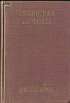
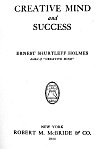
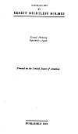

  
[Intangible Textual Heritage](../../index)  [New Thought](../index) 
[Index](index)  [Next](cms01) 

------------------------------------------------------------------------

[Buy this Book at
Amazon.com](https://www.amazon.com/exec/obidos/ASIN/0874778662/internetsacredte)

------------------------------------------------------------------------

Creative Mind and Success, by Ernest Shurtleff Holmes \[1919\], at
Intangible Textual Heritage

------------------------------------------------------------------------

p. iii

# CREATIVE MIND

## *and*

# SUCCESS

## ERNEST SHURTLEFF HOLMES

##### *Author of* "CREATIVE MIND"

#### NEW YORK

#### ROBERT M. McBRIDE & CO.

#### \[1919\]

Scanned at Intangible Textual Heritage, September 2006. Proofed and
formatted by John Bruno Hare. This text is in the public domain in the
United States because it was published prior to January 1st, 1923. These
files may be used for any non-commercial purpose provided this notice of
attribution is left intact in all copies.

[  
Click to enlarge](img/cover.jpg)  
Front Cover  

[  
Click to enlarge](img/title.jpg)  
Title Page  

[  
Click to enlarge](img/verso.jpg)  
Verso  

COPYRIGHT, 1919

BY

ERNEST SHURTLEFF HOLMES

Second Printing September, 1920

Printed in the United States of America

PUBLISHED 1919

------------------------------------------------------------------------

[Next: Contents](cms01)
