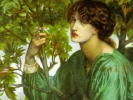

  
[Intangible Textual Heritage](../../index)  [New Thought](../index) 
[Index](index)  [Previous](dlms00)  [Next](dlms02) 

------------------------------------------------------------------------

  
*The Dore Lectures on Mental Science*, by Thomas Troward, \[1909\], at
Intangible Textual Heritage

------------------------------------------------------------------------

CONTENTS

[FOREWORD](dlms02.htm#an_f00)

[ENTERING INTO THE SPIRIT OF IT](dlms03.htm#an_f01)

[INDIVIDUALITY](dlms04.htm#an_f02)

[THE NEW THOUGHT AND THE NEW ORDER](dlms05.htm#an_f03)

[THE LIPS OF THE SPIRIT](dlms06.htm#an_f04)

[ALPHA AND OMEGA](dlms07.htm#an_f05)

[THE CREATIVE POWER OF THOUGHT](dlms08.htm#an_f06)

[THE GREAT AFFIRMATIVE](dlms09.htm#an_f07)

[CHRIST THE FULFILLING OF THE LAW](dlms10.htm#an_f08)

[THE STORY OF EDEN](dlms11.htm#an_f09)

[THE WORSHIP OF ISHI](dlms12.htm#an_f10)

[THE SHEPHERD AND THE STONE](dlms13.htm#an_f11)

[SALVATION IS OF THE JEWS](dlms14.htm#an_f12)

------------------------------------------------------------------------

[Next: Foreword](dlms02)

